# Vudy Api Documentation

**Version:** 6.0.0

**Generated:** January 31, 2026

---

# Table of Contents

1. [README](#readme)
2. [Unlimit Channel API](#unlimit-channel-api)
3. [Vudy Channel API](#vudy-channel-api)
4. [Application Management API](#application-management-api)
5. [Authentication API](#authentication-api)
6. [Configuration API](#configuration-api)
7. [KYC Verification API](#kyc-verification-api)
8. [Notifications API](#notifications-api)
9. [Organization Management API](#organization-management-api)
10. [OTC Operations API](#otc-operations-api)
11. [Profile Management API](#profile-management-api)
12. [Team Management API](#team-management-api)
13. [Transaction History API](#transaction-history-api)
14. [Vudy Request API](#vudy-request-api)
15. [Wallet Management API](#wallet-management-api)
16. [README](#readme)
17. [Authentication Flow](#authentication-flow)
18. [Onboarding Flow](#onboarding-flow)
19. [External Wallets Flow](#external-wallets-flow)
20. [Vudy Request Create Flow](#vudy-request-create-flow)
21. [Vudy Send Tokens (Executive Summary)](#vudy-send-tokens-executive-summary)
22. [Vudy Send Tokens Flow](#vudy-send-tokens-flow)
23. [Vudy OTC Request Flow](#vudy-otc-request-flow)
24. [API Key Webhooks](#api-key-webhooks)
25. [Auth Patterns](#auth-patterns)
26. [Logged-in Profile View: Data Map](#logged-in-profile-view-data-map)
27. [Response Format](#response-format)
28. [Vudy Requests User Flow](#vudy-requests-user-flow)

---

# README

> Source: `app/channel/paq/README.md`

## PAQ Channel API

All responses use: `{ success: boolean, data: any, error: { code: string, message: string, details: any } | null }`.

---

### GET `/channel/paq/validate-phone`

Validates a PAQ phone (`codigopaq`) via PAQ consulta.

**Auth:** API key required.

**Query params**
| Param | Type | Required | Description |
|-------|------|----------|-------------|
| `codigopaq` | string | yes | Phone / PAQ identifier, 1–25 chars |
| `destinationCountry` | string | yes | ISO-2 country code (e.g. `GT`) |

**Success (200)**
```json
{
  "success": true,
  "data": {
    "valid": true,
    "response": {
      "codret": 0,
      "mensaje": "éxito consultando",
      "nombre": "Example",
      "referencia": "",
      "descripcion": "",
      "monto": 0,
      "autorizacion": 0
    }
  },
  "error": null
}
```

**Error (400)** — invalid params, channel unavailable, unsupported country, or PAQ consulta failure.
```json
{
  "success": false,
  "data": null,
  "error": {
    "code": "APP_CHANNEL_PAQ_VALIDATE_PHONE_1",
    "message": "Invalid query parameters",
    "details": { "issues": [] }
  }
}
```

---

### GET `/channel/paq/preview`

Returns preview of amount received in QTZ and USD for a given chain, token address, and send amount.

**Auth:** API key required.

**Query params**
| Param | Type | Required | Description |
|-------|------|----------|-------------|
| `chain` | string | yes | Chain slug (e.g. `base`, `ethereum`) |
| `token` | string | yes | Token contract address (EVM) |
| `amount` | number | yes | Amount in token human units (e.g. `25` for 25 USDC) |

**Success (200)**
```json
{
  "success": true,
  "data": {
    "amount": 25,
    "amountUsd": 25,
    "amountQtz": 195.5,
    "qtzRate": 7.82,
    "token": { "symbol": "USDC", "address": "0x..." },
    "chain": { "slug": "base" }
  },
  "error": null
}
```

**Error (400)** — invalid params, token not found for chain/address, token not a stablecoin, or failed to fetch USD value.

---

### POST `/channel/paq/withdraw`

Creates a PAQ recharge. When session is present and `sendWallet` is a Turnkey wallet, the backend signs and sends the transaction and returns `{ txHash, signed: true, txId, rechargeId, idHash }`. Otherwise returns a prepared Send V2 transaction payload for client signing.

**Auth:** API key + profile context (session or header). Returns 403 if profile context missing.

**Body**
| Field | Type | Required | Description |
|-------|------|----------|-------------|
| `codigopaq` | string | yes | Phone / PAQ identifier, 1–25 chars |
| `destinationCountry` | string | yes | ISO-2 country code |
| `chain` | string | yes | Chain slug (e.g. `ethereum`) |
| `token` | string | yes | Token symbol; only **stablecoins** accepted (e.g. `USDC`). Native tokens (ETH, SOL, etc.) not allowed. |
| `amount` | number | yes | Positive amount |
| `sendWallet` | string | no | Sender EVM address; omitted = default team wallet |
| `sendAutomatically` | boolean | no | — |
| `note` | string | no | Optional note |

**Example body**
```json
{
  "codigopaq": "5025550101",
  "destinationCountry": "GT",
  "chain": "ethereum",
  "token": "USDC",
  "amount": 25,
  "sendWallet": "0x...",
  "note": "PAQ recharge"
}
```

**Success (200) — backend signed and sent** (session + Turnkey sendWallet)
```json
{
  "success": true,
  "data": {
    "txHash": "0x...",
    "signed": true,
    "txId": "uuid",
    "rechargeId": "uuid",
    "idHash": "0x..."
  },
  "error": null
}
```

**Success (200) — client must sign** (no session or sendWallet not Turnkey)
```json
{
  "success": true,
  "data": {
    "txId": "uuid",
    "rechargeId": "uuid",
    "idHash": "0x...",
    "sendWallet": "0x...",
    "transaction": {
      "to": "0xSendContract",
      "data": "0x...",
      "value": "0",
      "idHash": "0x...",
      "txType": "regular",
      "txIndex": 0
    }
  },
  "error": null
}
```

**Error (400)** — invalid body, channel/token/country issues, consulta failed, sender wallet missing/invalid, token not a stablecoin (native tokens rejected), **insufficient token allowance** for the send contract (details: `required`, `current`), or **insufficient token balance** (details: `required`, `balance`).  
**Error (403)** — missing profile context.

---

# Unlimit Channel API

> Source: `app/channel/unlimit/README.md`

## Overview

Dedicated endpoints for Unlimit (GateFi) onramp flows. Supports A/B/C auth patterns with profile context required for user-facing endpoints.

## Authentication

**Pattern C (session)**:

```json
{
  "x-api-key": "string (required)",
  "Authorization": "Bearer {SESSION_TOKEN}"
}
```

**Pattern B (headers)**:

```json
{
  "x-api-key": "string (required)",
  "x-profile-id": "string (required)",
  "x-team-id": "string (required)"
}
```

**Pattern A (app-level only)**:

```json
{
  "x-api-key": "string (required)"
}
```

## Endpoints

### GET `/channel/unlimit/config`

Returns filtered provider configuration for the authenticated profile: Vudy-supported crypto (USDT, USDC, ETH, POL/MATIC, AVAX, BNB) on supported chains, and payment methods that match the profile’s countries and currencies.

Notes:
- Countries and currencies come from the profile (user country + bank countries/currencies, plus country currencies from `lib/constants/countries`).
- Crypto is filtered to tokens supported by Vudy and to chains supported in the DB (EVM chains; native tokens only when they match the chain).
- Payments are filtered where `availableCountries` and `availableFiatCurrencies` intersect the profile’s countries and currencies.

**Response (200)**:
```json
{
  "success": true,
  "data": {
    "crypto": [
      {
        "id": "USDC-ERC20",
        "address": "0x...",
        "network": "1",
        "paymentLimits": [
          { "id": "BANKCARD", "currency": "USD", "min": "10", "max": "10000", "minCrypto": "10", "maxCrypto": "10000" }
        ],
        "memo": false,
        "memoRequired": false
      }
    ],
    "payments": [
      { "id": "BANKCARD", "availableFiatCurrencies": ["USD", "EUR"], "availableCountries": ["US", "AT", "BE"] }
    ]
  }
}
```

### GET `/channel/unlimit/quote`

Returns a server-validated quote for the selected options.

**Query**:
- `amount` (string, required)
- `fiat` (string, required)
- `payment` (string, required)
- `crypto` (string, required)
- `chainId` (number, required)
- `country` (string, optional)
- `language` (string, optional)

**Response (200)**:
```json
{
  "success": true,
  "data": {
    "country": "US",
    "language": "en",
    "selection": { "amount": "50", "fiat": "USD", "payment": "BANKCARD", "crypto": "ETH", "chainId": 1, "country": "US" },
    "quote": {
      "processingFee": "1.50",
      "networkFee": "2.00",
      "partnerFee": "0.50",
      "amountOut": "0.0234",
      "amountIn": "50.00",
      "exchangeRate": "1800.50"
    }
  }
}
```

### POST `/channel/unlimit/onramp`

Creates a hosted widget URL and stores correlation data.

**Body**:
```json
{
  "amount": "50",
  "fiat": "USD",
  "payment": "BANKCARD",
  "crypto": "ETH",
  "chainId": 1,
  "redirectUrl": "https://app.example.com/unlimit/return",
  "walletId": "wallet-id",
  "country": "US",
  "language": "en"
}
```

Notes:
- Provide either `walletId` or `walletAddress` (wallet must belong to profile).

**Response (200)**:
```json
{
  "success": true,
  "data": {
    "url": "https://hosted-widget-url...",
    "orderCustomId": "64-char-id"
  }
}
```

### GET `/channel/unlimit/orders/{orderId}`

Internal app-level order lookup. Optional refresh with provider.

**Query**:
- `refresh` (optional, `true`)

### GET `/channel/unlimit/orders`

Internal app-level list of orders.

**Query**:
- `limit` (optional)
- `offset` (optional)
- `walletId` (optional)
- `walletAddress` (optional)
- `email` (optional)
- `status` (optional)
- `from` (optional, ISO date)
- `to` (optional, ISO date)

## Error Response Format

```json
{
  "success": false,
  "error": { "code": "ERROR_CODE", "message": "Message", "details": {} }
}
```

---

# Vudy Channel API

> Source: `app/channel/vudy/README.md`

## 📋 Table of Contents

-   [Overview](#overview)
-   [Authentication](#authentication)
-   [Base URL](#base-url)
-   [Endpoints](#endpoints)
    -   [Create Payment Request](#create-payment-request)
    -   [Get Request Details](#get-request-details)
    -   [Process Request](#process-request)
-   [Create Send (V2)](#create-send-v2)
-   [Preview Send (V2)](#preview-send-v2)
-   [Process Send Transaction (V2)](#process-send-transaction-v2)
-   [Prepare Sponsored Transaction (V2)](#prepare-sponsored-transaction-v2)
-   [Process Sponsored Transaction (V2)](#process-sponsored-transaction-v2)
    -   [Create OTC Request](#create-otc-request)
    -   [Accept OTC Offer](#accept-otc-offer)
    -   [Reject OTC Offer](#reject-otc-offer)
    -   [Prepare OTC Proof Upload](#prepare-otc-proof-upload)
    -   [Submit OTC Proof](#submit-otc-proof)
    -   [Verify OTC Proof](#verify-otc-proof)
    -   [Deny OTC Proof](#deny-otc-proof)
-   [Error Response Format](#error-response-format)
-   [Rate Limiting](#rate-limiting)
-   [Support](#support)

## Overview

The Vudy Channel API provides dedicated endpoints for Vudy payment operations. This channel supports creating payment requests, processing payments, and managing OTC (Over-The-Counter) transactions.

## Authentication

All endpoints require API key authentication via the `x-api-key` header, along with profile and team identification.

**Header Examples:**

### API Key + Profile/Team Headers

```json
{
    "x-api-key": "string (required)",
    "x-profile-id": "string (required)",
    "x-team-id": "string (required)"
}
```

**Example Endpoints:**
- `POST /channel/vudy/request/create` - Create payment request
- `POST /channel/vudy/send/create` - Create send
- `POST /channel/vudy/otc/create` - Create OTC request

### API Key Only

```json
{
    "x-api-key": "string (required)"
}
```

**Example Endpoints:**
- `GET /channel/vudy/request/[id]` - Get request details
- `POST /channel/vudy/request/[id]` - Process request

### API Key + Authorization Token (Pattern C)

When using session authentication, **no profile/team headers are needed** - the session contains the user's profile context.

```json
{
    "x-api-key": "string (required)",
    "Authorization": "Bearer {SESSION_TOKEN}"
}
```

**Example Endpoints:**
- `POST /channel/vudy/otc/[id]/reject-offer` - Reject OTC offer (session required for user-initiated rejections)

### Pattern B or C (Conditional)

Some endpoints accept either Pattern B (headers) or Pattern C (session):

```json
// Pattern C (with session - preferred for user flows)
{
    "x-api-key": "string (required)",
    "Authorization": "Bearer {SESSION_TOKEN}"
}

// OR Pattern B (without session - for server-to-server)
{
    "x-api-key": "string (required)",
    "x-profile-id": "string (required)",
    "x-team-id": "string (required)"
}
```

**Example Endpoints:**
- `POST /channel/vudy/request/create` - Create payment request
- `POST /channel/vudy/send/create` - Create send
- `POST /channel/vudy/otc/create` - Create OTC request

## Base URL

```
/channel/vudy
```

## Endpoints

### Create Payment Request

Creates a new payment request with specified parameters. The request can be customized with currency tokens, fee configurations, and optional metadata.

**Endpoint:** `POST /channel/vudy/request/create`

#### Headers

```json
{
    "x-api-key": "string (required)",
    "x-profile-id": "string (required)",
    "x-team-id": "string (required)"
}
```

#### Request Body

```json
{
    "targetAddress": "string (optional) - Target wallet address for receiving payment. Must be a wallet directly associated with the profile. If not provided, uses team's default receiver wallet (request fails if that wallet isn't tied to the profile)",
    "amount": "number (required) - Amount for the request (must be positive)",
    "channelParams": {
        "customId": "string | null (optional) - Custom identifier for the request. If not provided, auto-generated as '{txId}-{profileId}'",
        "note": "string | null (optional) - Optional note or description for the request",
        "requestedChain": "string | null (optional) - Requested blockchain chain slug (e.g., 'ethereum', 'polygon')",
        "requestedToken": "string | null (optional) - Requested token symbol (e.g., 'USDC', 'USDT')",
        "currencyToken": "string | null (optional) - Currency token for amount calculation (e.g., 'USD'). Defaults to 'USD' if not provided",
        "addedFee": {
            "bps": "number | null (optional) - Fee in basis points (0-10000). 1 bps = 0.01%",
            "recipient": "string | null (optional) - Recipient address for the fee",
            "additionalRecipients": [
                {
                    "address": "string (required) - Additional recipient address",
                    "bps": "number (required) - Fee in basis points for this recipient (0-10000)"
                }
            ]
        } // | null | undefined (optional)
    }
}
```

#### Example Request

```json
{
    "targetAddress": "0x742d35Cc6634C0532925a3b8D4C9db96C4b4d8b6",
    "amount": 100.5,
    "channelParams": {
        "customId": "invoice-2024-001",
        "note": "Payment for services rendered",
        "currencyToken": "USD",
        "requestedChain": "ethereum",
        "requestedToken": "USDC",
        "addedFee": {
            "bps": 150,
            "recipient": "0x1234567890123456789012345678901234567890",
            "additionalRecipients": [
                {
                    "address": "0x0987654321098765432109876543210987654321",
                    "bps": 50
                }
            ]
        }
    }
}
```

#### Response

**Success (200)**

```json
{
    "success": true,
    "data": {
        "id": "req_abc123",
        "url": "https://vudy.app/request/tx_xyz789",
        "embedUrl": "https://vudy.app/embed/request/tx_xyz789"
    }
}
```

**Response Fields**

-   `id` (string) - Unique request identifier
-   `url` (string) - Full URL for the payment request page
-   `embedUrl` (string) - Embeddable URL for the payment request

#### Error Codes

**General Errors:**

-   `CH-01` - Invalid API key (403)
-   `CH-02` - Invalid profile or team access (403)
-   `CH-03` - Invalid request body (400)
-   `CH-04` - Channel not available for app (403)
-   `CH-06` - Invalid channel parameters (400)
-   `CH-07` - Channel function execution failed (500)

**Method-Specific Errors:**

-   `APP_CHANNEL_VUDY_REQUEST_CREATE#1` - Channel not available (403)
-   `APP_CHANNEL_VUDY_REQUEST_CREATE#2` - Invalid channel parameters (400)
-   `VUDY_REQUEST_METHODS#1` - User does not have permission to create request (403)
-   `VUDY_REQUEST_METHODS#2` - Currency token not found (400)
-   `VUDY_REQUEST_METHODS#4` - No target address provided or no default receiver wallet set (400)
-   `VUDY_REQUEST_METHODS#5` - Failed to create request (500)
-   `VUDY_REQUEST_METHODS#7` - Invalid chain or token provided (400)
-   `VUDY_REQUEST_METHODS#8` - Unsupported chain (400)
-   `VUDY_REQUEST_METHODS#9` - Unsupported chain deployment address not found (400)
-   `VUDY_REQUEST_METHODS#10` - Could not calculate amount to pay (400)
-   `SERVER_DB_CHANNELS_MIN_TX_AMOUNT#2` - Transaction amount below minimum (400)

#### Implementation Details

-   **Currency Token**: If `currencyToken` is not provided, defaults to "USD"
-   **Target Address**: If `targetAddress` is not provided, uses the team's default receiver wallet
-   **Fee Calculation**: Fees are calculated using app and team fee configurations, plus any `addedFee` specified
-   **Amount Conversion**: Amount is converted to USD for pricing calculations
-   **Minimum Amount**: Enforces minimum USD amount based on channel/app/team configuration
-   **Custom ID**: If `customId` is not provided, auto-generated as `{txId}-{profileId}`
-   **Request Status**: New requests are created with "pending" status
-   **Transaction Correlation**: Creates both a transaction record and a request record, with proper correlation
-   **Request Hash**: Generates a unique hash for the request using keccak256

#### Fee Configuration

The `addedFee` parameter allows you to configure additional fees on top of the base platform fees:

-   **bps** (basis points): Fee amount where 1 bps = 0.01% (100 bps = 1%)
-   **recipient**: Primary fee recipient address
-   **additionalRecipients**: Array of additional fee recipients with their respective bps values
-   **Total Fee Limit**: The sum of all additional recipient fees must not exceed 10,000 bps (100%)

#### Example: Minimal Request

```json
{
    "targetAddress": "0x742d35Cc6634C0532925a3b8D4C9db96C4b4d8b6",
    "amount": 100.5,
    "channelParams": {}
}
```

This minimal request will:

-   Use USD as the currency token (default)
-   Use the provided target address
-   Apply default fee configurations
-   Auto-generate a custom ID

---

### Get Request Details

Retrieves detailed information about a payment request, including transaction details, enriched token/chain data, team information, and associated OTC offers if applicable.

**Endpoint:** `GET /channel/vudy/request/{id}`

#### Headers

```json
{
    "x-api-key": "string (required)"
}
```

#### Path Parameters

-   `id` (string, required) - The request ID to retrieve

#### Example Request

```bash
GET /channel/vudy/request/req_abc123
```

#### Response

**Success (200)**

```json
{
    "success": true,
    "data": {
        "tx": {
            "txs": {
                "id": "tx_id",
                "profileId": "profile_id",
                "channelId": "channel_id",
                "channelMethod": "request",
                "targetAddress": "0x...",
                "amount": 100.5,
                "status": "pending",
                "note": "Payment for services",
                "createdAt": "2024-01-01T00:00:00Z",
                "updatedAt": "2024-01-01T00:00:00Z"
            },
            "channel": {
                "id": "channel_id",
                "name": "Vudy Services",
                "slug": "vudy",
                "metadata": { ... }
            }
        },
        "detail": {
            "id": "req_abc123",
            "amount": 100.5,
            "status": "pending",
            "customId": "invoice-2024-001",
            "note": "Payment for services",
            "currency": {
                "id": "token_id",
                "symbol": "USD",
                "priceUsd": 1
            },
            "token": null,
            "chain": null
        },
        "profile": {
            "id": "profile_id",
            "name": "Team Name or User Nickname",
            "image": "https://..."
        },
        "team": {
            "id": "team_id",
            "name": "Team Name",
            "image": "https://..."
        },
        "offers": [ ... ] // Only present for OTC requests
    }
}
```

#### Error Codes

**General Errors:**

-   `CH-01` - Invalid API key (403)

**Endpoint-Specific Errors:**

-   `APP_CHANNEL_VUDY_REQUEST_ID#1` - Request not found (404)
-   `APP_CHANNEL_VUDY_REQUEST_ID#2` - Transaction not found (404)

#### Implementation Details

-   **Request Retrieval**: Fetches request with full relations including transaction, profile, app, token, and team data
-   **Transaction Details**: Retrieves complete transaction information with channel details and correlations
-   **Data Enrichment**: Automatically enriches currency, token, and chain data with USD pricing for FIAT currencies
-   **Profile Name**: The `profile.name` field returns the team name if the team is of type "business", otherwise returns the user's nickname
-   **Team Information**: Includes team data with image URL (team image or admin's profile image)
-   **OTC Offers**: If the transaction is an OTC request, includes all associated offers with enriched provider team and bank information

---

### Process Request

Processes a payment request by validating the request, calculating token amounts, checking allowances, and generating transaction data for blockchain execution.

**Endpoint:** `POST /channel/vudy/request/{id}`

#### Headers

```json
{
    "x-api-key": "string (required)"
}
```

#### Path Parameters

-   `id` (string, required) - The request ID to process

#### Request Body

```json
{
    "sender": "string (required) - Sender wallet address",
    "chain": "string (required) - Blockchain chain slug (e.g., 'ethereum', 'polygon')",
    "token": "string (required) - Token symbol or contract address to pay with"
}
```

#### Example Request

```json
{
    "sender": "0x742d35Cc6634C0532925a3b8D4C9db96C4b4d8b6",
    "chain": "ethereum",
    "token": "USDC"
}
```

#### Response

**Success (200)**

```json
{
    "success": true,
    "data": {
        "txs": [
            {
                "description": "Approve Token",
                "encodedData": "0x...",
                "to": "0x..."
            },
            {
                "description": "Complete",
                "encodedData": "0x...",
                "to": "0x...",
                "value": "0"
            }
        ],
        "tokenPrice": 1.0,
        "amountInToken": 100.5,
        "gasEstimation": {
            "totalGasRequired": "210000",
            "hasEnoughGas": true,
            "gasRequired": [
                {
                    "description": "Approve Token",
                    "gas": "46000"
                },
                {
                    "description": "Complete",
                    "gas": "164000"
                }
            ]
        }
    }
}
```

**Success with Simulation Failure (200)**

When a transaction simulation fails, the API still returns a successful response (200) but includes simulation failure information:

```json
{
    "success": true,
    "data": {
        "txs": [
            {
                "description": "Approve Token",
                "encodedData": "0x...",
                "to": "0x..."
            },
            {
                "description": "Complete",
                "encodedData": "0x...",
                "to": "0x...",
                "value": "0"
            }
        ],
        "tokenPrice": 1.0,
        "amountInToken": 100.5,
        "gasEstimation": {
            "totalGasRequired": "164000",
            "hasEnoughGas": true,
            "gasRequired": [
                {
                    "description": "Approve Token",
                    "gas": "46000"
                },
                {
                    "description": "Complete",
                    "simulationFailed": true,
                    "simulationError": "VUDY_R_1__InsufficientETHSent"
                }
            ]
        }
    }
}
```

**Response Fields:**

-   `txs`: Array of transactions to execute
-   `tokenPrice`: USD price of the payment token
-   `amountInToken`: Amount to pay in the payment token
-   `gasEstimation`: Gas estimation information
    -   `totalGasRequired`: Total gas required for all transactions (as string)
    -   `hasEnoughGas`: Whether the sender has sufficient native token balance for gas
    -   `gasRequired`: Array of gas estimates per transaction
        -   `description`: Transaction description
        -   `gas`: Gas estimate (optional, only present when simulation succeeds)
        -   `simulationFailed`: Boolean indicating simulation failure (optional, only present when simulation fails)
        -   `simulationError`: Human-readable error message (optional, only present when simulation fails)

**Simulation Error Messages:**

When a transaction simulation fails, the `simulationError` field contains a human-readable error message decoded from the smart contract ABI. Common errors include:

-   `VUDY_R_1__InsufficientETHSent` - Insufficient ETH sent for the transaction
-   `VUDY_R_1__RequestIdAlreadyProcessed` - Request has already been processed
-   `VUDY_R_1__InvalidAmount` - Invalid amount specified
-   `VUDY_R_1__InvalidTokenAddress` - Invalid token address
-   `VUDY_R_1__TransferFailed` - Token transfer failed
-   `Run previous transaction (Approve Token) before executing this transaction` - Allowance error when first transaction is an approval

If the error has parameters, they will be included in the message (e.g., `VUDY_R_1__InvalidAmount(100, 50)`).

#### Error Codes

**General Errors:**

-   `CH-01` - Invalid API key (403)

**Endpoint-Specific Errors:**

-   `APP_CHANNEL_VUDY_REQUEST_ID#3` - Request is already completed or cancelled (400)

**Action-Specific Errors:**

-   `VUDY_REQUEST_METHODS#6` - Cannot process request update (400)
-   `VUDY_REQUEST_METHODS#7` - Invalid chain or token provided (400)
-   `VUDY_REQUEST_METHODS#8` - Unsupported chain (400)
-   `VUDY_REQUEST_METHODS#9` - Unsupported chain deployment address not found (400)
-   `VUDY_REQUEST_METHODS#10` - Could not calculate amount to pay (400)

#### Implementation Details

-   **Request Validation**: Validates that the request exists, belongs to the app, and is in "pending" status. Returns bad request if request is already completed or cancelled.
-   **Token Detection**: Supports both token symbols and contract addresses for the `token` parameter
-   **Price Calculation**: Calculates USD price for both request currency and payment token
-   **Amount Conversion**: Converts request amount to payment token amount based on current prices
-   **Allowance Check**: Automatically includes approval transaction if token allowance is insufficient
-   **Transaction Encoding**: Generates encoded transaction data for smart contract execution
-   **Native Token Support**: Handles native tokens (ETH, MATIC, etc.) with appropriate value field
-   **Transaction Simulation**: Simulates each transaction sequentially to verify it would succeed. If a transaction fails simulation, the API continues processing and returns simulation failure information instead of failing the request.
-   **Gas Estimation**: Estimates gas for all transactions (as if they would succeed) and checks if sender has sufficient native token balance for gas. Gas estimates are only included when simulation succeeds (to avoid misleading `gas: "0"` values).
-   **Gas Information**: Returns total gas required, per-transaction gas estimates (when available), and whether sender has enough gas
-   **Simulation Failure Handling**: When simulation fails, the API returns a successful response (200) with `simulationFailed: true` and a human-readable `simulationError` message. The `gas` field is omitted for failed transactions.
-   **Error Message Decoding**: Error messages are automatically decoded from ABI-encoded smart contract errors, providing human-readable error names (e.g., `VUDY_R_1__InsufficientETHSent`) instead of hex strings.
-   **Step Reuse**: If the same request is processed multiple times with the same chain and token, existing transaction steps are reused and only allowance is revalidated, improving performance.

---

### Create Send (V2)

Creates a payment send with multiple recipients, validates chain and token, calculates fees, handles gas requirements, and stores the send in the database. Supports multi-currency amounts with automatic conversion to the target token.

**Endpoint:** `POST /channel/vudy/send/create`

#### Headers

```json
{
    "x-api-key": "string (required)",
    "x-profile-id": "string (required)",
    "x-team-id": "string (required)"
}
```

#### Request Body

```json
{
    "targetAddress": "string (required) - Sender wallet address",
    "amount": "number (required) - Total amount in currencyToken (must equal sum of recipient amounts)",
    "channelParams": {
        "chain": "string (required) - Blockchain chain slug (e.g., 'ethereum', 'polygon')",
        "token": "string (required) - Token symbol or contract address to send",
        "note": "string | null (optional) - Optional transaction note",
        "currencyToken": "string | null (optional) - Currency symbol for amount specification (default: 'USD'). All recipient amounts are in this currency.",
        "gasConversionUsd": "number | null (optional) - Extra USD to convert into native gas when sponsoring",
        "sendAutomatically": "boolean | null (optional) - Whether to automatically send transactions (default: false)",
        "orgId": "string | null (optional) - Organization ID (required when sendAutomatically is true)",
        "recipients": [
            {
                "address": "string (required) - Recipient wallet address",
                "amount": "number (required) - Amount to send to this recipient (in currencyToken)",
                "name": "string | null (optional) - Optional recipient name",
                "note": "string | null (optional) - Optional recipient-specific note",
                "email": "string | null (optional) - Optional recipient email address for notifications (must be valid email format)",
                "requiresGas": "boolean | null (optional) - Whether recipient requires gas for transaction"
            }
        ]
    }
}
```

#### Example Request

```json
{
    "targetAddress": "0x742d35Cc6634C0532925a3b8D4C9db96C4b4d8b6",
    "amount": 1000,
    "channelParams": {
        "chain": "ethereum",
        "token": "USDC",
        "note": "Bulk payment for Q1 2024",
        "currencyToken": "USD",
        "recipients": [
            {
                "address": "0x1234567890123456789012345678901234567890",
                "amount": 500,
                "name": "John Doe",
                "note": "Payment for services",
                "email": "recipient1@example.com",
                "requiresGas": false
            },
            {
                "address": "0x0987654321098765432109876543210987654321",
                "amount": 500,
                "name": "Jane Smith",
                "note": "Payment for services",
                "requiresGas": true
            }
        ]
    }
}
```

#### Response

**Success (200)**

```json
{
    "success": true,
    "data": {
        "txId": "tx-uuid",
        "sendId": "send_abc123",
        "transactions": [
            {
                "type": "regular",
                "txType": "regular",
                "data": "0x...",
                "status": "pending",
                "to": "0x...",
                "value": "0"
            }
        ]
    }
}
```

#### Transaction Entry Fields

-   `type`: `"regular" | "gas" | "sponsored"`
-   `txType`: same as `type` (alias)
-   `kind`: `"deploy" | "sponsored"`

#### Error Codes

**General Errors:**

-   `CH-01` - Invalid API key (403)
-   `CH-02` - Invalid profile or team access (403)
-   `CH-03` - Invalid request body (400)
-   `CH-04` - Channel not available for app (403)
-   `CH-06` - Invalid channel parameters (400)
-   `CH-07` - Channel function execution failed (500)

**Method-Specific Errors:**

-   `APP_CHANNEL_VUDY_SEND_CREATE#1` - Channel not available (403)
-   `APP_CHANNEL_VUDY_SEND_CREATE#2` - Invalid channel parameters (400)
-   `CHANNELS_VUDY_SEND_METHODS#1` - User does not have permission to create send (403)
-   `CHANNELS_VUDY_SEND_METHODS#2` - Total amount does not match the recipient amounts (400)
-   `CHANNELS_VUDY_SEND_METHODS#3` - Chain and token not found by slug (400)
-   `CHANNELS_VUDY_SEND_METHODS#4` - Token info not found or incomplete (400)
-   `CHANNELS_VUDY_SEND_METHODS#5` - Could not get fee recipient (400)
-   `CHANNELS_VUDY_SEND_METHODS#6` - Currency token not found (400)
-   `CHANNELS_VUDY_SEND_METHODS#7` - Currency conversion failed (400)
-   `SERVER_DB_CHANNELS_MIN_TX_AMOUNT#2` - Transaction amount below minimum (400)

#### Implementation Details

-   **Recipients**: Must contain at least one recipient. Duplicate addresses will be automatically merged (amounts summed, notes combined).
-   **Amount**: Total of all recipient amounts must equal this field (in `currencyToken`)
-   **Currency Token**: Top-level currency for all recipient amounts. Defaults to "USD" if not provided. Supports both fiat (USD, EUR, etc.) and cryptocurrency symbols. Amounts are automatically converted from this currency to the target token.
-   **Send Automatically**: If `true`, transactions will be automatically sent using the team's wallet. Requires `orgId` to be provided. Defaults to `false` if not specified.
-   **Currency Conversion**: All recipient amounts are specified in the `currencyToken` currency and are automatically converted to the target token amount.
-   **Minimum Amount**: Enforces minimum USD amount based on channel/app/team configuration
-   **Sponsorship Criteria**: Sponsorship is only considered when sender lacks enough native balance for gas and token is ERC20. `gasConversionUsd` adds extra gas funding.

---

### Preview Send (V2)

Previews a V2 payment send without creating any DB records. Returns comprehensive data for displaying a quote/preview UI including fees, sponsorship eligibility, and balance status.

**Endpoint:** `POST /channel/vudy/send/preview`

#### Headers

```json
{
    "x-api-key": "string (required)"
}
```

#### Request Body

```json
{
    "senderAddress": "string (required) - Sender wallet address",
    "amount": "number (required) - Total amount in currencyToken",
    "channelParams": {
        "chain": "string (required) - Blockchain chain slug (e.g., 'base', 'ethereum')",
        "token": "string (required) - Token symbol or contract address",
        "currencyToken": "string | null (optional) - Currency for amounts (default: 'USD')",
        "gasConversionUsd": "number | null (optional) - Extra USD to convert into native gas when sponsoring",
        "recipients": [
            {
                "address": "string (required) - Recipient wallet address",
                "amount": "number (required) - Amount for this recipient",
                "name": "string | null (optional) - Recipient name",
                "note": "string | null (optional) - Recipient note",
                "email": "string | null (optional) - Recipient email",
                "requiresGas": "boolean | null (optional) - Whether recipient needs gas"
            }
        ]
    }
}
```

#### Example Request

```json
{
    "senderAddress": "0x742d35Cc6634C0532925a3b8D4C9db96C4b4d8b6",
    "amount": 1000,
    "channelParams": {
        "chain": "base",
        "token": "USDC",
        "currencyToken": "USD",
        "recipients": [
            { "address": "0x123...", "amount": 500, "requiresGas": true },
            { "address": "0x456...", "amount": 500 }
        ]
    }
}
```

#### Response

**Success (200)**

```json
{
    "success": true,
    "data": {
        "token": {
            "symbol": "USDC",
            "decimals": 6,
            "address": "0xA0b8...",
            "priceUsd": 1.0
        },
        "chain": {
            "slug": "base",
            "chainId": 8453,
            "name": "Base"
        },
        "currency": {
            "symbol": "USD",
            "priceUsd": 1.0
        },
        "recipients": [
            { "address": "0x123...", "amountInCurrency": 500, "amountInToken": 499.95, "amountInUsd": 500, "requiresGas": true, "gasAmountInNative": "100000000000000", "gasDeductedInToken": 0.05 },
            { "address": "0x456...", "amountInCurrency": 500, "amountInToken": 500, "amountInUsd": 500 }
        ],
        "sponsoredTx": false,
        "txsToSend": 1,
        "gasTxs": 1,
        "totals": {
            "totalAmountInCurrency": 1000,
            "totalAmountInUsd": 1000,
            "totalAmountInTokens": "1005000000",
            "totalAmountInNativeForGas": "7134722569668308",
            "recipientCount": 2,
            "totalFees": { "inUsd": 5, "inToken": "5000000" }
        },
        "gas": {
            "totalInNative": "100000000000000",
            "recipientCount": 1,
            "gasRecipientsWithoutGas": []
        },
        "senderStatus": {
            "tokenBalanceSufficient": true,
            "nativeBalanceSufficient": true,
            "allowance": "0",
            "allowanceSufficient": false,
            "approvalAmount": "1005",
            "requiredGasInNative": "7134722569668308",
            "isNativeToken": false
        }
    }
}
```

#### Key Response Fields

-   **recipients**: Converted amounts per recipient: `address`, `amountInCurrency`, `amountInToken` (net after gas deduction when they get gas), `amountInUsd`, optional `name`, `note`, `email`, `requiresGas`. When they get gas: `gasAmountInNative` (wei), `gasDeductedInToken` (token amount deducted).
-   **sponsoredTx**: Exchange (tokens → native gas) so user gets gas for own txs and/or gas txs. `false` when no sponsored tx; otherwise `{ tokensToUse, gasReturned }` (token wei, native wei).
-   **txsToSend**: Count of regular (send) txs.
-   **gasTxs**: Count of gas txs.
-   **totals.totalAmountInCurrency**: Sum in display currency.
-   **totals.totalAmountInUsd**: Total USD to send.
-   **totals.totalAmountInTokens**: Token amount to send (wei string). When sponsorship needed, includes gas-as-tokens.
-   **totals.totalAmountInNativeForGas**: Native wei for gas (self + user gas); `"0"` when none.
-   **totals.totalFees**: Fee total in USD and in token wei.
-   **gas** (when present): `totalInNative`, `recipientCount`, `gasRecipientsWithoutGas` (addresses that won’t receive gas).
-   **senderStatus**: `tokenBalanceSufficient`, `nativeBalanceSufficient`, `allowance` (current wei), `allowanceSufficient` (true when approved enough or native token), `approvalAmount` (amount to approve in token units; when `allowanceSufficient` frontend shows "Allowance OK"), `requiredGasInNative`, `isNativeToken`.

#### Error Codes

-   `APP_CHANNEL_VUDY_SEND_PREVIEW#1` - Channel not available (403)
-   `APP_CHANNEL_VUDY_SEND_PREVIEW#2` - Invalid parameters (400)
-   `CHANNELS_VUDY_SEND_V2_METHODS#2` - Total amount doesn't match recipients (400)
-   `CHANNELS_VUDY_SEND_V2_METHODS#3` - Chain/token not found (400)
-   `CHANNELS_VUDY_SEND_V2_METHODS#7` - Currency conversion failed (400)

#### Implementation Details

-   **No DB Records**: This endpoint does NOT create any database records
-   **Real-time Data**: Fetches live balances, allowances, and prices
-   **Sponsorship Check**: Evaluates if gas sponsorship is needed and available
-   **Quote-like**: Use this to display send preview before user commits

---

### Process Send Transaction (V2)

Processes an individual transaction from a V2 send. If the backend has access to the user's seamless wallet, it signs and sends via Turnkey. Otherwise it returns the transaction payload for client-side signing.

**Endpoint:** `POST /channel/vudy/send/{id}/process-send-tx`

#### Headers

```json
{
    "x-api-key": "string (required)",
    "x-profile-id": "string (required)",
    "x-team-id": "string (required)",
    "Authorization": "Bearer <session-token> (required for backend signing)"
}
```

#### Path Parameters

-   `id` (string, required) - The send ID

#### Request Body

```json
{
    "txType": "'regular' | 'gas' (required) - Type of transaction to process",
    "txIndex": "number (required) - Index of the transaction in the array (0-based)"
}
```

#### Example Request

```json
{
    "txType": "regular",
    "txIndex": 0
}
```

#### Response

**Success - Seamless Wallet (200)**

When backend wallet access is available, the transaction is signed and sent server-side:

```json
{
    "success": true,
    "data": {
        "txHash": "0xabcdef...",
        "idHash": "0x1234...",
        "txType": "regular",
        "txIndex": 0
    }
}
```

**Success - Client Signing (200)**

When backend wallet access is unavailable, returns transaction payload for client signing:

```json
{
    "success": true,
    "data": {
        "to": "0x...",
        "data": "0x...",
        "value": "0",
        "idHash": "0x1234...",
        "txType": "regular",
        "txIndex": 0
    }
}
```

#### Error Codes

-   `APP_CHANNEL_VUDY_SEND_ID_PROCESS_SEND_TX#2` - Send not found (404)
-   `APP_CHANNEL_VUDY_SEND_ID_PROCESS_SEND_TX#3` - Unauthorized access to send (403)
-   `APP_CHANNEL_VUDY_SEND_ID_PROCESS_SEND_TX#5` - Transaction index out of range (400)
-   `APP_CHANNEL_VUDY_SEND_ID_PROCESS_SEND_TX#6` - Transaction already completed (409)
-   `APP_CHANNEL_VUDY_SEND_ID_PROCESS_SEND_TX#9` - Send is not a V2 send (400)
-   `APP_CHANNEL_VUDY_SEND_ID_PROCESS_SEND_TX#10` - Sponsored transactions must use process-sponsored-tx endpoint (400)

#### Implementation Details

-   **V2 Only**: Only works with V2 sends (sends created with `version: 2` in transaction data)
-   **Transaction Types**: Supports `regular` (token transfers) and `gas` (native token transfers for recipients requiring gas)
-   **Seamless Wallets**: Requires session with `suborgId` and Turnkey access to the user wallet
-   **idHash Correlation**: Each transaction has a unique `idHash` used for blockchain event correlation via Moralis webhooks
-   **Tx Status**: After sending, status becomes `inflight`; webhook marks it `completed`
-   **Client Signing**: Returns `{ to, data, value, idHash }` for client-side transaction construction

---

### Prepare Sponsored Transaction (V2)

Prepares EIP-712 payload for external wallet signing of a sponsored V2 send.

**Endpoint:** `POST /channel/vudy/send/{id}/prepare-sponsored-tx`

#### Headers

```json
{
    "x-api-key": "string (required)",
    "x-profile-id": "string (required)",
    "x-team-id": "string (required)"
}
```

#### Request Body

```json
{
    "txIndex": "number (optional, default: 0)"
}
```

#### Response

**Success (200)**

```json
{
    "success": true,
    "data": {
        "prepareId": "uuid",
        "expiresAtMs": 1730000000000,
        "attestation": "base64url",
        "typedData": {
            "domain": { "name": "VudyDeploy", "version": "2", "chainId": 1, "verifyingContract": "0x..." },
            "types": { "SponsoredDeploy": [ { "name": "idHash", "type": "bytes32" } ] },
            "primaryType": "SponsoredDeploy",
            "message": { "idHash": "0x...", "sender": "0x..." }
        },
        "signerAddress": "0x..."
    }
}
```

#### Notes

-   Payload TTL is 60s; use `prepareId` immediately.
-   `attestation` is required in the follow-up `process-sponsored-tx` call.

#### External Wallet Flow

1) `POST /channel/vudy/send/{id}/prepare-sponsored-tx` returns:
- `prepareId`
- `expiresAtMs`
- `attestation`
- `typedData` (EIP-712 payload)
- `signerAddress`

2) Client signs `typedData` with the external wallet and gets `userSignature`.

3) `POST /channel/vudy/send/{id}/process-sponsored-tx` with:

```json
{
    "prepareId": "uuid",
    "attestation": "base64url",
    "userSignature": "0x...",
    "txIndex": 0
}
```

Required handoff fields: `prepareId`, `attestation`, `userSignature` (optional `txIndex` must match prepared payload).

#### Error Codes

-   `APP_CHANNEL_VUDY_SEND_ID_PREPARE_SPONSORED_TX#1` - Invalid request body (400)
-   `APP_CHANNEL_VUDY_SEND_ID_PREPARE_SPONSORED_TX#2` - Send not found (404)
-   `APP_CHANNEL_VUDY_SEND_ID_PREPARE_SPONSORED_TX#3` - Unauthorized (403)
-   `APP_CHANNEL_VUDY_SEND_ID_PREPARE_SPONSORED_TX#4` - Send is not V2 (400)
-   `APP_CHANNEL_VUDY_SEND_ID_PREPARE_SPONSORED_TX#5` - Sponsorship not needed (400)
-   `APP_CHANNEL_VUDY_SEND_ID_PREPARE_SPONSORED_TX#6` - Transaction not sponsored (400)
-   `APP_CHANNEL_VUDY_SEND_ID_PREPARE_SPONSORED_TX#7` - Sponsored tx already processed (409)
-   `APP_CHANNEL_VUDY_SEND_ID_PREPARE_SPONSORED_TX#13` - Prepare secret missing (500)
-   `APP_CHANNEL_VUDY_SEND_ID_PREPARE_SPONSORED_TX#14` - Failed to store prepare payload (500)
-   `APP_CHANNEL_VUDY_SEND_ID_PREPARE_SPONSORED_TX#17` - Failed to get fee data (500)
-   `APP_CHANNEL_VUDY_SEND_ID_PREPARE_SPONSORED_TX#18` - Fee recipient not found (400)

---

### Process Sponsored Transaction (V2)

Processes a sponsored transaction for a V2 send. Only available when the sender has insufficient native balance for gas. Uses the platform's owner wallet to send gas to the sender while collecting fees in tokens.

**Endpoint:** `POST /channel/vudy/send/{id}/process-sponsored-tx`

#### Headers

```json
{
    "x-api-key": "string (required)",
    "x-profile-id": "string (required)",
    "x-team-id": "string (required)",
    "Authorization": "Bearer <session-token> (required for Turnkey signing)"
}
```

#### Path Parameters

-   `id` (string, required) - The send ID

#### Request Body

```json
{
    "txIndex": "number (optional, default: 0) - Index of the sponsored transaction",
    "prepareId": "string (optional) - Required for external wallet flow",
    "attestation": "string (optional) - Required for external wallet flow",
    "userSignature": "string (optional) - Required for external wallet flow"
}
```

#### Example Request

```json
{
    "txIndex": 0
}
```

#### Response

**Success (200)**

```json
{
    "success": true,
    "data": {
        "txHash": "0xabcdef...",
        "idHash": "0x1234...",
        "txIndex": 0
    }
}
```

#### Error Codes

-   `APP_CHANNEL_VUDY_SEND_ID_PROCESS_SPONSORED_TX#2` - Send not found (404)
-   `APP_CHANNEL_VUDY_SEND_ID_PROCESS_SPONSORED_TX#3` - Unauthorized access to send (403)
-   `APP_CHANNEL_VUDY_SEND_ID_PROCESS_SPONSORED_TX#4` - Send is not a V2 send (400)
-   `APP_CHANNEL_VUDY_SEND_ID_PROCESS_SPONSORED_TX#5` - This send does not need sponsorship (400)
-   `APP_CHANNEL_VUDY_SEND_ID_PROCESS_SPONSORED_TX#6` - Transaction is not a sponsored tx (400)
-   `APP_CHANNEL_VUDY_SEND_ID_PROCESS_SPONSORED_TX#7` - Sponsored transaction already completed (409)
-   `APP_CHANNEL_VUDY_SEND_ID_PROCESS_SPONSORED_TX#11` - Suborg ID required for user signature (400)
-   `APP_CHANNEL_VUDY_SEND_ID_PROCESS_SPONSORED_TX#15` - Prepare payload not found/expired (400)
-   `APP_CHANNEL_VUDY_SEND_ID_PROCESS_SPONSORED_TX#16` - Prepare payload expired (400)
-   `APP_CHANNEL_VUDY_SEND_ID_PROCESS_SPONSORED_TX#17` - Prepare attestation invalid (400)
-   `APP_CHANNEL_VUDY_SEND_ID_PROCESS_SPONSORED_TX#18` - Prepare signature invalid (400)
-   `APP_CHANNEL_VUDY_SEND_ID_PROCESS_SPONSORED_TX#19` - Prepare secret missing (500)
-   `APP_CHANNEL_VUDY_SEND_ID_PROCESS_SPONSORED_TX#20` - Signature signer mismatch (400)
-   `APP_CHANNEL_VUDY_SEND_ID_PROCESS_SPONSORED_TX#21` - Prepare payload send mismatch (400)
-   `APP_CHANNEL_VUDY_SEND_ID_PROCESS_SPONSORED_TX#22` - Prepare payload invalid (400)
-   `APP_CHANNEL_VUDY_SEND_ID_PROCESS_SPONSORED_TX#23` - Failed to get fee data (500)
-   `APP_CHANNEL_VUDY_SEND_ID_PROCESS_SPONSORED_TX#24` - Fee recipient not found (400)
-   `APP_CHANNEL_VUDY_SEND_ID_PROCESS_SPONSORED_TX#25` - Gas returned to user (amountInNative) below minimum threshold (400)

#### Implementation Details

-   **Gas Sponsorship**: When sender lacks native balance for gas, the platform sponsors gas by:
    1. Collecting `amountInTokens` (fee + gas conversion) from sender's token balance
    2. Sending `amountInNative` to sender's wallet for future gas needs
    3. Distributing tokens to all recipients in a single transaction
-   **EIP712 Signature**: Requires user's EIP712 signature authorizing the sponsored deploy
-   **Owner Wallet**: Transaction is sent by the platform's owner wallet (not the user)
-   **Single Transaction**: Replaces multiple regular transactions with a single sponsored transaction
-   **Token Type**: Only available for ERC20 token sends (not native token sends)
-   **External Wallet Flow**: Use `prepare-sponsored-tx` to get typed data + `prepareId`, sign externally, then call `process-sponsored-tx` with `{ prepareId, attestation, userSignature }`.
-   **Gas transactions must be sent after sponsored**: After a successful `process-sponsored-tx`, the client **must** execute the **gas** transactions (`gasTransactions[]`) so that recipients with `requiresGas` receive their native. Flow: create send → process-sponsored-tx → then call `POST /channel/vudy/send/{id}/process-send-tx` for each gas tx with `txType: "gas"` and the corresponding `txIndex`.

---

### Create OTC Request

Creates an Over-The-Counter trading request for peer-to-peer cryptocurrency trading with escrow protection.

**Endpoint:** `POST /channel/vudy/otc/create`

#### Headers

```json
{
    "x-api-key": "string (required)",
    "x-profile-id": "string (required)",
    "x-team-id": "string (required)"
}
```

#### Request Body

```json
{
    "targetAddress": "string (required) - User wallet address",
    "amount": "number (required) - Amount (buy or sell amount depending on amountType)",
    "channelParams": {
        "requestType": "'buy' | 'sell' (required) - Type of OTC request",
        "amountType": "'buy' | 'sell' (required) - Dictates what the amount field represents",
        "buyCurrency": "string (required) - Token symbol for buying (e.g., 'USDC')",
        "sellCurrency": "string (required) - Token symbol for selling (e.g., 'ETH')",
        "buyChain": "string (required) - Blockchain chain slug for buying (e.g., 'ethereum')",
        "sellChain": "string (required) - Blockchain chain slug for selling (e.g., 'ethereum')",
        "userBankId": "string (required) - UUID of user bank account for the request currency (must be valid UUID format)"
    }
}
```

#### Example Request

```json
{
    "targetAddress": "0x742d35Cc6634C0532925a3b8D4C9db96C4b4d8b6",
    "amount": 1000,
    "channelParams": {
        "requestType": "buy",
        "amountType": "buy",
        "buyCurrency": "USD",
        "sellCurrency": "ETH",
        "buyChain": "fiat",
        "sellChain": "ethereum",
        "userBankId": "123e4567-e89b-12d3-a456-426614174000"
    }
}
```

#### Response

**Success (200)**

```json
{
    "success": true,
    "data": {
        "id": "otc_req_abc123",
        "type": "buy",
        "amountType": "buy",
        "buyAmount": 1000,
        "sellAmount": 0,
        "status": "pending",
        "createdAt": "2024-01-01T00:00:00Z"
    }
}
```

#### Error Codes

**General Errors:**

-   `CH-01` - Invalid API key (403)
-   `CH-02` - Invalid profile or team access (403)
-   `CH-03` - Invalid request body (400)
-   `CH-04` - Channel not available for app (403)
-   `CH-06` - Invalid channel parameters (400)
-   `CH-07` - Channel function execution failed (500)

**Method-Specific Errors:**

-   `APP_CHANNEL_VUDY_OTC_CREATE#1` - Channel not available (403)
-   `APP_CHANNEL_VUDY_OTC_CREATE#2` - Invalid channel parameters (400)
-   `CHANNELS_VUDY_OTC_METHODS#1` - Bank does not belong to team (400)
-   `CHANNELS_VUDY_OTC_METHODS#2` - Buy currency not found (400)
-   `CHANNELS_VUDY_OTC_METHODS#3` - Sell currency not found (400)
-   `CHANNELS_VUDY_OTC_METHODS#27` - Request currency not found (400)
-   `CHANNELS_VUDY_OTC_METHODS#28` - Insufficient balance for sell request (400)
-   `CHANNELS_VUDY_OTC_METHODS#29` - Insufficient allowance for sell request (400)
-   `SERVER_DB_CHANNELS_MIN_TX_AMOUNT#2` - Transaction amount below minimum (400)

#### Implementation Details

-   **Request Type**: Type of OTC request - either "buy" or "sell" tokens
-   **Amount Type**: Dictates what the `amount` field represents - either "buy" or "sell" amount
-   **User Bank ID**: UUID of the user's bank account (must be valid UUID format). Must belong to the team and support the request currency (the currency being received, not sent)
-   **KYC Verification**: Profile must have approved KYC verification to create OTC requests
-   **Wallet Address**: If not provided, uses the team's default wallet address
-   **Minimum Amount**: Enforces minimum USD amount based on channel/app/team configuration

---

### Accept OTC Offer

Accepts an OTC offer, verifies the user signature, and creates the escrow contract on-chain.

**Endpoint:** `POST /channel/vudy/otc/{id}/accept-offer`

#### Headers

```json
{
    "x-api-key": "string (required)"
}
```

#### Path Parameters

-   `id` (string, required) - The OTC request ID

#### Request Body

```json
{
    "offerId": "string (required) - The OTC offer ID to accept",
    "userSignature": "string (required) - The user's wallet signature approving the escrow creation"
}
```

#### Example Request

```json
{
    "offerId": "offer-456",
    "userSignature": "0x1234567890abcdef..."
}
```

#### Response

**Success (200)**

```json
{
    "success": true,
    "data": {
        "escrowAddress": "0x...",
        "txHash": "0x...",
        "offerId": "offer-456",
        "requestId": "otc-123"
    }
}
```

#### Error Codes

**General Errors:**

-   `CH-01` - Invalid API key (403)
-   `CH-03` - Invalid request body (400)

**Method-Specific Errors:**

-   `CHANNELS_VUDY_OTC_METHODS#4` - Offer not found (404)
-   `CHANNELS_VUDY_OTC_METHODS#5` - Offer mismatched with request (400)
-   `CHANNELS_VUDY_OTC_METHODS#6` - Request ID hash not found (400)
-   `CHANNELS_VUDY_OTC_METHODS#7` - Failed to verify user signature (400)

#### Implementation Details

-   **Authorization**: Requires valid API key
-   **Signature Verification**: The user signature is verified against the target wallet address
-   **Escrow Creation**: Creates an escrow contract on-chain with the offer details
-   **Offer Status**: The accepted offer status is updated to "accepted", other offers are rejected
-   **Request Status**: The OTC request status is updated to "processing"

---

### Reject OTC Offer

Rejects an OTC offer. This endpoint has conditional authorization - if the API key is team-level and matches the OTC request creator's team, no additional authorization is required. Otherwise, requires session authentication and validates that the acting profile belongs to the creator's team and is either the creator or a team admin.

**Endpoint:** `POST /channel/vudy/otc/{id}/reject-offer`

#### Headers

```json
{
    "x-api-key": "string (required)",
    "Authorization": "Bearer <session-token> (conditional - see Authorization section below)",
    "x-profile-id": "string (conditional - required when Authorization is required)"
}
```

#### Path Parameters

-   `id` (string, required) - The OTC request ID

#### Request Body

```json
{
    "offerId": "string (required) - The OTC offer ID to reject"
}
```

#### Example Request

```json
{
    "offerId": "offer-456"
}
```

#### Response

**Success (200)**

```json
{
    "success": true,
    "data": {
        "offerId": "offer-456",
        "status": "rejected"
    }
}
```

#### Error Codes

**General Errors:**

-   `CH-01` - Invalid API key (403)
-   `CH-03` - Invalid request body (400)

**Endpoint-Specific Errors:**

-   `APP_CHANNEL_VUDY_OTC_REJECT_OFFER#1` - Offer not found (404)
-   `APP_CHANNEL_VUDY_OTC_REJECT_OFFER#2` - Offer does not belong to this OTC request (400)
-   `APP_CHANNEL_VUDY_OTC_REJECT_OFFER#3` - Creator profile not found (500)
-   `APP_CHANNEL_VUDY_OTC_REJECT_OFFER#4` - Authorization header required (401)
-   `APP_CHANNEL_VUDY_OTC_REJECT_OFFER#5` - Profile does not belong to the OTC request creator's team (403)
-   `APP_CHANNEL_VUDY_OTC_REJECT_OFFER#6` - Only the request creator or a team admin can reject offers (403)

#### Authorization

This endpoint uses conditional authorization:

1. **Team-level API key matching creator's team**: If the API key has a `teamId` that matches the OTC request creator's team, the request is allowed without additional authorization headers.

2. **All other cases**: Requires:
    - `Authorization: Bearer <session-token>` header with a valid session JWT
    - `x-profile-id` header to identify the acting profile
    - The acting profile must belong to the OTC request creator's team
    - The acting profile must be either the request creator OR have `admin` role in the team

#### Implementation Details

-   **API Key Required**: Always required for rate limiting and app identification
-   **Offer Validation**: Validates that the offer exists and belongs to the specified OTC request
-   **Authorization**: Conditional based on API key team ownership (see Authorization section)
-   **Offer Status**: The rejected offer status is updated to "rejected"

---

### Prepare OTC Proof Upload

Generates signed URLs for uploading proof files to cloud storage. This is the first step in the proof submission flow.

**Endpoint:** `POST /channel/vudy/otc/{id}/prepare-proof`

#### Headers

```json
{
    "x-api-key": "string (required)"
}
```

#### Path Parameters

-   `id` (string, required) - The OTC request ID

#### Request Body

```json
{
    "fileNames": [
        "string (required) - Array of file names to upload (at least one)"
    ],
    "splitIndex": "number (required) - The split index for the proof (0-based)"
}
```

**File Name Requirements:**

-   Must contain only alphanumeric characters, spaces, and hyphens
-   Must end with a valid extension: `.pdf`, `.png`, `.jpg`, `.jpeg`, `.gif`, `.bmp`, `.webp`
-   TIFF files (`.tiff`, `.tif`) are not allowed

#### Example Request

```json
{
    "fileNames": ["receipt.pdf", "bank-screenshot.png"],
    "splitIndex": 0
}
```

#### Response

**Success (200)**

```json
{
    "success": true,
    "data": {
        "uploadUrls": [
            {
                "fileName": "receipt.pdf",
                "signedUrl": "https://storage.googleapis.com/...",
                "expiresAt": "2024-01-01T01:00:00Z",
                "filePath": "otc-proofs/otc-123/1234567890-receipt.pdf"
            },
            {
                "fileName": "bank-screenshot.png",
                "signedUrl": "https://storage.googleapis.com/...",
                "expiresAt": "2024-01-01T01:00:00Z",
                "filePath": "otc-proofs/otc-123/1234567890-bank-screenshot.png"
            }
        ],
        "uploadId": "upload_1234567890_abc",
        "splitIndex": 0
    }
}
```

#### Error Codes

**General Errors:**

-   `CH-01` - Invalid API key (403)
-   `CH-03` - Invalid request body (400)

**Method-Specific Errors:**

-   `CHANNELS_VUDY_OTC_METHODS#14` - No escrow address found (400)
-   `CHANNELS_VUDY_OTC_METHODS#10` - Failed to add upload to Redis (500)
-   `CHANNELS_VUDY_OTC_METHODS#30` - Invalid file name format (400)
-   `CHANNELS_VUDY_OTC_METHODS#31` - TIFF files are not allowed (400)

#### Implementation Details

-   **Authorization**: Requires valid API key
-   **Escrow Required**: The OTC request must have an escrow address (offer must be accepted)
-   **URL Expiration**: Signed URLs expire in 1 hour
-   **Status Update**: The OTC request status is updated to "proofing"
-   **Redis Storage**: File paths are stored in Redis for validation during submit-proof

---

### Submit OTC Proof

Submits proof after files have been uploaded. Validates uploaded files exist and submits approval transaction to blockchain.

**Endpoint:** `POST /channel/vudy/otc/{id}/submit-proof`

#### Headers

```json
{
    "x-api-key": "string (required)"
}
```

#### Path Parameters

-   `id` (string, required) - The OTC request ID

#### Request Body

```json
{
    "splitIndex": "number (required) - The split index to submit proof for (0-based)",
    "signature": "string (required) - The wallet signature approving the split"
}
```

#### Example Request

```json
{
    "splitIndex": 0,
    "signature": "0x1234567890abcdef..."
}
```

#### Response

**Success (200)**

```json
{
    "success": true,
    "data": {
        "requestId": "otc-123",
        "splitIndex": 0,
        "txHash": "0xabcdef..."
    }
}
```

#### Error Codes

**General Errors:**

-   `CH-01` - Invalid API key (403)
-   `CH-03` - Invalid request body (400)

**Method-Specific Errors:**

-   `CHANNELS_VUDY_OTC_METHODS#11` - Request not found (404)
-   `CHANNELS_VUDY_OTC_METHODS#12` - No accepted offer found (400)
-   `CHANNELS_VUDY_OTC_METHODS#13` - Failed to get public client (500)
-   `CHANNELS_VUDY_OTC_METHODS#15` - Invalid signature (400)
-   `CHANNELS_VUDY_OTC_METHODS#16` - Failed to get upload from Redis (400)
-   `CHANNELS_VUDY_OTC_METHODS#17` - Proof files not found (400)
-   `CHANNELS_VUDY_OTC_METHODS#32` - Invalid JSON from Redis (500)

#### Implementation Details

-   **Authorization**: Requires valid API key
-   **File Validation**: Validates that all files from prepare-proof have been uploaded to cloud storage
-   **Signature Verification**: The signature is verified against the receiver address
-   **Blockchain Transaction**: On successful validation, an approval transaction is submitted to the escrow contract
-   **Proof Storage**: File paths are stored in the database for record-keeping

---

### Verify OTC Proof

Verifies proof for an OTC request by approving it on the blockchain. This is called by the counterparty (sender) to approve the submitted proof.

**Endpoint:** `POST /channel/vudy/otc/{id}/verify-proof`

#### Headers

```json
{
    "x-api-key": "string (required)"
}
```

#### Path Parameters

-   `id` (string, required) - The OTC request ID

#### Request Body

```json
{
    "splitIndex": "number (required) - The split index to verify (0-based)",
    "signature": "string (required) - The wallet signature approving the proof"
}
```

#### Example Request

```json
{
    "splitIndex": 0,
    "signature": "0x1234567890abcdef..."
}
```

#### Response

**Success (200)**

```json
{
    "success": true,
    "data": {
        "requestId": "otc-123",
        "splitIndex": 0,
        "txHash": "0xabcdef...",
        "status": "verification sent"
    }
}
```

#### Error Codes

**General Errors:**

-   `CH-01` - Invalid API key (403)
-   `CH-03` - Invalid request body (400)

**Method-Specific Errors:**

-   `CHANNELS_VUDY_OTC_METHODS#18` - Request not found (404)
-   `CHANNELS_VUDY_OTC_METHODS#19` - No accepted offer found (400)
-   `CHANNELS_VUDY_OTC_METHODS#20` - Failed to get public client (500)
-   `CHANNELS_VUDY_OTC_METHODS#21` - Invalid signature (400)

#### Implementation Details

-   **Authorization**: Requires valid API key
-   **Signature Verification**: The signature is verified against the sender address (provider for buy requests, user for sell requests)
-   **Blockchain Transaction**: On successful verification, an approval transaction is submitted to the escrow contract
-   **Status Update**: The OTC request status is updated to "verifying"

---

### Deny OTC Proof

Denies proof for an OTC request by rejecting it on the blockchain. This can be called by either party (user or provider) to reject the submitted proof.

**Endpoint:** `POST /channel/vudy/otc/{id}/deny-proof`

#### Headers

```json
{
    "x-api-key": "string (required)"
}
```

#### Path Parameters

-   `id` (string, required) - The OTC request ID

#### Request Body

```json
{
    "splitIndex": "number (required) - The split index to deny (0-based)",
    "walletAddress": "string (required) - The wallet address of the denier (must be user or provider)",
    "signature": "string (required) - The wallet signature denying the proof",
    "reason": "string | null (optional) - Reason for denying the proof"
}
```

#### Example Request

```json
{
    "splitIndex": 0,
    "walletAddress": "0x742d35Cc6634C0532925a3b8D4C9db96C4b4d8b6",
    "signature": "0x1234567890abcdef...",
    "reason": "Invalid receipt - amount does not match"
}
```

#### Response

**Success (200)**

```json
{
    "success": true,
    "data": {
        "requestId": "otc-123",
        "splitIndex": 0,
        "reason": "Invalid receipt - amount does not match",
        "txHash": "0xabcdef...",
        "status": "conflict"
    }
}
```

#### Error Codes

**General Errors:**

-   `CH-01` - Invalid API key (403)
-   `CH-03` - Invalid request body (400)

**Method-Specific Errors:**

-   `CHANNELS_VUDY_OTC_METHODS#22` - Request not found (404)
-   `CHANNELS_VUDY_OTC_METHODS#23` - No accepted offer found (400)
-   `CHANNELS_VUDY_OTC_METHODS#24` - Invalid wallet address (400)
-   `CHANNELS_VUDY_OTC_METHODS#25` - Failed to get public client (500)
-   `CHANNELS_VUDY_OTC_METHODS#26` - Invalid signature (400)

#### Implementation Details

-   **Authorization**: Requires valid API key
-   **Wallet Validation**: The `walletAddress` must be either the user's target address or the provider's wallet address
-   **Signature Verification**: The signature is verified against the provided wallet address
-   **Blockchain Transaction**: On successful denial, a rejection transaction is submitted to the escrow contract
-   **Status Update**: The OTC request status is updated to "conflict"

---

## Error Response Format

All error responses follow this structure:

```json
{
    "success": false,
    "error": {
        "code": "ERROR_CODE",
        "message": "Human-readable error message",
        "details": {
            "additional": "error context"
        }
    }
}
```

## Rate Limiting

API rate limits are applied per API key. Contact support for higher rate limits.

## Support

For API support or questions, contact the Vudy team or refer to the comprehensive [Channels API Documentation](../../../docs/CHANNELS-API.md) for detailed information on all methods, actions, parameters, and examples.

---

# Application Management API

> Source: `app/v1/apps/README.md`

## 📋 Table of Contents

-   [Overview](#overview)
-   [Authentication](#authentication)
-   [Base URL](#base-url)
-   [Endpoints](#endpoints)
    -   [List Available Channels for App](#list-available-channels-for-app)
-   [Channel Discovery](#channel-discovery)
-   [Channel Methods](#channel-methods)
-   [Integration Flow](#integration-flow)
-   [Error Response Format](#error-response-format)
-   [Notes](#notes)
-   [Support](#support)

## Overview

The Application Management API provides endpoints for retrieving available payment channels and chain information for your application. This API enables applications to discover and use the available payment processing capabilities.

## Authentication

All endpoints require API key authentication.

**Header Example:**

### API Key Only

```json
{
    "x-api-key": "string (required)"
}
```

**Note:** All Application Management API endpoints use the same header format - API key only.

## Base URL

```
/v1/apps
```

## Endpoints

### List Available Channels for App

Retrieves all payment channels available for your application. Returns channel information including supported chains and methods.

**Endpoint:** `GET /v1/apps/channels`

#### Headers

```json
{
    "x-api-key": "string (required)"
}
```

#### Response

**Success (200)**

```json
{
    "success": true,
    "data": [
        {
            "id": "channel-123",
            "name": "Vudy Payment Channel",
            "slug": "vudy",
            "description": "Multi-chain payment processing",
            "supportedChains": ["ethereum", "polygon", "arbitrum"],
            "methods": ["createRequest", "processRequest", "createSend"],
            "isActive": true,
            "createdAt": "2024-01-01T00:00:00Z"
        }
    ]
}
```

**Response Fields**

| Field           | Type    | Description                         |
| --------------- | ------- | ----------------------------------- |
| id              | string  | Channel ID                          |
| name            | string  | Channel display name                |
| slug            | string  | Channel identifier                  |
| description     | string  | Channel description                 |
| supportedChains | array   | List of supported blockchain chains |
| methods         | array   | Available channel methods           |
| isActive        | boolean | Whether channel is active           |
| createdAt       | string  | ISO 8601 creation timestamp         |

**Error Codes**

**Endpoint-Specific Errors:**

-   None (no endpoint-specific errors)

**Bubbled Errors (from other functions):**

-   `VALIDATION_API-AUTH_01` through `VALIDATION_API-AUTH_10` - API key validation errors (403/500) - from `validateApiKey`
-   Various database operation errors (500) - from channel data retrieval functions

---

## Channel Discovery

Use this endpoint to discover which payment channels are available for your application. The response includes:

-   **Channel Information**: Name, description, and identifier
-   **Supported Chains**: List of blockchain networks supported by the channel
-   **Available Methods**: Action methods you can invoke on the channel
-   **Status**: Whether the channel is currently active

## Channel Methods

Each channel supports different payment methods:

### Payment Channels

**Vudy Channel** (`vudy`):

-   `createRequest` - Create a payment request
-   `processRequest` - Process a payment request
-   `createSend` - Send a payment

Additional channels may have different methods. Use the [Channel Information API](../channels/README.md#get-channel-information) to discover specific channel methods.

## Integration Flow

1.  **Discover Channels**: Use this endpoint to get available channels
2.  **Get Channel Details**: Use `/channels/[channelSlug]` to get method details
3.  **Execute Methods**: Use `/channels` POST to execute payment operations

## Error Response Format

All error responses follow this structure:

```json
{
    "success": false,
    "error": {
        "code": "ERROR_CODE",
        "message": "Human-readable error message",
        "details": "Additional error details (optional)"
    }
}
```

## Notes

-   Available channels are determined by your application's configuration
-   Channel availability may change based on your API key permissions
-   Not all applications have access to all channels
-   Active status indicates the channel is operational

## Support

For channel availability questions or integration support, contact the Vudy support team or refer to the [Channels API documentation](../channels/README.md).

---

# Authentication API

> Source: `app/v1/auth/README.md`

## 📋 Table of Contents

-   [Overview](#overview)
-   [Authentication](#authentication)
-   [Base URL](#base-url)
-   [Endpoints](#endpoints)
    -   [User Onboarding](#user-onboarding)
    -   [Send OTP](#send-otp)
    -   [Verify OTP](#verify-otp)
    -   [Refresh Session](#refresh-session)
-   [Session Management](#session-management)
-   [Security Notes](#security-notes)
-   [Error Response Format](#error-response-format)
-   [Support](#support)

## Overview

The Authentication API provides endpoints for user onboarding, OTP-based authentication, and session management. This API handles user registration, email verification, and secure session creation for the Vudy platform.

## Authentication

Most endpoints require API key authentication via the `x-api-key` header.

**Header Example:**

### API Key Only

```json
{
    "x-api-key": "string (required)"
}
```

**Note:** All authentication endpoints use the same header format - API key only.

## Base URL

```
/v1/auth
```

## Endpoints

### User Onboarding

Creates a new user account, team setup, Turnkey sub-organization, and profile initialization. Supports both personal and business account creation.

**Endpoint:** `POST /v1/auth/onboard`

#### Headers

```json
{
    "x-api-key": "string (required)"
}
```

#### Request Body

**Personal Account**

```json
{
    "email": "user@example.com",
    "firstName": "John",
    "lastName": "Doe",
    "username": "johndoe",
    "country": "US",
    "language": "en",
    "isBusiness": false,
    "termsOfService": true
}
```

**Business Account**

```json
{
    "email": "admin@company.com",
    "firstName": "Jane",
    "lastName": "Smith",
    "username": "company-admin",
    "country": "CA",
    "language": "en",
    "isBusiness": true,
    "businessName": "Acme Corp",
    "teamDescription": "Optional team description",
    "teamMetadata": {},
    "termsOfService": true
}
```

#### Field Descriptions

| Field           | Type    | Required    | Description                                                                         |
| --------------- | ------- | ----------- | ----------------------------------------------------------------------------------- |
| email           | string  | Yes         | User's email address (no sub-addresses allowed, normalized to lowercase)            |
| firstName       | string  | Yes         | User's first name (min 2 chars, trimmed)                                            |
| lastName        | string  | Yes         | User's last name (min 2 chars, trimmed)                                             |
| username        | string  | Yes         | Unique username (min 4 chars, alphanumeric + hyphens only, normalized to lowercase) |
| country         | string  | Yes         | Two-letter country code (ISO 3166-1 alpha-2)                                        |
| language        | string  | No          | Language preference (must be supported language code)                               |
| isBusiness      | boolean | Yes         | Whether this is a business account                                                  |
| businessName    | string  | Conditional | Required if isBusiness is true (min 2 chars)                                        |
| teamDescription | string  | No          | Optional description for the team                                                   |
| teamMetadata    | object  | No          | Optional metadata object for the team (defaults to {})                              |
| termsOfService  | boolean | Yes         | Must be true to proceed                                                             |

#### Response

**Success (201)**

```json
{
    "success": true,
    "data": {
        "team": {
            "id": "team-123"
        },
        "profile": {
            "id": "profile-456",
            "nickname": "johndoe",
            "suborgId": "suborg-789"
        },
        "teamMember": {
            "id": "team-member-123",
            "teamId": "team-123",
            "profileId": "profile-456",
            "role": "admin"
        },
        "invitationAccepted": false
    }
}
```

**Error Codes**

**Endpoint-Specific Errors:**

-   `AUTH_ONBOARD_ROUTE_01` - User already exists (409)
-   `AUTH_ONBOARD_ROUTE_02` - Failed to create user (500)
-   `AUTH_ONBOARD_ROUTE_05` - Failed to get suborg ID (500)

**Bubbled Errors (from other functions):**

-   `VALIDATION_API-AUTH_01` through `VALIDATION_API-AUTH_10` - API key validation errors (403/500) - from `validateApiKey`
-   `BODY-PARSE_01`, `BODY-PARSE_02` - Request body parsing/validation errors (400) - from `parseBodyWithSchema`
-   Various database operation errors (500) - from user, team, profile creation functions
-   Various Turnkey operation errors (500) - from sub-org creation, wallet operations

---

### Send OTP

Sends an OTP (One-Time Password) email to the user for authentication.

**Note:** If the API key has `OTC_PROVIDER` permission, only teams with `metadata.otcApproved: true` will be returned. If no approved teams are found, the request will return 401 Unauthorized.

**Endpoint:** `POST /v1/auth/send-otp`

#### Headers

```json
{
    "x-api-key": "string (required)"
}
```

#### Request Body

```json
{
    "email": "user@example.com",
    "identifier": "0x1234567890abcdef",
    "language": "en"
}
```

#### Field Descriptions

| Field      | Type   | Required | Description                                                     |
| ---------- | ------ | -------- | --------------------------------------------------------------- |
| email      | string | Yes      | User's email address (normalized to lowercase)                  |
| identifier | string | No       | Public key identifier (min 10 chars, nullable)                  |
| language   | string | No       | Language preference (must be supported language code, nullable) |

#### Response

**Success (201)**

```json
{
    "success": true,
    "data": {
        "otpId": "otp-session-123",
        "identifier": "0x1234567890abcdef",
        "profiles": [
            {
                "id": "profile-456",
                "nickname": "john_doe",
                "team": "John's Team"
            }
        ]
    }
}
```

**Error Codes**

**Endpoint-Specific Errors:**

-   `APP_V1_AUTH_SEND_OTP_ROUTE_01` - User not found (404)
-   `APP_V1_AUTH_SEND_OTP_ROUTE_02` - User has no profile for this app (404)
-   `APP_V1_AUTH_SEND_OTP_ROUTE_03` - No teams with OTC approval found for this user (401) - Only returned when API key has `OTC_PROVIDER` permission

**Bubbled Errors (from other functions):**

-   `VALIDATION_API-AUTH_01` through `VALIDATION_API-AUTH_10` - API key validation errors (403/500) - from `validateApiKey`
-   `BODY-PARSE_01`, `BODY-PARSE_02` - Request body parsing/validation errors (400) - from `parseBodyWithSchema`
-   `TURNKEY_OTP_01` - Failed to init OTP (500) - from `sendOtpEmail`
-   Various database operation errors (500) - from user/profile lookup functions
-   Various Turnkey operation errors (500) - from key pair generation

---

### Verify OTP

Verifies OTP code and creates a user session with encrypted session storage.

**Endpoint:** `POST /v1/auth/verify-otp`

#### Headers

```json
{
    "x-api-key": "string (required)"
}
```

#### Request Body

```json
{
    "otp": "123456789",
    "otpId": "otp-session-123",
    "email": "user@example.com",
    "identifier": "0x1234567890abcdef",
    "profileId": "profile-456"
}
```

#### Field Descriptions

| Field      | Type   | Required    | Description                                                   |
| ---------- | ------ | ----------- | ------------------------------------------------------------- |
| otp        | string | Yes         | 9-digit OTP code                                              |
| otpId      | string | Yes         | OTP session identifier (min 1 char)                           |
| email      | string | Yes         | User's email address                                          |
| identifier | string | No          | Public key identifier (min 10 chars, nullable)                |
| profileId  | string | Conditional | Required if user has multiple profiles (min 1 char, nullable) |

#### Response

**Success (200)**

```json
{
    "success": true,
    "data": {
        "session": "jwt-session-token",
        "orgId": "org-789",
        "country": "US",
        "teams": [
            {
                "teamId": "team-123",
                "teamName": "John's Team",
                "profileId": "profile-456",
                "profileNickname": "john_doe",
                "profileSuborgId": "suborg-789",
                "profileRole": "owner"
            }
        ]
    }
}
```

**Note:** The `teams` array includes all teams the user belongs to. The `profileRole` can be "owner", "admin", or "member" (defaults to "member" if not specified).

**Error Codes**

**Endpoint-Specific Errors:**

-   `AUTH_VERIFY_OTP_ROUTE_01` - User not found (404)
-   `AUTH_VERIFY_OTP_ROUTE_02` - Multiple profiles found, profile ID required (404)
-   `AUTH_VERIFY_OTP_ROUTE_03` - Profile not found (404)

**Bubbled Errors (from other functions):**

-   `VALIDATION_API-AUTH_01` through `VALIDATION_API-AUTH_10` - API key validation errors (403/500) - from `validateApiKey`
-   `BODY-PARSE_01`, `BODY-PARSE_02` - Request body parsing/validation errors (400) - from `parseBodyWithSchema`
-   `TURNKEY_OTP_02` through `TURNKEY_OTP_06` - OTP verification errors (500) - from `verifyAndLoginWithCode`
-   Various database operation errors (500) - from user/profile lookup, email verification update

---

### Refresh Session

Refreshes the user's session token and updates the session data in Redis. If the session token from the `Authorization` header matches the stored session in Redis, a new Turnkey session token is created. If they differ, the Redis cache is updated with the session from the `Authorization` header.

**Endpoint:** `GET /v1/auth/refresh-session`

#### Headers

```json
{
    "x-api-key": "string (required)",
    "Authorization": "Bearer {SESSION_TOKEN} (required)"
}
```

#### Field Descriptions

| Header        | Type   | Required | Description                               |
| ------------- | ------ | -------- | ----------------------------------------- |
| x-api-key     | string | Yes      | API key for authentication                |
| Authorization | string | Yes      | Bearer token with the current session JWT |

#### Response

**Success (200) - New Session Created**

When the session token from the `Authorization` header matches the stored session in Redis, a new Turnkey session token is generated:

```json
{
    "success": true,
    "data": {
        "session": "new-jwt-session-token",
        "expirationTimestamp": 1234567890
    }
}
```

**Success (200) - Session Cache Updated**

When the session token from the `Authorization` header differs from the stored session in Redis, the Redis cache is updated with the session from the `Authorization` header:

```json
{
    "success": true,
    "data": {
        "message": "Session refreshed",
        "expirationTimestamp": 1234567890
    }
}
```

**Note:** `expirationTimestamp` is a Unix timestamp (in seconds) extracted from the JWT token indicating when the session expires. It may be `undefined` if the JWT cannot be decoded.

**Error Codes**

**Endpoint-Specific Errors:**

-   `APP_V1_AUTH_REFRESH_SESSION_01` - Keypair not found (404)
-   `APP_V1_AUTH_REFRESH_SESSION_02` - Failed to create read write session (500)

**Bubbled Errors (from other functions):**

-   `VALIDATION_API-AUTH_01` through `VALIDATION_API-AUTH_10` - API key validation errors (403/500) - from `validateApiKey`
-   `VALIDATION_SESSION-AUTH_*` - Session validation errors (401) - from `validateSession`
-   Various Turnkey operation errors (500) - from session refresh operations

---

## Session Management

After successful OTP verification, the session token should be used for authenticated requests via the `Authorization` header:

```bash
Authorization: Bearer {SESSION_TOKEN}
```

Where `{SESSION_TOKEN}` is the JWT session token returned from the `verify-otp` endpoint.

### Internal Session Structure

Sessions are stored encrypted in Redis using an internal `SessionData` structure. This includes:

-   `session`: JWT session token
-   `user`: authenticated user record
-   `profile`: array of `{ profiles, teams, teamMembers }` tuples for all of the user's profiles
-   `kyc`: array of KYC verification records
-   `currentProfileId`: ID of the profile explicitly selected at login (for multi-profile users)
-   `currentTeamId`: ID of the team associated with the login-selected profile

These fields are **not** exposed directly in any public API responses, but are used by backend endpoints to consistently determine the active profile/team for a given session.

### Keypair Caching

When the client does not provide an `identifier` (public key) during `send-otp`, the server generates and stores an ephemeral keypair in Redis. This keypair is used for Turnkey session signing and its TTL is synchronized to match the actual session expiry:

-   Initial TTL: 15 minutes (OTP window)
-   After `verify-otp`: TTL is synced to the decoded JWT session expiry
-   After `refresh-session`: TTL is synced to the new session expiry

If the client provides their own `identifier`, no server-side keypair is stored.

## Security Notes

-   OTP codes are valid for 15 minutes (production) or 4 hours (development)
-   All email addresses are normalized to lowercase and trimmed
-   Usernames must be alphanumeric with hyphens only (min 4 chars, normalized to lowercase)
-   Sub-addresses in email (e.g., user+tag@example.com) are not allowed
-   First and last names are trimmed
-   API keys must have appropriate permissions for each endpoint
-   Session data is encrypted and stored in Redis with session-matching expiration
-   Server-managed keypairs are cached in Redis with TTL synced to session expiry

## Error Response Format

All error responses follow this structure:

```json
{
    "success": false,
    "error": {
        "code": "ERROR_CODE",
        "message": "Human-readable error message",
        "details": "Additional error details (optional)"
    }
}
```

## Support

For authentication issues or account creation problems, contact the Vudy support team.

---

# Configuration API

> Source: `app/v1/config/README.md`

## 📋 Table of Contents

-   [Overview](#overview)
-   [Authentication](#authentication)
-   [Base URL](#base-url)
-   [Endpoints](#endpoints)
    -   [Get Countries](#get-countries)
    -   [Get Banks by Country](#get-banks-by-country)
    -   [Get Bank Configuration](#get-bank-configuration)
    -   [Get Chains](#get-chains)
    -   [Get Tokens](#get-tokens)
-   [Data Structure Notes](#data-structure-notes)
-   [Error Response Format](#error-response-format)
-   [Use Cases](#use-cases)
-   [Configuration Modules](#configuration-modules)
-   [Support](#support)

## Overview

The Configuration API provides endpoints for retrieving system configuration data including countries, banks, blockchain chains, and tokens. These endpoints are essential for building forms, validating inputs, and displaying available options in the Vudy platform.

## Authentication

Most endpoints require API key authentication via the `x-api-key` header. The `/v1/config/countries` endpoint does not require authentication.

**Header Examples:**

### No Authentication Required

```json
{}
```

**Example Endpoints:**
- `GET /v1/config/countries` - Get countries list

### API Key Only

```json
{
    "x-api-key": "string (required)"
}
```

**Example Endpoints:**
- `GET /v1/config/countries/banks` - Get banks by country
- `GET /v1/config/bank` - Get bank configuration
- `GET /v1/config/chains` - Get chains
- `GET /v1/config/chains/tokens` - Get tokens

## Base URL

```
/v1/config
```

## Endpoints

### Get Countries

Retrieves all available countries with their codes, names, flag emojis, and supported currencies. By default, returns only countries that have banks configured. Use the `all` parameter to get all countries.

**Endpoint:** `GET /v1/config/countries`

#### Headers

```json
{
    "x-api-key": "string (required)"
}
```

#### Query Parameters

| Parameter | Type    | Required | Description                                                                                                    |
| --------- | ------- | -------- | -------------------------------------------------------------------------------------------------------------- |
| all       | boolean | No       | If `true`, returns all countries. If omitted or any other value, returns only countries with banks configured. |

#### Example Requests

```
# Get countries with banks only (default)
GET /v1/config/countries

# Get all countries
GET /v1/config/countries?all=true
```

#### Response

**Success (200)**

```json
{
    "success": true,
    "data": {
        "countries": [
            {
                "code": "US",
                "name": "United States",
                "flag": "🇺🇸",
                "currencies": ["USD", "USN"]
            },
            {
                "code": "GB",
                "name": "United Kingdom",
                "flag": "🇬🇧",
                "currencies": ["GBP", "USD"]
            }
        ]
    }
}
```

**Error Codes**

**Endpoint-Specific Errors:**

-   None (no endpoint-specific errors)

**Bubbled Errors (from other functions):**

-   `VALIDATION_API-AUTH_01` through `VALIDATION_API-AUTH_10` - API key validation errors (403/500) - from `validateApiKey`

---

### Get Banks by Country

Retrieves all available banks for a specific country code, along with the country's supported currencies and their symbols.

**Endpoint:** `GET /v1/config/countries/banks`

#### Headers

```json
{
    "x-api-key": "string (required)"
}
```

#### Query Parameters

| Parameter | Type   | Required | Description                              |
| --------- | ------ | -------- | ---------------------------------------- |
| country   | string | Yes      | 2-letter ISO country code (e.g., US, GB) |

#### Example Request

```
GET /v1/config/countries/banks?country=US
```

#### Response

**Success (200)**

```json
{
    "success": true,
    "data": {
        "country": "US",
        "currencies": [
            {
                "code": "USD",
                "symbol": "$"
            },
            {
                "code": "USN",
                "symbol": "USN"
            }
        ],
        "banks": [
            {
                "slug": "jpmorgan-us",
                "name": "JPMorgan Chase",
                "code": "JPM"
            },
            {
                "slug": "bankofamerica-us",
                "name": "Bank of America",
                "code": "BOFA"
            }
        ]
    }
}
```

**Error Codes**

**Endpoint-Specific Errors:**

-   `CONFIG_COUNTRIES_BANKS_ROUTE_01` - Missing country parameter (400)
-   `CONFIG_COUNTRIES_BANKS_ROUTE_02` - Invalid country format (must be 2-letter ISO code) (400)
-   `CONFIG_COUNTRIES_BANKS_ROUTE_03` - Country not supported yet (404)

**Bubbled Errors (from other functions):**

-   `VALIDATION_API-AUTH_01` through `VALIDATION_API-AUTH_10` - API key validation errors (403/500) - from `validateApiKey`

---

### Get Bank Configuration

Retrieves country-specific bank field configurations for form building and validation. Supports filtering by one or multiple countries.

**Endpoint:** `GET /v1/config/bank`

#### Headers

```json
{
    "x-api-key": "string (required)"
}
```

#### Query Parameters

| Parameter | Type   | Required | Description                                                                                                  |
| --------- | ------ | -------- | ------------------------------------------------------------------------------------------------------------ |
| countries | string | No       | Comma-separated list of 2-letter ISO country codes (e.g., US,GB,CA). If omitted, returns all configurations. |

#### Example Requests

```
# Get all bank configurations
GET /v1/config/bank

# Get configuration for single country
GET /v1/config/bank?countries=US

# Get configurations for multiple countries
GET /v1/config/bank?countries=US,GB,CA
```

#### Response

**Success (200)**

```json
{
    "success": true,
    "data": {
        "configurations": [
            {
                "country": "US",
                "fields": [
                    {
                        "key": "routingNumber",
                        "label": "Routing Number",
                        "required": true,
                        "pattern": "^\\d{9}$",
                        "placeholder": "123456789"
                    },
                    {
                        "key": "accountNumber",
                        "label": "Account Number",
                        "required": true,
                        "pattern": "^\\d{10,17}$",
                        "placeholder": "1234567890"
                    }
                ]
            },
            {
                "country": "GB",
                "fields": [
                    {
                        "key": "sortCode",
                        "label": "Sort Code",
                        "required": true,
                        "pattern": "^\\d{6}$",
                        "placeholder": "123456"
                    },
                    {
                        "key": "accountNumber",
                        "label": "Account Number",
                        "required": true,
                        "pattern": "^\\d{8}$",
                        "placeholder": "12345678"
                    }
                ]
            }
        ]
    }
}
```

**Error Codes**

**Endpoint-Specific Errors:**

-   `CONFIG_BANK_ROUTE_01` - Invalid country format or no valid countries provided (400)
-   Occurs when:
    -   Empty or invalid country codes are provided in the `countries` parameter
    -   One or more requested country codes are not supported

**Bubbled Errors (from other functions):**

-   `VALIDATION_API-AUTH_01` through `VALIDATION_API-AUTH_10` - API key validation errors (403/500) - from `validateApiKey`

---

### Get Chains

Retrieves all available blockchain chains with their associated tokens embedded.

**Endpoint:** `GET /v1/config/chains`

#### Headers

```json
{
    "x-api-key": "string (required)"
}
```

#### Response

**Success (200)**

```json
{
    "success": true,
    "data": {
        "chains": [
            {
                "id": "chain-uuid",
                "slug": "ethereum",
                "name": "Ethereum",
                "chainId": 1,
                "image": "https://example.com/eth-logo.png",
                "type": "EVM",
                "chainSpecifics": {
                    "rpcUrl": "https://eth-mainnet.g.alchemy.com/v2/..."
                },
                "createdAt": "2024-01-01T00:00:00Z",
                "tokens": [
                    {
                        "id": "token-uuid",
                        "name": "USD Coin",
                        "symbol": "USDC",
                        "image": "https://example.com/usdc-logo.png",
                        "accepted": true,
                        "address": "0xA0b86a33E6...",
                        "decimals": 6,
                        "type": "stable",
                        "metadata": {}
                    }
                ]
            }
        ]
    }
}
```

**Error Codes**

**Endpoint-Specific Errors:**

-   None (no endpoint-specific errors)

**Bubbled Errors (from other functions):**

-   `VALIDATION_API-AUTH_01` through `VALIDATION_API-AUTH_10` - API key validation errors (403/500) - from `validateApiKey`
-   Various database operation errors (500) - from chain data retrieval functions

---

### Get Tokens

Retrieves all available tokens with their associated chains embedded.

**Endpoint:** `GET /v1/config/chains/tokens`

#### Headers

```json
{
    "x-api-key": "string (required)"
}
```

#### Response

**Success (200)**

```json
{
    "success": true,
    "data": {
        "tokens": [
            {
                "id": "token-uuid",
                "name": "USD Coin",
                "symbol": "USDC",
                "image": "https://example.com/usdc-logo.png",
                "accepted": true,
                "chains": [
                    {
                        "id": "chain-uuid",
                        "slug": "ethereum",
                        "name": "Ethereum",
                        "chainId": 1,
                        "image": "https://example.com/eth-logo.png",
                        "type": "EVM",
                        "address": "0xA0b86a33E6...",
                        "decimals": 6,
                        "tokenType": "stable",
                        "metadata": {}
                    },
                    {
                        "id": "chain-uuid-2",
                        "slug": "polygon",
                        "name": "Polygon",
                        "chainId": 137,
                        "image": "https://example.com/polygon-logo.png",
                        "type": "EVM",
                        "address": "0x2791Bca1f2de...",
                        "decimals": 6,
                        "tokenType": "stable",
                        "metadata": {}
                    }
                ]
            }
        ]
    }
}
```

**Error Codes**

**Endpoint-Specific Errors:**

-   None (no endpoint-specific errors)

**Bubbled Errors (from other functions):**

-   `VALIDATION_API-AUTH_01` through `VALIDATION_API-AUTH_10` - API key validation errors (403/500) - from `validateApiKey`
-   Various database operation errors (500) - from token data retrieval functions

---

## Data Structure Notes

### Chain Types

-   `EVM` - Ethereum Virtual Machine compatible chains
-   Other chain types may be added in the future

### Token Types

-   `stable` - Stablecoin tokens
-   Other token types may be available

### Country Codes

All country codes follow the ISO 3166-1 alpha-2 standard (2-letter codes).

### Country Currencies

Each country object includes a `currencies` array containing ISO 4217 3-letter currency codes. This array includes:
- The country's official currency(ies) as defined by the IBAN standard
- USD (United States Dollar) is included for all countries to support international transactions

Countries may have multiple currencies listed (e.g., Bhutan uses both BTN and INR, Switzerland uses CHE, CHF, and CHW).

### Bank Field Configuration

Each country's bank configuration includes:

-   `key` - Field identifier for programmatic access
-   `label` - Human-readable label for display
-   `required` - Whether the field is mandatory
-   `pattern` - Regular expression for validation (if applicable)
-   `placeholder` - Example value for input fields (if applicable)

## Error Response Format

All error responses follow this structure:

```json
{
    "success": false,
    "error": {
        "code": "ERROR_CODE",
        "message": "Human-readable error message",
        "details": {}
    }
}
```

## Use Cases

-   **Form Building**: Use bank configurations to dynamically build country-specific bank account forms
-   **Validation**: Use field patterns to validate user input before submission
-   **Display Options**: Use countries, banks, chains, and tokens lists to populate dropdowns and selection UI
-   **Chain/Token Selection**: Use chains and tokens endpoints to display available options for transactions

## Configuration Modules

These API endpoints are powered by configuration modules located in `/config`:

-   **`bank-list.ts`** - Provides bank data (BankList, BanksByCountry maps) - Used by `/countries/banks` endpoint
-   **`bank-country-config.ts`** - Defines country-specific bank field requirements (BankCountryConfig map) - Used by `/bank` endpoint
-   **`lib/constants/countries.ts`** - Country data with codes, names, and flags - Used by `/countries` endpoint
-   **`db.ts`** - Database connection and schema configuration (Drizzle ORM)
-   **`server/db/config/read.ts`** - Database functions for chains and tokens - Used by `/chains` and `/chains/tokens` endpoints

## Support

For configuration API issues, contact the Vudy support team.

---

# KYC Verification API

> Source: `app/v1/kyc/README.md`

## 📋 Table of Contents

-   [Overview](#overview)
-   [Authentication](#authentication)
-   [Base URL](#base-url)
-   [Endpoints](#endpoints)
    -   [Create KYC Session](#create-kyc-session)
    -   [Get Verification Status](#get-verification-status)
    -   [List All Verifications](#list-all-verifications)
    -   [Retrieve Session Data](#retrieve-session-data)
    -   [Generate KYC PDF](#generate-kyc-pdf)
-   [Verification Status Flow](#verification-status-flow)
-   [Webhook Integration](#webhook-integration)
-   [Verification Provider](#verification-provider)
-   [Security Notes](#security-notes)
-   [Error Response Format](#error-response-format)
-   [Support](#support)

## Overview

The KYC Verification API provides endpoints for creating KYC (Know Your Customer) verification sessions, checking verification status, and listing all verifications for a user. It integrates with Didit for identity verification.

## Authentication

All endpoints require both API key and session authentication.

**Header Examples:**

### API Key + Session Token + Profile ID

```json
{
    "x-api-key": "string (required)",
    "Authorization": "Bearer {SESSION_TOKEN} (required)",
    "x-profile-id": "string (required)"
}
```

**Example Endpoints:**
- `POST /v1/kyc/session` - Create KYC session
- `GET /v1/kyc/status` - Get verification status
- `GET /v1/kyc/verifications` - List all verifications

### API Key + Session Token (Profile ID in Path)

```json
{
    "x-api-key": "string (required)",
    "Authorization": "Bearer {SESSION_TOKEN} (required)"
}
```

**Example Endpoints:**
- `GET /v1/kyc/[profileId]` - Retrieve session data (profileId in URL path)
- `GET /v1/kyc/[profileId]/pdf` - Generate KYC PDF (profileId in URL path)

## Base URL

```
/v1/kyc
```

## Endpoints

### Create KYC Session

Creates a Didit verification session and stores the verification record.

**Business Teams:** If the profile belongs to a `business` team **and** the role is `admin`, this endpoint creates a **KYB** session for the team (team-scoped verification). All other roles/teams receive standard **KYC** (user-scoped verification).

**Note:** In staging environment (`VUDY_DB_ENV=staging`), this endpoint automatically creates an approved verification with dummy data, bypassing the Didit API call. This allows for demo/testing without requiring actual KYC verification.

**Endpoint:** `POST /v1/kyc/session`

#### Headers

```json
{
    "x-api-key": "string (required)",
    "Authorization": "Bearer {SESSION_TOKEN} (required)",
    "x-profile-id": "string (required)"
}
```

#### Request Body

```json
{
    "email": "user@example.com",
    "metadata": {
        "user_type": "premium"
    }
}
```

#### Field Descriptions

| Field    | Type   | Required | Description                         |
| -------- | ------ | -------- | ----------------------------------- |
| email    | string | Yes      | User's email address                |
| metadata | object | No       | Additional metadata for the session |

#### Response

**Success (201)**

**Production/Development:**

```json
{
    "success": true,
    "data": {
        "sessionUrl": "https://verify.didit.me/session/abc123",
        "verificationId": "didit-session-456",
        "status": "not_started"
    }
}
```

**Staging (Demo Mode):**

```json
{
    "success": true,
    "data": {
        "sessionUrl": "https://staging-demo.verify.example.com/session/staging-dummy-1234567890",
        "verificationId": "staging-dummy-1234567890",
        "status": "approved"
    }
}
```

In staging environment, the verification is immediately created with `status: "approved"` and dummy data, allowing immediate access to features requiring KYC verification.

**Error Codes**

**Endpoint-Specific Errors:**

-   `KYC_SESSION_ROUTE_04` - Profile not found (404)

**Bubbled Errors (from other functions):**

-   `VALIDATION_API-AUTH_01` through `VALIDATION_API-AUTH_10` - API key validation errors (403/500) - from `validateApiKey`
-   `VALIDATION_SESSION-AUTH_*` - Session validation errors (403) - from `validateSession`
-   `VALIDATION_PROFILE-CHECK_*` - Profile validation errors (403) - from `validateProfile`
-   `BODY-PARSE_01`, `BODY-PARSE_02` - Request body parsing/validation errors (400) - from `parseBodyWithSchema`
-   `LIB_DIDIT_CLIENT_*` - Didit session creation errors (500) - from `createDiditSession` (not applicable in staging)
-   Various database operation errors (500) - from profile lookup, verification creation functions

**Staging Behavior:**

When `VUDY_DB_ENV=staging`, the endpoint:

-   Bypasses Didit API integration
-   Automatically creates a verification with `status: "approved"`
-   Uses dummy verification data including:
    -   Dummy verification ID (format: `staging-dummy-{timestamp}`)
    -   Dummy session URL
    -   Decision data with `result: "approved"`, `score: 100`, and `reasons: ["staging_demo_mode"]`
    -   `staging: true` flag in metadata
-   Returns immediately with approved status (no user interaction required)

---

### Get Verification Status

Gets the current KYC verification status for the authenticated profile's user.

**Endpoint:** `GET /v1/kyc/status`

#### Headers

```json
{
    "x-api-key": "string (required)",
    "Authorization": "Bearer {SESSION_TOKEN} (required)",
    "x-profile-id": "string (required)"
}
```

#### Response

**Success (200)**

```json
{
    "success": true,
    "data": {
        "isVerified": true,
        "status": "approved",
        "verification": {
            "id": "verification-123",
            "status": "approved",
            "createdAt": "2024-01-01T00:00:00Z",
            "data": {
                "decision": {
                    "result": "approved",
                    "score": 95,
                    "reasons": ["document_valid", "face_match"]
                }
            }
        }
    }
}
```

**Possible Status Values:**

The following statuses are returned from Didit's verification system. Status values are returned in lowercase format (e.g., `not_started`, `approved`). For the complete list and descriptions, see [Didit's Verification Statuses documentation](https://docs.didit.me/reference/verification-statuses).

-   `not_started` - The verification process has not been initiated by the user yet. This is the initial state for all new verification requests.
-   `in_progress` - The user has started the verification process and is currently submitting their information and documents.
-   `approved` - The verification has been successfully completed and approved. All required checks have passed.
-   `declined` - The verification has been rejected due to issues with submitted information or documents not meeting requirements.
-   `kyc_expired` - The previously verified KYC has expired and needs to be renewed. This typically occurs after a set period from the initial verification.
-   `in_review` - The verification requires manual review by the compliance team due to certain flags or inconsistencies.
-   `expired` - The verification session has timed out before completion. The user will need to start a new verification process.
-   `abandoned` - The user started but did not complete the verification process within the required timeframe.

**Error Codes**

**Endpoint-Specific Errors:**

-   None (no endpoint-specific errors)

**Bubbled Errors (from other functions):**

-   `VALIDATION_API-AUTH_01` through `VALIDATION_API-AUTH_10` - API key validation errors (403/500) - from `validateApiKey`
-   `VALIDATION_SESSION-AUTH_*` - Session validation errors (403) - from `validateSession`
-   `VALIDATION_PROFILE-CHECK_*` - Profile validation errors (403) - from `validateProfile`
-   `VALIDATION_KYC-CHECK_*` - Verification status check errors (500) - from `validateUserVerification`

---

### List All Verifications

Gets all KYC verification records for the authenticated profile's user.

**Endpoint:** `GET /v1/kyc/verifications`

#### Headers

```json
{
    "x-api-key": "string (required)",
    "Authorization": "Bearer {SESSION_TOKEN} (required)",
    "x-profile-id": "string (required)"
}
```

#### Response

**Success (200)**

```json
{
    "success": true,
    "data": [
        {
            "id": "verification-123",
            "verificationId": "didit-session-456",
            "status": "approved",
            "verificationProvider": "didit",
            "createdAt": "2024-01-01T00:00:00Z",
            "data": {
                "decision": {
                    "result": "approved",
                    "score": 95
                }
            }
        }
    ]
}
```

**Error Codes**

**Endpoint-Specific Errors:**

-   `KYC_VERIFICATIONS_ROUTE_04` - Profile not found (404)

**Bubbled Errors (from other functions):**

-   `VALIDATION_API-AUTH_01` through `VALIDATION_API-AUTH_10` - API key validation errors (403/500) - from `validateApiKey`
-   `VALIDATION_SESSION-AUTH_*` - Session validation errors (403) - from `validateSession`
-   `VALIDATION_PROFILE-CHECK_*` - Profile validation errors (403) - from `validateProfile`
-   Various database operation errors (500) - from profile lookup, verification retrieval functions

---

### Retrieve Session Data

Retrieves Didit session verification decision data for the latest approved verification session of a profile.

**Endpoint:** `GET /v1/kyc/{profileId}`

#### Headers

```json
{
    "x-api-key": "string (required)",
    "Authorization": "Bearer {SESSION_TOKEN} (required)"
}
```

#### Path Parameters

| Parameter | Type   | Required | Description                                 |
| --------- | ------ | -------- | ------------------------------------------- |
| profileId | string | Yes      | The profile ID to retrieve session data for |

#### Response

**Success (200)**

The response contains the complete session decision data from Didit's Retrieve Session API. The structure includes:

**Top-Level Session Information:**

| Field            | Type           | Description                                                                                               |
| ---------------- | -------------- | --------------------------------------------------------------------------------------------------------- |
| `session_id`     | string         | Unique Didit session identifier (UUID)                                                                    |
| `session_number` | number         | Sequential session number                                                                                 |
| `session_url`    | string         | URL to access the verification session                                                                    |
| `status`         | string         | Overall session status (e.g., "Approved", "Declined", "In Progress")                                      |
| `workflow_id`    | string         | Workflow identifier used for this verification                                                            |
| `features`       | string[]       | Array of verification features enabled (e.g., "ID_VERIFICATION", "LIVENESS", "FACE_MATCH", "IP_ANALYSIS") |
| `vendor_data`    | string         | User identifier passed during session creation (typically userId)                                         |
| `metadata`       | object         | Custom metadata object passed during session creation                                                     |
| `callback`       | string \| null | Webhook callback URL if configured                                                                        |
| `created_at`     | string         | ISO 8601 timestamp of session creation                                                                    |

**Verification Feature Results:**

The response includes detailed results for each enabled verification feature:

**ID Verification (`id_verification`):**

-   `status`: Verification status (e.g., "Approved", "Declined")
-   `document_type`: Type of document verified (e.g., "Identity Card", "Passport")
-   `document_number`: Document identification number
-   `personal_number`: Personal identification number (if available)
-   `date_of_birth`: Date of birth extracted from document (YYYY-MM-DD)
-   `age`: Calculated age
-   `expiration_date`: Document expiration date
-   `issuing_state`: State/country code where document was issued
-   `issuing_state_name`: Full name of issuing state/country
-   `first_name`, `last_name`, `full_name`: Extracted name information
-   `gender`: Gender code (e.g., "U" for unspecified)
-   `address`, `formatted_address`: Address information from document
-   `place_of_birth`: Place of birth information
-   `marital_status`: Marital status (e.g., "SINGLE")
-   `nationality`: Nationality information
-   `portrait_image`: URL to extracted portrait image (signed S3 URL, expires in 4 hours)
-   `front_image`, `back_image`: URLs to document images
-   `front_video`, `back_video`: URLs to document capture videos
-   `full_front_image`, `full_back_image`: URLs to full document images
-   `extra_fields`: Additional document-specific fields
-   `warnings`: Array of warnings or issues detected

**Liveness (`liveness`):**

-   `status`: Liveness verification status
-   `method`: Liveness detection method (e.g., "PASSIVE")
-   `score`: Liveness score (0-100)
-   `reference_image`: URL to reference image used for comparison
-   `video_url`: URL to liveness verification video
-   `age_estimation`: Estimated age from liveness check
-   `matches`: Array of face matches found
-   `warnings`: Array of warnings

**Face Match (`face_match`):**

-   `status`: Face match verification status
-   `score`: Face match confidence score (0-100)
-   `source_image`: URL to source image used for comparison
-   `target_image`: URL to target image used for comparison
-   `source_image_session_id`: Session ID of source image (if from another session)
-   `warnings`: Array of warnings

**IP Analysis (`ip_analysis`):**

-   `status`: IP analysis status
-   `device_brand`, `device_model`: Device information
-   `browser_family`, `os_family`: Browser and OS information
-   `platform`: Device platform (e.g., "desktop", "mobile")
-   `ip_country`, `ip_country_code`: Country information from IP
-   `ip_state`, `ip_city`: State and city from IP geolocation
-   `latitude`, `longitude`: Geographic coordinates
-   `ip_address`: IP address used
-   `isp`: Internet Service Provider
-   `organization`: Organization associated with IP
-   `is_vpn_or_tor`: Boolean indicating if IP is VPN/Tor
-   `is_data_center`: Boolean indicating if IP is from data center
-   `time_zone`, `time_zone_offset`: Timezone information
-   `locations_info`: Detailed location comparison data including:
    -   `ip`: IP location and distance from ID document
    -   `id_document`: ID document location and distance from IP
    -   `poa_document`: Proof of address document location (if available)
    -   `additional_locations`: Array of additional device/IP locations detected
-   `warnings`: Array of warnings

**Other Features:**

-   `nfc`: NFC verification results (null if not enabled)
-   `poa`: Proof of Address verification results (null if not enabled)
-   `phone`: Phone verification results (null if not enabled)
-   `email`: Email verification results (null if not enabled)
-   `aml`: AML screening results (null if not enabled)
-   `database_validation`: Database validation results (null if not enabled)
-   `reviews`: Array of manual review records (if any)
-   `contact_details`: Contact information including email, phone, and notification preferences
-   `expected_details`: Expected user details for comparison (null if not provided)
-   `questionnaire`: Questionnaire responses (null if not used)

**Example Response:**

```json
{
    "success": true,
    "data": {
        "session_id": "437b01e5-bc82-4015-b2c9-5ca7712c51d5",
        "session_number": 3,
        "session_url": "https://verify.didit.me/session/99Uo9hNpXoQ3",
        "status": "Approved",
        "workflow_id": "1abefec9-1b34-44d8-9dd8-cc6eef887aec",
        "features": [
            "ID_VERIFICATION",
            "LIVENESS",
            "FACE_MATCH",
            "IP_ANALYSIS"
        ],
        "vendor_data": "cc7976d6-4bf4-4c86-98b3-edba46a36c12",
        "metadata": {},
        "callback": null,
        "id_verification": {
            "status": "Approved",
            "document_type": "Identity Card",
            "document_number": "3762",
            "date_of_birth": "1999-11-13",
            "age": 26,
            "first_name": "Rafael Moises",
            "last_name": "Abuawad Vivanco",
            "full_name": "Rafael Moises Abuawad Vivanco",
            "portrait_image": "https://...",
            "front_image": "https://...",
            "back_image": "https://...",
            "warnings": []
        },
        "liveness": {
            "status": "Approved",
            "method": "PASSIVE",
            "score": 100,
            "reference_image": "https://...",
            "video_url": "https://...",
            "age_estimation": 28.81,
            "matches": [],
            "warnings": []
        },
        "face_match": {
            "status": "Approved",
            "score": 95.36,
            "source_image": "https://...",
            "target_image": "https://...",
            "warnings": []
        },
        "ip_analysis": {
            "status": "Approved",
            "device_brand": "Apple",
            "platform": "desktop",
            "ip_country": "Bolivia",
            "ip_city": "Cochabamba",
            "is_vpn_or_tor": false,
            "locations_info": {
                "ip": {
                    "location": {
                        "latitude": -17.382200241088867,
                        "longitude": -66.15180206298828
                    },
                    "distance_from_id_document": {
                        "distance": 129.52,
                        "direction": "W"
                    }
                }
            },
            "warnings": []
        },
        "nfc": null,
        "poa": null,
        "phone": null,
        "email": null,
        "aml": null,
        "database_validation": null,
        "reviews": [],
        "contact_details": {
            "email": "rafael@u3tech.co",
            "email_lang": "en",
            "send_notification_emails": false,
            "phone": null
        },
        "expected_details": null,
        "questionnaire": null,
        "created_at": "2025-11-11T20:27:22.682800Z"
    }
}
```

**Note:** All image and video URLs are signed S3 URLs that expire after 4 hours. The response structure matches Didit's Retrieve Session API response format exactly.

**Error Codes**

**Endpoint-Specific Errors:**

-   `KYC_ROUTE_01` - Invalid API key or missing permission (403)
-   `KYC_ROUTE_02` - Invalid session (403)
-   `KYC_ROUTE_03` - Profile not found (404)
-   `KYC_ROUTE_04` - No approved verification found (404)
-   `KYC_ROUTE_05` - No valid Didit API key configured (500)
-   `KYC_ROUTE_06` - Failed to retrieve session from Didit (500)
-   `KYC_ROUTE_07` - Failed to process Didit response (500)

**Bubbled Errors (from other functions):**

-   `VALIDATION_API-AUTH_01` through `VALIDATION_API-AUTH_10` - API key validation errors (403/500) - from `validateApiKey`
-   `VALIDATION_SESSION-AUTH_*` - Session validation errors (403) - from `validateSession`
-   Various database operation errors (500) - from profile lookup, verification retrieval functions

**Note:** This endpoint retrieves the latest approved verification for the profile's user and fetches the complete session decision data from Didit's API. The response structure matches Didit's Retrieve Session API response format.

---

### Generate KYC PDF

Generates a PDF report from Didit for the latest approved verification session. Restricted to API keys with `OTC_PROVIDER` permission.

**Endpoint:** `GET /v1/kyc/{profileId}/pdf`

#### Headers

```json
{
    "x-api-key": "string (required, must have OTC_PROVIDER permission)",
    "Authorization": "Bearer {SESSION_TOKEN} (required)"
}
```

#### Path Parameters

| Parameter | Type   | Required | Description                        |
| --------- | ------ | -------- | ---------------------------------- |
| profileId | string | Yes      | The profile ID to generate PDF for |

#### Response

**Success (200)**

Returns a binary PDF file with the following headers:

-   `Content-Type: application/pdf`
-   `Content-Disposition: attachment; filename="session_{sessionId}.pdf"`

**Error Codes**

**Endpoint-Specific Errors:**

-   `KYC_PDF_ROUTE_01` - Invalid API key or missing OTC_PROVIDER permission (403)
-   `KYC_PDF_ROUTE_02` - Invalid session (403)
-   `KYC_PDF_ROUTE_03` - Profile not found (404)
-   `KYC_PDF_ROUTE_04` - No approved verification found (404)
-   `KYC_PDF_ROUTE_05` - No valid Didit API key configured (500)
-   `KYC_PDF_ROUTE_06` - Failed to generate PDF from Didit (500)
-   `KYC_PDF_ROUTE_07` - Failed to process PDF response from Didit (500)

**Bubbled Errors (from other functions):**

-   `VALIDATION_API-AUTH_01` through `VALIDATION_API-AUTH_10` - API key validation errors (403/500) - from `validateApiKey`
-   `VALIDATION_SESSION-AUTH_*` - Session validation errors (403) - from `validateSession`
-   Various database operation errors (500) - from profile lookup, verification retrieval functions

**Note:** This endpoint requires an API key with `OTC_PROVIDER` permission. It retrieves the latest approved verification for the profile's user and generates a PDF report from Didit.

---

## Verification Status Flow

The verification process follows this general flow based on Didit's status system:

```
not_started → in_progress → approved
                           ↓
                      declined
                           ↓
                      in_review
                           ↓
                      expired / abandoned / kyc_expired
```

**Status Descriptions:**

-   **not_started**: Initial state when a verification session is created
-   **in_progress**: User is actively completing the verification
-   **approved**: Verification successfully completed and approved
-   **declined**: Verification rejected due to issues
-   **in_review**: Requires manual review by compliance team
-   **expired**: Session timed out before completion
-   **abandoned**: User started but didn't complete within timeframe
-   **kyc_expired**: Previously approved KYC has expired and needs renewal

For detailed information about each status, refer to [Didit's Verification Statuses documentation](https://docs.didit.me/reference/verification-statuses).

## Webhook Integration

Verification status updates are sent via webhooks to the configured callback URL. See the webhooks documentation for details.

## Verification Provider

The current KYC verification provider is **Didit**. The API is designed to support multiple verification providers in the future.

## Staging Environment

When `VUDY_DB_ENV=staging`, the KYC verification system operates in demo mode:

-   **Automatic Approval**: All KYC session creation requests are automatically approved
-   **No External API Calls**: Didit API integration is bypassed
-   **Dummy Data**: Verification records are created with dummy data for testing purposes
-   **Immediate Access**: Users can immediately access features requiring KYC verification
-   **Demo Only**: This behavior is **only** active in staging environment and should never be used in production

The staging bypass allows for rapid testing and demos without requiring actual identity verification. All verification records created in staging are clearly marked with `staging: true` in their metadata.

## Security Notes

-   All verification data is encrypted at rest
-   Personal information is processed in accordance with privacy regulations
-   Session data is required for all verification endpoints
-   API keys must have appropriate permissions
-   Staging bypass is only available when `VUDY_DB_ENV=staging` and is disabled in production

## Error Response Format

All error responses follow this structure:

```json
{
    "success": false,
    "error": {
        "code": "ERROR_CODE",
        "message": "Human-readable error message",
        "details": "Additional error details (optional)"
    }
}
```

## Support

For KYC verification issues, contact the Vudy support team or consult the main API documentation.

---

# Notifications API

> Source: `app/v1/notifications/README.md`

## 📋 Table of Contents

-   [Overview](#overview)
-   [Authentication](#authentication)
-   [Base URL](#base-url)
-   [Endpoints](#endpoints)
    -   [Get Notifications](#get-notifications)
-   [Notification Data Structure](#notification-data-structure)
-   [Pagination](#pagination)
-   [Authorization Flow](#authorization-flow)
-   [Error Response Format](#error-response-format)
-   [Permission Requirements](#permission-requirements)
-   [Integration Notes](#integration-notes)
-   [Support](#support)

## Overview

The Notifications API provides endpoints for retrieving notifications from DynamoDB for teams. Notifications are generated automatically when important events occur, such as transaction completions, webhook deliveries, and system events. The API supports flexible authorization through API keys with team context or session-based authentication.

## Authentication

All endpoints require API key authentication. Session authentication is required for any team or profile. If the API key has a `teamId` associated with it, the session is optional; but the notifications will be scoped to the team associated with the API key (careful not to expose your notifications).

**Header Examples:**

### API Key Only (when API key has teamId)

```json
{
    "x-api-key": "string (required)"
}
```

**Use Case:** API keys with an associated `teamId` can access notifications without a session token.

### API Key + Session Token

```json
{
    "x-api-key": "string (required)",
    "Authorization": "Bearer {SESSION_TOKEN} (required)"
}
```

**Use Case:** API keys without a `teamId` require a session token to determine the team context.

## Base URL

```
/v1/notifications
```

## Endpoints

### Get Notifications

Retrieves notifications for a team. The team is determined from the API key's `teamId` (if available) or from the authenticated session. Supports filtering by profileId to show only unread notifications for a specific profile.

**Endpoint:** `GET /v1/notifications`

#### Headers

**Option 1: API Key Only (when API key has teamId)**

```json
{
    "x-api-key": "string (required)"
}
```

**Option 2: API Key + Session Token (when API key doesn't have teamId)**

```json
{
    "x-api-key": "string (required)",
    "Authorization": "Bearer {SESSION_TOKEN} (required)"
}
```

#### Query Parameters

| Parameter         | Type   | Required | Description                                                    |
| ----------------- | ------ | -------- | -------------------------------------------------------------- |
| type              | string | No       | Query type: "default" (defaults to "default" if not specified) |
| profileId         | string | No       | Filter to show only unread notifications for this profile      |
| limit             | number | No       | Maximum number of results to return (1-100, default: 50)       |
| exclusiveStartKey | string | No       | Pagination token from previous response to fetch next page     |

#### Example Requests

```bash
# Get notifications (API key with teamId)
GET /v1/notifications?type=default

# Get notifications with pagination
GET /v1/notifications?type=default&limit=20

# Get unread notifications for a specific profile
GET /v1/notifications?type=default&profileId=profile-123

# Get next page of notifications
GET /v1/notifications?type=default&limit=20&exclusiveStartKey=<STRING_FROM_RESPONSE>
```

#### Response

**Success (200)**

```json
{
    "success": true,
    "data": {
        "items": [
            {
                "PK": "TEAM#team-123",
                "SK": "TIMESTAMP#2024-01-01T00:00:00Z",
                "NotificationType": "transaction",
                "Title": "Transaction Completed",
                "TitleKey": "notification.tx_completed.title",
                "Message": "Your payment request has been completed",
                "MessageKey": "notification.tx_completed.completed.message",
                "Severity": "success",
                "ReadBy": [],
                "ActionUrl": "https://app.vudy.app/transactions/tx-789",
                "RelatedActionName": "tx_completed",
                "RelatedTxId": "tx-789",
                "CreatedAt": "2024-01-01T00:00:00Z"
            },
            {
                "PK": "TEAM#team-123",
                "SK": "TIMESTAMP#2024-01-01T01:00:00Z",
                "NotificationType": "webhook",
                "Title": "Webhook Delivered",
                "TitleKey": "notification.webhook_notified.title",
                "Message": "Webhook notification sent successfully",
                "MessageKey": "notification.webhook_notified.success.message",
                "Severity": "info",
                "ReadBy": ["profile-123"],
                "RelatedActionName": "webhook_notified",
                "RelatedTxId": "tx-456",
                "CreatedAt": "2024-01-01T01:00:00Z"
            }
        ],
        "lastEvaluatedKey": "STRING_WITH_KEY_AS_CURSOR"
    }
}
```

**Error Codes**

**Endpoint-Specific Errors:**

-   `APP_V1_NOTIFICATIONS_01` - Invalid type parameter (must be "default") (400)
-   `APP_V1_NOTIFICATIONS_02` - Failed to get notifications (500)
-   `APP_V1_NOTIFICATIONS_03` - Invalid limit parameter (must be between 1 and 100) (400)
-   `APP_V1_NOTIFICATIONS_04` - Session required when API key doesn't have teamId (401)
-   `APP_V1_NOTIFICATIONS_05` - No teamId available from API key or session (400)

---

### Mark Notification as Seen

Marks a notification as seen by the current profile. Requires both API key and session authentication. If all team members have seen the notification, it is automatically deleted. Admins can delete notifications directly using the `delete=true` query parameter.

**Endpoint:** `POST /v1/notifications/[notificationId]/seen`

#### Headers

```json
{
    "x-api-key": "string (required)",
    "Authorization": "Bearer {SESSION_TOKEN} (required)"
}
```

#### Path Parameters

-   `notificationId` (string, required) - Can be one of:
    -   Notification SK (e.g., `TIMESTAMP#2024-01-01T00:00:00Z`). Must be URL encoded.
    -   `"all"` - Marks all notifications for the team as seen
    -   `"multiple"` - Marks multiple notifications as seen (requires `ids` query parameter)

#### Query Parameters

| Parameter | Type    | Required             | Description                                                                               |
| --------- | ------- | -------------------- | ----------------------------------------------------------------------------------------- |
| delete    | boolean | No                   | If `true` and user is admin, deletes notification entirely (only for single notification) |
| ids       | string  | Yes (for 'multiple') | JSON array or comma-separated list of notification IDs to mark as seen                    |

#### Example Requests

```bash
# Mark single notification as seen
POST /v1/notifications/TIMESTAMP%232024-01-01T00%3A00%3A00Z/seen

# Delete single notification as admin
POST /v1/notifications/TIMESTAMP%232024-01-01T00%3A00%3A00Z/seen?delete=true

# Mark all notifications as seen
POST /v1/notifications/all/seen

# Mark multiple notifications as seen (JSON array format)
POST /v1/notifications/multiple/seen?ids=["TIMESTAMP%232024-01-01T00%3A00%3A00Z","TIMESTAMP%232024-01-02T00%3A00%3A00Z"]

# Mark multiple notifications as seen (comma-separated format)
POST /v1/notifications/multiple/seen?ids=TIMESTAMP%232024-01-01T00%3A00%3A00Z,TIMESTAMP%232024-01-02T00%3A00%3A00Z
```

#### Response

**Success (200) - Marked as Seen**

```json
{
    "success": true,
    "data": {
        "markedAsSeen": true,
        "notification": {
            "PK": "TEAM#team-123",
            "SK": "TIMESTAMP#2024-01-01T00:00:00Z",
            "NotificationType": "transaction",
            "Title": "Transaction Completed",
            "ReadBy": ["profile-123"]
        }
    }
}
```

**Success (200) - Auto-Deleted (All Team Members Have Seen)**

```json
{
    "success": true,
    "data": {
        "markedAsSeen": true,
        "deleted": true,
        "notificationId": "TIMESTAMP#2024-01-01T00:00:00Z",
        "message": "All team members have seen this notification. It has been automatically deleted."
    }
}
```

**Success (200) - Admin Delete**

```json
{
    "success": true,
    "data": {
        "deleted": true,
        "notificationId": "TIMESTAMP#2024-01-01T00:00:00Z"
    }
}
```

**Success (200) - Mark All as Seen**

```json
{
    "success": true,
    "data": {
        "markedAsSeen": true,
        "count": 5,
        "deletedCount": 2,
        "message": "Marked 5 notification(s) as seen. 2 notification(s) were automatically deleted."
    }
}
```

**Success (200) - Mark Multiple as Seen**

```json
{
    "success": true,
    "data": {
        "markedAsSeen": true,
        "count": 3,
        "invalidIds": ["TIMESTAMP#2024-01-03T00:00:00Z"],
        "deletedCount": 1,
        "message": "Marked 3 notification(s) as seen. 1 invalid ID(s) were ignored. 1 notification(s) were automatically deleted."
    }
}
```

**Error Codes**

**Endpoint-Specific Errors:**

-   `APP_V1_NOTIFICATIONS_SEEN_01` - Notification not found (404)
-   `APP_V1_NOTIFICATIONS_SEEN_02` - Failed to mark as seen (500)
-   `APP_V1_NOTIFICATIONS_SEEN_03` - Insufficient permissions for delete (403)
-   `APP_V1_NOTIFICATIONS_SEEN_04` - Session required (401)
-   `APP_V1_NOTIFICATIONS_SEEN_05` - Invalid notification IDs (400) - Missing or empty `ids` parameter for 'multiple' scenario

**Bubbled Errors (from other functions):**

-   `VALIDATION_API-AUTH_01` through `VALIDATION_API-AUTH_10` - API key validation errors (403/500) - from `validateApiKey`
-   `VALIDATION_SESSION-AUTH_*` - Session validation errors (401) - from `validateSession`

---

## Notification Data Structure

### Notification Fields

| Field             | Type     | Description                                                                |
| ----------------- | -------- | -------------------------------------------------------------------------- |
| PK                | string   | DynamoDB partition key (team identifier)                                   |
| SK                | string   | DynamoDB sort key (timestamp identifier)                                   |
| NotificationType  | string   | Type of notification: "transaction", "webhook", "system", "auth", "wallet" |
| Title             | string   | Human-readable notification title                                          |
| TitleKey          | string   | Translation key for the title (for i18n support)                           |
| Message           | string   | Human-readable notification message                                        |
| MessageKey        | string   | Translation key for the message (for i18n support)                         |
| Severity          | string   | Notification severity: "info", "success", "warning", "error"               |
| ReadBy            | string[] | Array of profile IDs who have read this notification                       |
| ActionUrl         | string   | Optional URL to related resource or action                                 |
| RelatedActionName | string   | Name of the action that triggered this notification                        |
| RelatedTxId       | string   | Optional transaction ID related to this notification                       |
| CreatedAt         | string   | ISO 8601 creation timestamp                                                |

### Notification Types

| Type        | Description                                     |
| ----------- | ----------------------------------------------- |
| transaction | Transaction-related events (created, completed) |
| webhook     | Webhook delivery events                         |
| system      | System-level notifications                      |
| auth        | Authentication events (login, logout)           |
| wallet      | Wallet-related events                           |

### Severity Levels

| Severity | Description                   |
| -------- | ----------------------------- |
| info     | Informational notification    |
| success  | Success notification          |
| warning  | Warning notification          |
| error    | Error or failure notification |

## Pagination

The notifications endpoint supports pagination using DynamoDB's `exclusiveStartKey` mechanism.

### How Pagination Works

1. **First Request**: Make a request without `exclusiveStartKey`
2. **Check Response**: If `lastEvaluatedKey` is present in the response, more results are available
3. **Next Request**: Include the `lastEvaluatedKey` value as the `exclusiveStartKey` parameter
4. **Repeat**: Continue until `lastEvaluatedKey` is no longer present

### Pagination Example

```javascript
// First page
const firstPage = await fetch("/v1/notifications?type=default&limit=20", {
    headers: {
        "x-api-key": "your-api-key",
    },
});

const { data: firstData } = await firstPage.json();
console.log("First page:", firstData.items);

// Second page (if more results available)
if (firstData.lastEvaluatedKey) {
    const secondPage = await fetch(
        `/v1/notifications?type=default&limit=20&exclusiveStartKey=${encodeURIComponent(
            firstData.lastEvaluatedKey
        )}`,
        {
            headers: {
                "x-api-key": "your-api-key",
            },
        }
    );

    const { data: secondData } = await secondPage.json();
    console.log("Second page:", secondData.items);
}
```

### Pagination Notes

-   Results are sorted by timestamp in descending order (newest first)
-   The `limit` parameter controls how many items are returned per page
-   Maximum `limit` value is 100
-   Default `limit` is 50 if not specified
-   `exclusiveStartKey` is a base64-encoded JSON string containing DynamoDB pagination information

## Authorization Flow

The notifications endpoint supports two authorization modes:

### Mode 1: API Key with TeamId

When the API key has a `teamId` associated with it:

-   **Required**: API key only
-   **Optional**: Session token
-   **TeamId Source**: From API key's `teamId` field

**Use Case**: Team-level API keys for automated systems or integrations

### Mode 2: API Key without TeamId

When the API key doesn't have a `teamId`:

-   **Required**: API key + Session token
-   **TeamId Source**: From session's `currentTeamId` or first profile's team

**Use Case**: App-level API keys used by authenticated users

### Determining Authorization Mode

```javascript
// Check if API key has teamId
const apiKeyResult = await validateApiKey(request);

if (apiKeyResult.value.teamId) {
    // Mode 1: Use API key's teamId
    teamId = apiKeyResult.value.teamId;
} else {
    // Mode 2: Require session and get teamId from session
    const sessionResult = await validateSession(request);
    teamId =
        sessionResult.value.currentTeamId ||
        sessionResult.value.profile[0]?.teams.id;
}
```

## Error Response Format

All error responses follow this structure:

```json
{
    "success": false,
    "error": {
        "code": "ERROR_CODE",
        "message": "Human-readable error message",
        "details": {
            "additional": "error context"
        }
    }
}
```

### Common Error Scenarios

**Invalid Type Parameter (400)**

```json
{
    "success": false,
    "error": {
        "code": "APP_V1_NOTIFICATIONS_01",
        "message": "Invalid type parameter. Must be 'default'",
        "details": {
            "type": "invalid-value"
        }
    }
}
```

**Session Required (401)**

```json
{
    "success": false,
    "error": {
        "code": "APP_V1_NOTIFICATIONS_04",
        "message": "Session required when API key doesn't have teamId",
        "details": {}
    }
}
```

**Invalid Limit (400)**

```json
{
    "success": false,
    "error": {
        "code": "APP_V1_NOTIFICATIONS_03",
        "message": "Invalid limit parameter. Must be between 1 and 100",
        "details": {
            "limit": "150"
        }
    }
}
```

## Permission Requirements

-   **API Key**: Must be valid and enabled
-   **Session** (when required): Must be valid and not expired
-   **Team Access**: User must have access to the team associated with the notifications

## Integration Notes

-   Notifications are stored in DynamoDB and sorted by timestamp (newest first)
-   Translation keys (`TitleKey`, `MessageKey`) can be used for i18n support
-   Notifications are team-scoped; all notifications for a team are accessible to team members
-   The `ReadBy` array tracks which profiles have read each notification
-   Notifications are automatically deleted when all team members have seen them
-   Admins can delete notifications directly using the mark-as-seen endpoint with `delete=true`
-   Use the `profileId` query parameter to filter notifications to show only unread items for a specific profile
-   `ActionUrl` provides direct links to related resources (transactions, etc.)
-   Notifications are automatically created when events occur (transaction completions, webhook deliveries, etc.)
-   All timestamps are in ISO 8601 format (UTC)

## Support

For notifications API issues, contact the Vudy support team or consult the main API documentation.

---

# Organization Management API

> Source: `app/v1/orgs/README.md`

## 📋 Table of Contents

-   [Overview](#overview)
-   [Authentication](#authentication)
-   [Base URL](#base-url)
-   [Endpoints](#endpoints)
    -   [Create Organization](#create-organization)
    -   [List Organizations](#list-organizations)
    -   [Create Application](#create-application)
    -   [Create API Key](#create-api-key)
-   [Permission Requirements](#permission-requirements)
-   [Organization Types](#organization-types)
-   [Environment Types](#environment-types)
-   [Error Response Format](#error-response-format)
-   [Security Notes](#security-notes)
-   [Support](#support)

## Overview

<!-- The Organization Management API provides endpoints for creating and managing organizations, creating applications within organizations, and managing API keys for applications. Requires MASTER API key for authentication. -->

## Authentication

All endpoints require MASTER API key authentication and session authentication.

**Header Example:**

### MASTER API Key + Session Token

```json
{
    "x-api-key": "string (required, must have MASTER permission)",
    "Authorization": "Bearer {SESSION_TOKEN} (required)"
}
```

**Note:** All Organization Management API endpoints use the same header format - MASTER API key and session token.

## Base URL

```
/v1/orgs
```

## Endpoints

### Create Organization

Creates a new organization within a team.

**Endpoint:** `POST /v1/orgs/create`

#### Headers

```json
{
    "x-api-key": "master-api-key (required)",
    "Authorization": "Bearer {SESSION_TOKEN} (required)"
}
```

#### Request Body

```json
{
    "name": "Acme Corporation",
    "teamId": "team-123"
}
```

#### Field Descriptions

| Field  | Type   | Required | Description                                |
| ------ | ------ | -------- | ------------------------------------------ |
| name   | string | Yes      | Organization name (4-50 characters)        |
| teamId | string | Yes      | Team ID to associate with the organization |

#### Response

**Success (201)**

```json
{
    "success": true,
    "data": {
        "id": "org-456",
        "name": "Acme Corporation",
        "type": "FREE",
        "termsOfServiceSigner": "user-789",
        "createdAt": "2024-01-01T00:00:00Z"
    }
}
```

**Error Codes**

**Endpoint-Specific Errors:**

-   `ORGS_CREATE_ROUTE_01` - User does not have admin access to team (401)
-   `ORGS_CREATE_ROUTE_02` - Failed to add organization to team (500)

**Bubbled Errors (from other functions):**

-   `VALIDATION_API-AUTH_01` through `VALIDATION_API-AUTH_10` - API key validation errors (403/500) - from `validateApiKey` (requires MASTER permissions)
-   `VALIDATION_SESSION-AUTH_*` - Session validation errors (403) - from `validateSession`
-   `BODY-PARSE_01`, `BODY-PARSE_02` - Request body parsing/validation errors (400) - from `parseBodyWithSchema`
-   Various database operation errors (500) - from organization creation functions

---

### List Organizations

Retrieves organizations associated with the user's teams.

**Endpoint:** `GET /v1/orgs/list`

#### Headers

```json
{
    "x-api-key": "master-api-key (required)",
    "Authorization": "Bearer {SESSION_TOKEN} (required)"
}
```

#### Query Parameters

| Parameter | Type   | Required | Description             |
| --------- | ------ | -------- | ----------------------- |
| teamId    | string | No       | Filter by specific team |

#### Example Request

```bash
GET /v1/orgs/list?teamId=team-123
```

#### Response

**Success (200)**

```json
{
    "success": true,
    "data": [
        {
            "id": "org-456",
            "name": "Acme Corporation",
            "type": "FREE",
            "termsOfServiceSigner": "user-789",
            "createdAt": "2024-01-01T00:00:00Z",
            "teamId": "team-123"
        }
    ]
}
```

**Error Codes**

**Endpoint-Specific Errors:**

-   None (no endpoint-specific errors)

**Bubbled Errors (from other functions):**

-   `VALIDATION_API-AUTH_01` through `VALIDATION_API-AUTH_10` - API key validation errors (403/500) - from `validateApiKey` (requires MASTER permissions)
-   `VALIDATION_SESSION-AUTH_*` - Session validation errors (403) - from `validateSession`
-   Various database operation errors (500) - from organization retrieval functions

---

### Create Application

Creates a new application within an organization.

**Endpoint:** `POST /v1/orgs/[id]/apps`

#### Path Parameters

-   `id` (string, required) - Organization ID

#### Headers

```json
{
    "x-api-key": "master-api-key (required)",
    "Authorization": "Bearer {SESSION_TOKEN} (required)"
}
```

#### Request Body

```json
{
    "name": "My Payment App",
    "symbol": "USD"
}
```

#### Field Descriptions

| Field  | Type   | Required | Description                         |
| ------ | ------ | -------- | ----------------------------------- |
| name   | string | Yes      | Application name                    |
| symbol | string | No       | Currency symbol (defaults to "USD") |

#### Response

**Success (201)**

```json
{
    "success": true,
    "data": {
        "id": "app-456",
        "name": "My Payment App",
        "organizationId": "org-123",
        "symbol": "USD",
        "createdAt": "2024-01-01T00:00:00Z"
    }
}
```

**Error Codes**

**Endpoint-Specific Errors:**

-   None (no endpoint-specific errors)

**Bubbled Errors (from other functions):**

-   `VALIDATION_API-AUTH_01` through `VALIDATION_API-AUTH_10` - API key validation errors (403/500) - from `validateApiKey` (requires MASTER permissions)
-   `VALIDATION_SESSION-AUTH_*` - Session validation errors (403) - from `validateSession`
-   `BODY-PARSE_01`, `BODY-PARSE_02` - Request body parsing/validation errors (400) - from `parseBodyWithSchema`
-   Various database operation errors (500) - from application creation functions

---

### Create API Key

Creates a new API key for an application.

**Endpoint:** `POST /v1/orgs/[id]/apps/[appId]/keys`

#### Path Parameters

-   `id` (string, required) - Organization ID
-   `appId` (string, required) - Application ID

#### Headers

```json
{
    "x-api-key": "master-api-key (required)",
    "Authorization": "Bearer {SESSION_TOKEN} (required)"
}
```

#### Request Body

```json
{
    "name": "Production API Key",
    "environment": "production",
    "permissions": ["READ", "WRITE", "WEBHOOK"]
}
```

#### Field Descriptions

| Field       | Type   | Required | Description                               |
| ----------- | ------ | -------- | ----------------------------------------- |
| name        | string | Yes      | API key name                              |
| environment | string | Yes      | Environment (sandbox or production)       |
| permissions | array  | Yes      | Array of permissions (MASTER not allowed) |

#### Available Permissions

-   `READ` - Read access to resources
-   `WRITE` - Write access to resources
-   `WEBHOOK` - Webhook management
-   `EMAIL` - Email sending
-   `OTC_PROVIDER` - OTC operations

**Note:** MASTER permissions cannot be created via this endpoint.

#### Response

**Success (201)**

```json
{
    "success": true,
    "data": {
        "id": "key-456",
        "name": "Production API Key",
        "appId": "app-123",
        "environment": "production",
        "permissions": ["READ", "WRITE", "WEBHOOK"],
        "keyPrefix": "vudy_prod_",
        "createdAt": "2024-01-01T00:00:00Z"
    }
}
```

**Error Codes**

**Endpoint-Specific Errors:**

-   `ORGS_APPS_KEYS_ROUTE_01` - Invalid API key (403)
-   `ORGS_APPS_KEYS_ROUTE_02` - Invalid request body (400)
-   `ORGS_APPS_KEYS_ROUTE_03` - Invalid session (403)

**Bubbled Errors (from other functions):**

-   `VALIDATION_API-AUTH_01` through `VALIDATION_API-AUTH_10` - API key validation errors (403/500) - from `validateApiKey` (requires MASTER permissions)
-   `VALIDATION_SESSION-AUTH_*` - Session validation errors (403) - from `validateSession`
-   `BODY-PARSE_01`, `BODY-PARSE_02` - Request body parsing/validation errors (400) - from `parseBodyWithSchema`
-   Various database operation errors (500) - from API key creation functions

---

## Permission Requirements

All endpoints require:

1. **MASTER API key** - For API authentication
2. **Valid session** - For user authentication
3. **Organization access** - User must be admin or developer for the organization

## Organization Types

| Type | Description            | Limitations       |
| ---- | ---------------------- | ----------------- |
| FREE | Free tier organization | Standard features |

## Environment Types

| Environment | Description                 |
| ----------- | --------------------------- |
| sandbox     | Testing environment         |
| production  | Live production environment |

## Error Response Format

All error responses follow this structure:

```json
{
    "success": false,
    "error": {
        "code": "ERROR_CODE",
        "message": "Human-readable error message",
        "details": "Additional error details (optional)"
    }
}
```

## Security Notes

-   MASTER API keys have full access to all operations
-   API keys created for applications cannot have MASTER permissions
-   All sessions are encrypted and stored securely
-   Organization admins and developers can manage applications and API keys

## Support

For organization management issues, contact the Vudy support team.

---

# OTC Operations API

> Source: `app/v1/otc/README.md`

## 📋 Table of Contents

-   [Overview](#overview)
-   [Authentication](#authentication)
-   [Base URL](#base-url)
-   [Endpoints](#endpoints)
    -   [Get OTC Requests by Profile](#get-otc-requests-by-profile)
    -   [OTC Gating Preflight](#otc-gating-preflight)
    -   [Create OTC Offer](#create-otc-offer)
    -   [List Offers](#list-offers)
    -   [Withdraw Offer](#withdraw-offer)
    -   [List OTC Requests by Team Countries](#list-otc-requests-by-team-countries)
    -   [List OTC Requests by Status](#list-otc-requests-by-status)
    -   [Get Proof URLs](#get-proof-urls)
    -   [Provider Transaction File Upload URLs](#provider-transaction-file-upload-urls)
    -   [Provider Transaction File Confirm](#provider-transaction-file-confirm)
    -   [Signature Endpoints](#signature-endpoints)
        -   [Approve Split Signature](#approve-split-signature)
        -   [Deny Split Signature](#deny-split-signature)
        -   [Create Escrow - User Signature](#create-escrow---user-signature)
        -   [Create Escrow - Provider Signature](#create-escrow---provider-signature)
        -   [Check Allowance](#check-allowance)
        -   [Approve Token](#approve-token)
-   [Offer Status Flow](#offer-status-flow)
-   [Required Permissions](#required-permissions)
-   [Status Transition Rules](#status-transition-rules)
-   [Error Response Format](#error-response-format)
-   [Security Notes](#security-notes)
-   [Support](#support)

## Overview

The OTC (Over-The-Counter) Operations API provides endpoints for creating, listing, updating, and withdrawing OTC offers. This API enables providers to create payment offers and manage their status throughout the transaction lifecycle.

## Verification Requirements

To create an OTC request:

- **Non-business teams**: the profile's user must have **approved KYC**.
- **Business teams**: the team must have **approved KYB**. If the requester is **not an admin**, the user must also have **approved KYC**.
- Optional `taxId` can be provided in OTC create params to select a specific tax entry for the bank country.

## Authentication

All endpoints require API key authentication with specific permissions. See [GET_STARTED.md](../../GET_STARTED.md) for detailed authentication patterns.

**Header Patterns:**

### Pattern A: API Key Only

```json
{
    "x-api-key": "string (required)"
}
```

**Example Endpoints:**
- `GET /v1/otc/requests` - List OTC requests by team countries
- `GET /v1/otc/allowance/check` - Check token allowance

### Pattern B: API Key + Profile/Team Headers

Use for server-to-server calls without user sessions.

```json
{
    "x-api-key": "string (required)",
    "x-profile-id": "string (required)",
    "x-team-id": "string (required)"
}
```

**Example Endpoints:**
- `GET /v1/otc/txs` - Get OTC transactions with offers
- `GET /v1/otc/proof/[requestId]` - Get proof URLs

### Pattern C: API Key + Authorization Token

Use for user-authenticated operations. **No profile/team headers needed** - session contains profile context.

```json
{
    "x-api-key": "string (required)",
    "Authorization": "Bearer {SESSION_TOKEN}"
}
```

**Example Endpoints:**
- `POST /v1/otc/offers` - Create OTC offer
- `POST /v1/otc/signatures/approve` - Approve token allowance
- `POST /v1/otc/signatures/approve-split` - Approve split signature
- `POST /v1/otc/signatures/deny-split` - Deny split signature
- `POST /v1/otc/signatures/create-escrow/user` - User escrow signature
- `POST /v1/otc/signatures/create-escrow/provider` - Provider escrow signature

### API Key + Provider Team Header

```json
{
    "x-api-key": "string (required, must have OTC_PROVIDER permission)",
    "X-Provider-Team-Id": "string (required)"
}
```

**Example Endpoints:**
- `GET /v1/otc/offers` - List offers
- `GET /v1/otc/requests/[status]` - List OTC requests by status

## Base URL

```
/v1/otc
```

## Endpoints

### Get OTC Transactions with Offers

Retrieves OTC transactions with their details and offers for a profile or team.

**Endpoint:** `GET /v1/otc/txs`

#### Headers

```json
{
    "x-api-key": "string (required)",
    "x-profile-id": "string (required)",
    "x-team-id": "string (required)"
}
```

#### Query Parameters

| Parameter | Type   | Required | Description                                   |
| --------- | ------ | -------- | --------------------------------------------- |
| type      | string | No       | Filter by type: "profile" (default) or "team" |

#### Example Requests

**Get transactions for profile (default):**

```bash
GET /v1/otc/txs
```

**Get transactions for profile explicitly:**

```bash
GET /v1/otc/txs?type=profile
```

**Get transactions for team:**

```bash
GET /v1/otc/txs?type=team
```

#### Response

**Success (200)**

```json
{
    "success": true,
    "data": [
        {
            "otcRequest": {
                "id": "otc-123",
                "generatedId": "otc_1234567890_abc123",
                "txId": "tx-456",
                "status": "new",
                "type": "buy",
                "buyAmount": 1000.5,
                "sellAmount": 950.0,
                "buyCurrency": "token-uuid",
                "sellCurrency": "token-uuid-2",
                "buyChainId": "chain-uuid",
                "sellChainId": "chain-uuid-2",
                "profileBankId": "bank-uuid",
                "buyAddress": "0x123...",
                "sellAddress": "0x456...",
                "amountUsd": 1000.5,
                "createdAt": "2024-01-01T00:00:00Z",
                "updatedAt": "2024-01-01T00:00:00Z"
            },
            "tx": {
                "id": "tx-456",
                "profileId": "profile-123",
                "channelId": "channel-uuid",
                "type": "fund",
                "status": "pending",
                "channelMethod": "otc-request",
                "createdAt": "2024-01-01T00:00:00Z"
            },
            "buyToken": {
                "token": {
                    "id": "token-uuid",
                    "name": "Ethereum",
                    "symbol": "ETH",
                    "image": "https://example.com/eth.png",
                    "accepted": true
                },
                "chain": {
                    "id": "chain-uuid",
                    "slug": "ethereum",
                    "name": "Ethereum",
                    "chainId": 1,
                    "image": "https://example.com/ethereum.png",
                    "type": "EVM",
                    "chainSpecifics": {},
                    "createdAt": "2024-01-01T00:00:00Z"
                },
                "token_by_chain": {
                    "tokenId": "token-uuid",
                    "chainId": "chain-uuid",
                    "address": "0x0000000000000000000000000000000000000000",
                    "decimals": 18,
                    "type": "native",
                    "metadata": {}
                }
            },
            "sellToken": {
                "token": {
                    "id": "token-uuid-2",
                    "name": "USD Coin",
                    "symbol": "USDC",
                    "image": "https://example.com/usdc.png",
                    "accepted": true
                },
                "chain": {
                    "id": "chain-uuid-2",
                    "slug": "ethereum",
                    "name": "Ethereum",
                    "chainId": 1,
                    "image": "https://example.com/ethereum.png",
                    "type": "EVM",
                    "chainSpecifics": {},
                    "createdAt": "2024-01-01T00:00:00Z"
                },
                "token_by_chain": {
                    "tokenId": "token-uuid-2",
                    "chainId": "chain-uuid-2",
                    "address": "0xA0b86991c6218b36c1d19D4a2e9Eb0cE3606eB48",
                    "decimals": 6,
                    "type": "stable",
                    "metadata": {}
                }
            },
            "offers": [
                {
                    "id": "offer-789",
                    "otcRequestId": "otc-123",
                    "status": "new",
                    "amount": 1000.5,
                    "expirationTime": "2024-12-31T23:59:59Z",
                    "timeToComplete": 3600,
                    "bankId": "bank-456",
                    "approvalSignature": "0x123abc...",
                    "providerTeamId": "team-uuid",
                    "providerWalletAddress": "0x789def...",
                    "createdAt": "2024-01-01T00:00:00Z",
                    "updatedAt": "2024-01-01T00:00:00Z",
                    "bank": {
                        "id": "bank-456",
                        "accountAlias": "Main Account",
                        "accountName": "John Doe",
                        "bankSlug": "chase",
                        "country": "US"
                    }
                }
            ]
        }
    ]
}
```

**Response Fields**

| Field                 | Type   | Description                                                     |
| --------------------- | ------ | --------------------------------------------------------------- |
| otcRequest            | object | OTC request details                                             |
| otcRequest.id         | string | Unique request ID                                               |
| otcRequest.txId       | string | Transaction ID (foreign key to txs table)                       |
| otcRequest.status     | string | Request status                                                  |
| otcRequest.type       | string | Request type ("buy" or "sell")                                  |
| otcRequest.buyAmount  | number | Amount to buy                                                   |
| otcRequest.sellAmount | number | Amount to sell                                                  |
| otcRequest.amountUsd  | number | USD equivalent amount                                           |
| otcRequest.createdAt  | string | ISO 8601 creation timestamp                                     |
| otcRequest.updatedAt  | string | ISO 8601 last update timestamp                                  |
| tx                    | object | Transaction details                                             |
| tx.id                 | string | Transaction ID                                                  |
| tx.profileId          | string | Profile ID                                                      |
| buyToken              | object | Buy token details (token, chain, token_by_chain) - may be null  |
| sellToken             | object | Sell token details (token, chain, token_by_chain) - may be null |
| offers                | array  | Array of offers for this OTC request                            |
| offers[].id           | string | Offer ID                                                        |
| offers[].status       | string | Offer status ("new", "accepted", "rejected", "expired")         |
| offers[].amount       | number | Offer amount                                                    |
| offers[].bank         | object | Bank details associated with the offer (may be null)            |

**Error Codes**

**Endpoint-Specific Errors:**

-   `1` - Invalid type parameter (400)

**Bubbled Errors (from other functions):**

-   `VALIDATION_API-AUTH_01` through `VALIDATION_API-AUTH_10` - API key validation errors (403/500) - from `validateApiKey`
-   `VALIDATION_PROFILE-CHECK_*` - Profile validation errors (403) - from `validateProfileAndTeam`
-   Various database operation errors (500) - from OTC transaction retrieval functions

**Notes**

-   Results are ordered by creation date (newest first)
-   When `type=profile`, returns OTC transactions for the specified profile
-   When `type=team`, returns OTC transactions for all team members
-   All offers for each OTC request are included in the response
-   Offers are ordered by creation date (newest first)
-   Token information (buyToken, sellToken) is included when available

---

### Get OTC Requests by Profile

Retrieves OTC requests for a profile with comprehensive filtering options.

**Endpoint:** `GET /v1/otc`

#### Headers

```json
{
    "x-api-key": "string (required)",
    "Authorization": "Bearer {SESSION_TOKEN} (required if API key doesn't have teamId)",
    "x-profile-id": "string (optional, used when allowHeaderValidation is enabled)",
    "x-team-id": "string (optional, used when allowHeaderValidation is enabled)"
}
```

#### Query Parameters

| Parameter        | Type     | Required | Description                                           |
| ---------------- | -------- | -------- | ----------------------------------------------------- |
| status           | string[] | No       | Filter by status(es). Can be specified multiple times |
| type             | string   | No       | Filter by type: "buy" or "sell"                       |
| buyCurrency      | string   | No       | Filter by buy currency token ID (UUID)                |
| sellCurrency     | string   | No       | Filter by sell currency token ID (UUID)               |
| minBuyAmount     | number   | No       | Minimum buy amount                                    |
| maxBuyAmount     | number   | No       | Maximum buy amount                                    |
| minSellAmount    | number   | No       | Minimum sell amount                                   |
| maxSellAmount    | number   | No       | Maximum sell amount                                   |
| minAmountUsd     | number   | No       | Minimum USD equivalent amount                         |
| maxAmountUsd     | number   | No       | Maximum USD equivalent amount                         |
| startDate        | string   | No       | Start date for createdAt filter (ISO 8601)            |
| endDate          | string   | No       | End date for createdAt filter (ISO 8601)              |
| updatedStartDate | string   | No       | Start date for updatedAt filter (ISO 8601)            |
| updatedEndDate   | string   | No       | End date for updatedAt filter (ISO 8601)              |
| limit            | number   | No       | Maximum number of results to return                   |
| offset           | number   | No       | Number of results to skip for pagination              |

#### Valid Status Values

-   `new` - New request
-   `processing` - Request is being processed
-   `proofing` - Proof is being generated
-   `verifying` - Request is being verified
-   `conflict` - Request has a conflict
-   `completed` - Request is completed
-   `cancelled` - Request is cancelled

#### Example Requests

**Basic request:**

```bash
GET /v1/otc
```

**With filters:**

```bash
GET /v1/otc?type=buy&status=new&status=processing&minBuyAmount=100&startDate=2024-01-01T00:00:00Z
```

**With date range and pagination:**

```bash
GET /v1/otc?startDate=2024-01-01T00:00:00Z&endDate=2024-12-31T23:59:59Z&limit=10&offset=0
```

**With amount filters:**

```bash
GET /v1/otc?minBuyAmount=100&maxBuyAmount=1000&minAmountUsd=500
```

#### Response

**Success (200)**

```json
{
    "success": true,
    "data": [
        {
            "otcRequest": {
                "id": "otc-123",
                "generatedId": "otc_1234567890_abc123",
                "txId": "tx-456",
                "status": "new",
                "type": "buy",
                "buyAmount": 1000.5,
                "sellAmount": 950.0,
                "buyCurrency": "token-uuid",
                "sellCurrency": "token-uuid-2",
                "buyChainId": "chain-uuid",
                "sellChainId": "chain-uuid-2",
                "profileBankId": "bank-uuid",
                "buyAddress": "0x123...",
                "sellAddress": "0x456...",
                "amountUsd": 1000.5,
                "createdAt": "2024-01-01T00:00:00Z",
                "updatedAt": "2024-01-01T00:00:00Z"
            },
            "tx": {
                "id": "tx-456",
                "profileId": "profile-123",
                "channelId": "channel-uuid",
                "type": "fund",
                "status": "pending",
                "channelMethod": "otc-request",
                "createdAt": "2024-01-01T00:00:00Z"
            },
            "buyToken": {
                "token": {
                    "id": "token-uuid",
                    "name": "Ethereum",
                    "symbol": "ETH",
                    "image": "https://example.com/eth.png",
                    "accepted": true
                },
                "chain": {
                    "id": "chain-uuid",
                    "slug": "ethereum",
                    "name": "Ethereum",
                    "chainId": 1,
                    "image": "https://example.com/ethereum.png",
                    "type": "EVM",
                    "chainSpecifics": {},
                    "createdAt": "2024-01-01T00:00:00Z"
                },
                "token_by_chain": {
                    "tokenId": "token-uuid",
                    "chainId": "chain-uuid",
                    "address": "0x0000000000000000000000000000000000000000",
                    "decimals": 18,
                    "type": "native",
                    "metadata": {}
                }
            },
            "sellToken": {
                "token": {
                    "id": "token-uuid-2",
                    "name": "USD Coin",
                    "symbol": "USDC",
                    "image": "https://example.com/usdc.png",
                    "accepted": true
                },
                "chain": {
                    "id": "chain-uuid-2",
                    "slug": "ethereum",
                    "name": "Ethereum",
                    "chainId": 1,
                    "image": "https://example.com/ethereum.png",
                    "type": "EVM",
                    "chainSpecifics": {},
                    "createdAt": "2024-01-01T00:00:00Z"
                },
                "token_by_chain": {
                    "tokenId": "token-uuid-2",
                    "chainId": "chain-uuid-2",
                    "address": "0xA0b86991c6218b36c1d19D4a2e9Eb0cE3606eB48",
                    "decimals": 6,
                    "type": "stable",
                    "metadata": {}
                }
            }
        }
    ]
}
```

**Response Fields**

| Field                 | Type   | Description                                                     |
| --------------------- | ------ | --------------------------------------------------------------- |
| otcRequest            | object | OTC request details                                             |
| otcRequest.id         | string | Unique request ID                                               |
| otcRequest.txId       | string | Transaction ID (foreign key to txs table)                       |
| otcRequest.status     | string | Request status                                                  |
| otcRequest.type       | string | Request type ("buy" or "sell")                                  |
| otcRequest.buyAmount  | number | Amount to buy                                                   |
| otcRequest.sellAmount | number | Amount to sell                                                  |
| otcRequest.amountUsd  | number | USD equivalent amount                                           |
| otcRequest.createdAt  | string | ISO 8601 creation timestamp                                     |
| otcRequest.updatedAt  | string | ISO 8601 last update timestamp                                  |
| tx                    | object | Transaction details                                             |
| tx.id                 | string | Transaction ID                                                  |
| tx.profileId          | string | Profile ID                                                      |
| buyToken              | object | Buy token details (token, chain, token_by_chain) - may be null  |
| sellToken             | object | Sell token details (token, chain, token_by_chain) - may be null |

**Error Codes**

**Endpoint-Specific Errors:**

-   `1` - Invalid status parameter (400)
-   `2` - Invalid type parameter (400)
-   `3` - Invalid buyCurrency parameter (400)
-   `4` - Invalid sellCurrency parameter (400)
-   `5` - Invalid minBuyAmount parameter (400)
-   `6` - Invalid maxBuyAmount parameter (400)
-   `7` - Invalid minSellAmount parameter (400)
-   `8` - Invalid maxSellAmount parameter (400)
-   `9` - Invalid minAmountUsd parameter (400)
-   `10` - Invalid maxAmountUsd parameter (400)
-   `11` - Invalid startDate parameter (400)
-   `12` - Invalid endDate parameter (400)
-   `13` - Invalid updatedStartDate parameter (400)
-   `14` - Invalid updatedEndDate parameter (400)
-   `15` - Invalid limit parameter (400)
-   `16` - Invalid offset parameter (400)
-   `17` - Failed to get OTC requests (500)

**Bubbled Errors (from other functions):**

-   `VALIDATION_API-AUTH_01` through `VALIDATION_API-AUTH_10` - API key validation errors (403/500) - from `validateApiKey`
-   `VALIDATION_PROFILE-CHECK_*` - Profile validation errors (403) - from `validateProfileAndTeam`
-   Various database operation errors (500) - from OTC request retrieval functions

**Notes**

-   Results are ordered by creation date (newest first)
-   All requests include the `txId` field linking to the transaction
-   Token information (buyToken, sellToken) is included when available
-   Multiple status values can be specified by repeating the `status` query parameter
-   Date filters support ISO 8601 format (e.g., "2024-01-01T00:00:00Z")
-   Amount filters support decimal values
-   Pagination is supported via `limit` and `offset` parameters

---

### OTC Gating Preflight

Returns OTC gating status and missing requirements for UI usage.

**Endpoint:** `GET /v1/otc/gating`

#### Headers

```json
{
    "x-api-key": "string (required)",
    "x-profile-id": "string (required)",
    "x-team-id": "string (required)"
}
```

#### Query Parameters

| Parameter | Type   | Required | Description                                  |
| --------- | ------ | -------- | -------------------------------------------- |
| bankId    | string | No       | Bank ID to preview tax selection (UUID)      |

#### Response

**Success (200)**

```json
{
    "success": true,
    "data": {
        "canCreate": true,
        "missing": {},
        "taxPreview": {
            "bankCountry": "US",
            "selected": {
                "taxId": "A1B2C3",
                "countryUsed": "US",
                "source": "country"
            }
        }
    }
}
```

---

### Create OTC Offer

Creates a new OTC offer with comprehensive validation.

**Endpoint:** `POST /v1/otc/offers`

#### Headers

```json
{
    "x-api-key": "string (required)",
    "Authorization": "Bearer {SESSION_TOKEN} (required)",
    "x-profile-id": "string (required)",
    "x-team-id": "string (required)"
}
```

**Note:** The `Authorization` header with a valid JWT token is optional for backend signing when `approvalSignature` is not provided in the request body.

#### Request Body

```json
{
    "otcRequestId": "otc-123",
    "amount": 1000.5,
    "expirationTime": "2024-12-31T23:59:59Z",
    "timeToComplete": 3600,
    "bankId": "bank-456",
    "approvalSignature": "0x123abc...",
    "providerTeamId": "team-uuid",
    "providerWalletAddress": "0x789def..."
}
```

#### Field Descriptions

| Field                 | Type   | Required | Description                                                                                         |
| --------------------- | ------ | -------- | --------------------------------------------------------------------------------------------------- |
| otcRequestId          | string | Yes      | ID of the OTC request                                                                               |
| amount                | number | Yes      | Offer amount                                                                                        |
| expirationTime        | string | Yes      | ISO 8601 expiration timestamp                                                                       |
| timeToComplete        | number | Yes      | Time to complete in seconds                                                                         |
| bankId                | string | Yes      | Bank account ID for the offer                                                                       |
| approvalSignature     | string | No       | Cryptographic approval signature (optional if Authorization header is provided for backend signing) |
| providerTeamId        | string | Yes      | Provider team UUID                                                                                  |
| providerWalletAddress | string | Yes      | Provider wallet address                                                                             |

#### Validation Rules

-   The provider team must have `otcApproved: true` in its metadata to create offers
-   The team metadata is checked before offer creation
-   Error code `8` is returned if team is not approved for OTC operations
-   For BUY requests, both balance and allowance are automatically checked before creating the offer
-   Error code `9` is returned if provider has insufficient balance for BUY requests
-   Error code `12` is returned if provider has insufficient allowance for BUY requests
-   The `approvalSignature` field is optional - if not provided and `Authorization` header is present, the signature will be generated automatically via backend signing

#### Response

**Success (201)**

```json
{
    "success": true,
    "data": {
        "id": "offer-789",
        "otcRequestId": "otc-123",
        "status": "new",
        "amount": 1000.5,
        "expirationTime": "2024-12-31T23:59:59Z",
        "timeToComplete": 3600,
        "bankId": "bank-456",
        "approvalSignature": "0x123abc...",
        "providerTeamId": "team-uuid",
        "createdAt": "2024-01-01T00:00:00Z"
    }
}
```

**Error Codes**

**Endpoint-Specific Errors:**

-   `1` - Failed to get provider banks (500)
-   `2` - Bank not found (400)
-   `3` - OTC request not found (404)
-   `4` - Bank country or currency mismatch (400)
-   `5` - Chain token not found or failed to verify signature (500/400)
-   `6` - Team not found (404)
-   `8` - Team is not approved for OTC operations (400)
-   `9` - Insufficient balance for buy OTC offer (400)
-   `10` - Failed to sign approval signature (500)
-   `11` - Failed to get org ID (500)
-   `12` - Insufficient allowance for buy OTC offer (400)

**Bubbled Errors (from other functions):**

-   `VALIDATION_API-AUTH_01` through `VALIDATION_API-AUTH_10` - API key validation errors (403/500) - from `validateApiKey`
-   `BODY-PARSE_01`, `BODY-PARSE_02` - Request body parsing/validation errors (400) - from `parseBodyWithSchema`
-   Various database operation errors (500) - from team lookup, bank lookup, OTC request lookup, offer creation functions

---

### List Offers

Lists all OTC offers for a specific OTC request.

**Endpoint:** `GET /v1/otc/offers`

#### Headers

```json
{
    "x-api-key": "string (required, must have OTC_PROVIDER permission)",
    "X-Provider-Team-Id": "string (required)"
}
```

#### Query Parameters

| Parameter    | Type   | Required | Description    |
| ------------ | ------ | -------- | -------------- |
| otcRequestId | string | Yes      | OTC request ID |

#### Example Request

```bash
GET /v1/otc/offers?otcRequestId=otc-123
```

#### Response

**Success (200)**

```json
{
    "success": true,
    "data": [
        {
            "id": "offer-789",
            "otcRequestId": "otc-123",
            "status": "new",
            "amount": 1000.5,
            "expirationTime": "2024-12-31T23:59:59Z",
            "timeToComplete": 3600,
            "bankId": "bank-456",
            "approvalSignature": "0x123abc...",
            "providerTeamId": "team-uuid",
            "createdAt": "2024-01-01T00:00:00Z",
            "bank": {
                "id": "bank-456",
                "accountAlias": "Main Account",
                "accountName": "John Doe",
                "bankSlug": "chase",
                "country": "US"
            }
        }
    ]
}
```

**Error Codes**

**Endpoint-Specific Errors:**

-   `6` - Missing provider team ID header (400)
-   `7` - Missing OTC request ID (400)

**Bubbled Errors (from other functions):**

-   `VALIDATION_API-AUTH_01` through `VALIDATION_API-AUTH_10` - API key validation errors (403/500) - from `validateApiKey`
-   Various database operation errors (500) - from offer retrieval functions

---

### Withdraw Offer

Withdraws an OTC offer. Requires provider authentication.

**Endpoint:** `DELETE /v1/otc/offers/[offerId]`

#### Path Parameters

-   `offerId` (string, required) - Offer ID

#### Headers

```json
{
    "x-api-key": "string (required, must have OTC_PROVIDER permission)",
    "x-provider-team-id": "string (required)"
}
```

#### Response

**Success (200)**

```json
{
    "success": true,
    "data": {
        "id": "offer-789",
        "otcRequestId": "otc-123",
        "status": "rejected",
        "amount": 1000.5,
        "expirationTime": "2024-12-31T23:59:59Z",
        "timeToComplete": 3600,
        "bankId": "bank-456",
        "approvalSignature": "0x123abc...",
        "providerTeamId": "team-uuid",
        "updatedAt": "2024-01-01T12:00:00Z"
    }
}
```

**Error Codes**

**Endpoint-Specific Errors:**

-   `1` - Missing provider team ID header (400)
-   `2` - Offer not found (404)
-   `3` - Provider ownership validation failed (403)

**Bubbled Errors (from other functions):**

-   `VALIDATION_API-AUTH_01` through `VALIDATION_API-AUTH_10` - API key validation errors (403/500) - from `validateApiKey`
-   Various database operation errors (500) - from offer lookup, deletion functions

---

### List OTC Requests by Team Countries

Lists OTC requests with status "new" or "offerReceived" filtered by the countries of the teams that created the transactions. Supports filtering by multiple countries simultaneously. When `teamId` is provided, also includes all OTC requests that have an accepted offer from that provider team, regardless of request status or country.

**Endpoint:** `GET /v1/otc/requests`

#### Headers

```json
{
    "x-api-key": "string (required, must have OTC_PROVIDER permission)"
}
```

#### Query Parameters

| Parameter | Type   | Required | Description                                                                                                                                                                             |
| --------- | ------ | -------- | --------------------------------------------------------------------------------------------------------------------------------------------------------------------------------------- |
| country   | string | Yes      | Comma-separated ISO country codes (e.g., "US" or "US,CA,GB")                                                                                                                            |
| teamId    | string | No       | Provider team ID. When provided, includes offer data for this team in the response and also includes all requests with accepted offers from this team (regardless of status or country) |
| limit     | number | No       | Maximum number of results to return (default: no limit)                                                                                                                                 |
| offset    | number | No       | Number of results to skip for pagination (default: 0)                                                                                                                                   |

#### Example Requests

**Single country:**

```bash
GET /v1/otc/requests?country=US
```

**Multiple countries:**

```bash
GET /v1/otc/requests?country=US,CA,GB
```

**With pagination:**

```bash
GET /v1/otc/requests?country=US,CA&limit=10&offset=0
```

**With teamId (includes offer data):**

```bash
GET /v1/otc/requests?country=US&teamId=team-uuid-123
```

#### Response

**Success (200)**

**Without teamId:**

```json
{
    "success": true,
    "data": [
        {
            "otcRequest": {
                "id": "otc-123",
                "generatedId": "otc_1234567890_abc123",
                "txId": "tx-456",
                "status": "new",
                "type": "buy",
                "buyAmount": 1000.5,
                "sellAmount": 950.0,
                "buyCurrency": "token-uuid",
                "sellCurrency": "token-uuid",
                "buyChainId": "chain-uuid",
                "sellChainId": "chain-uuid",
                "profileBankId": "bank-uuid",
                "buyAddress": "0x123...",
                "sellAddress": "0x456...",
                "amountUsd": 1000.5,
                "createdAt": "2024-01-01T00:00:00Z",
                "updatedAt": "2024-01-01T00:00:00Z"
            },
            "team": {
                "id": "team-456",
                "name": "Team Name",
                "appId": "app-uuid",
                "description": "Team description",
                "notificationEmail": "team@example.com",
                "defaultReceiverWallet": "0x789...",
                "countries": ["US", "CA"],
                "metadata": {},
                "createdAt": "2024-01-01T00:00:00Z",
                "updatedAt": "2024-01-01T00:00:00Z"
            },
            "buyToken": {
                "token": {
                    "id": "token-uuid",
                    "name": "Ethereum",
                    "symbol": "ETH",
                    "image": "https://example.com/eth.png",
                    "accepted": true
                },
                "chain": {
                    "id": "chain-uuid",
                    "slug": "ethereum",
                    "name": "Ethereum",
                    "chainId": 1,
                    "image": "https://example.com/ethereum.png",
                    "type": "EVM",
                    "chainSpecifics": {},
                    "createdAt": "2024-01-01T00:00:00Z"
                },
                "token_by_chain": {
                    "tokenId": "token-uuid",
                    "chainId": "chain-uuid",
                    "address": "0x0000000000000000000000000000000000000000",
                    "decimals": 18,
                    "type": "native",
                    "metadata": {}
                }
            },
            "sellToken": {
                "token": {
                    "id": "token-uuid-2",
                    "name": "USD Coin",
                    "symbol": "USDC",
                    "image": "https://example.com/usdc.png",
                    "accepted": true
                },
                "chain": {
                    "id": "chain-uuid-2",
                    "slug": "ethereum",
                    "name": "Ethereum",
                    "chainId": 1,
                    "image": "https://example.com/ethereum.png",
                    "type": "EVM",
                    "chainSpecifics": {},
                    "createdAt": "2024-01-01T00:00:00Z"
                },
                "token_by_chain": {
                    "tokenId": "token-uuid-2",
                    "chainId": "chain-uuid-2",
                    "address": "0xA0b86991c6218b36c1d19D4a2e9Eb0cE3606eB48",
                    "decimals": 6,
                    "type": "stable",
                    "metadata": {}
                }
            }
        }
    ]
}
```

**With teamId (includes offer field):**

```json
{
    "success": true,
    "data": [
        {
            "otcRequest": {
                "id": "otc-123",
                "generatedId": "otc_1234567890_abc123",
                "txId": "tx-456",
                "status": "new",
                "type": "buy",
                "buyAmount": 1000.5,
                "sellAmount": 950.0,
                "buyCurrency": "token-uuid",
                "sellCurrency": "token-uuid",
                "buyChainId": "chain-uuid",
                "sellChainId": "chain-uuid",
                "profileBankId": "bank-uuid",
                "buyAddress": "0x123...",
                "sellAddress": "0x456...",
                "amountUsd": 1000.5,
                "createdAt": "2024-01-01T00:00:00Z",
                "updatedAt": "2024-01-01T00:00:00Z"
            },
            "team": {
                "id": "team-456",
                "name": "Team Name",
                "appId": "app-uuid",
                "description": "Team description",
                "notificationEmail": "team@example.com",
                "defaultReceiverWallet": "0x789...",
                "countries": ["US", "CA"],
                "metadata": {},
                "createdAt": "2024-01-01T00:00:00Z",
                "updatedAt": "2024-01-01T00:00:00Z"
            },
            "buyToken": {
                "token": {
                    "id": "token-uuid",
                    "name": "Ethereum",
                    "symbol": "ETH",
                    "image": "https://example.com/eth.png",
                    "accepted": true
                },
                "chain": {
                    "id": "chain-uuid",
                    "slug": "ethereum",
                    "name": "Ethereum",
                    "chainId": 1,
                    "image": "https://example.com/ethereum.png",
                    "type": "EVM",
                    "chainSpecifics": {},
                    "createdAt": "2024-01-01T00:00:00Z"
                },
                "token_by_chain": {
                    "tokenId": "token-uuid",
                    "chainId": "chain-uuid",
                    "address": "0x0000000000000000000000000000000000000000",
                    "decimals": 18,
                    "type": "native",
                    "metadata": {}
                }
            },
            "sellToken": {
                "token": {
                    "id": "token-uuid-2",
                    "name": "USD Coin",
                    "symbol": "USDC",
                    "image": "https://example.com/usdc.png",
                    "accepted": true
                },
                "chain": {
                    "id": "chain-uuid-2",
                    "slug": "ethereum",
                    "name": "Ethereum",
                    "chainId": 1,
                    "image": "https://example.com/ethereum.png",
                    "type": "EVM",
                    "chainSpecifics": {},
                    "createdAt": "2024-01-01T00:00:00Z"
                },
                "token_by_chain": {
                    "tokenId": "token-uuid-2",
                    "chainId": "chain-uuid-2",
                    "address": "0xA0b86991c6218b36c1d19D4a2e9Eb0cE3606eB48",
                    "decimals": 6,
                    "type": "stable",
                    "metadata": {}
                }
            },
            "offer": [
                {
                    "id": "offer-789",
                    "otcRequestId": "otc-123",
                    "status": "new",
                    "amount": 1000.5,
                    "expirationTime": "2024-12-31T23:59:59Z",
                    "timeToComplete": 3600,
                    "bankId": "bank-456",
                    "approvalSignature": "0x123abc...",
                    "providerTeamId": "team-uuid-123",
                    "providerWalletAddress": "0x789def...",
                    "createdAt": "2024-01-01T00:00:00Z",
                    "updatedAt": null
                }
            ]
        }
    ]
}
```

**Response Fields**

| Field                  | Type   | Description                                                                                                   |
| ---------------------- | ------ | ------------------------------------------------------------------------------------------------------------- |
| otcRequest             | object | OTC request details                                                                                           |
| otcRequest.id          | string | Unique request ID                                                                                             |
| otcRequest.generatedId | string | Generated identifier for the request                                                                          |
| otcRequest.status      | string | Request status ("new" or "offerReceived")                                                                     |
| otcRequest.type        | string | Request type ("buy" or "sell")                                                                                |
| otcRequest.buyAmount   | number | Amount to buy                                                                                                 |
| otcRequest.sellAmount  | number | Amount to sell                                                                                                |
| otcRequest.amountUsd   | number | USD equivalent amount                                                                                         |
| otcRequest.createdAt   | string | ISO 8601 creation timestamp                                                                                   |
| otcRequest.updatedAt   | string | ISO 8601 last update timestamp                                                                                |
| team                   | object | Team that created the transaction                                                                             |
| team.id                | string | Team ID                                                                                                       |
| team.name              | string | Team name                                                                                                     |
| team.countries         | array  | Array of ISO country codes for the team                                                                       |
| team.createdAt         | string | ISO 8601 team creation timestamp                                                                              |
| buyToken               | object | Buy token details (token, chain, token_by_chain) - may be null. See [Token Structure](#token-structure)       |
| sellToken              | object | Sell token details (token, chain, token_by_chain) - may be null. See [Token Structure](#token-structure)      |
| taxInfoSelected        | object | Selected tax info snapshot for this OTC request (from tx metadata)                                            |
| offer                  | array  | Array of offer data for the specified teamId (only present when teamId is provided, empty array if no offers) |
| offer[].id             | string | Offer ID                                                                                                      |
| offer[].status         | string | Offer status ("new", "accepted", "rejected", "expired")                                                       |
| offer[].amount         | number | Offer amount                                                                                                  |
| offer[].expirationTime | string | ISO 8601 expiration timestamp                                                                                 |
| offer[].providerTeamId | string | Provider team ID                                                                                              |
| offer[].createdAt      | string | ISO 8601 creation timestamp                                                                                   |

**Error Codes**

**Endpoint-Specific Errors:**

-   `1` - Missing country parameter (400)
-   `2` - Invalid country format (400)
-   `3` - Failed to get OTC requests (500)

**Bubbled Errors (from other functions):**

-   `VALIDATION_API-AUTH_01` through `VALIDATION_API-AUTH_10` - API key validation errors (403/500) - from `validateApiKey` (requires OTC_PROVIDER permission)
-   Various database operation errors (500) - from OTC request retrieval functions

**Error Response Example**

```json
{
    "success": false,
    "error": {
        "code": "2",
        "message": "Invalid country codes. Must be 2-letter ISO country codes",
        "details": {
            "invalidCountries": ["XX", "YY"]
        }
    }
}
```

**Notes**

-   Only returns requests with status "new" or "offerReceived" (unless `teamId` is provided)
-   When `teamId` is provided, also includes all requests that have an accepted offer from that provider team, regardless of request status or country
-   Country codes are case-insensitive (automatically converted to uppercase)
-   Duplicate country codes in the query parameter are automatically removed
-   Results are ordered by creation date (newest first)
-   Teams must have at least one matching country in their `countries` array (unless the request has an accepted offer from the specified `teamId`)
-   All country codes must be valid 2-letter ISO codes
-   When `teamId` is provided, the response includes an `offer` field containing an array of offer data for that team. The `offer` array will be empty if no offers exist for the specified team

---

### List OTC Requests by Status

Lists OTC requests filtered by status for a specific provider team. Returns requests that have offers from the specified provider team.

**Endpoint:** `GET /v1/otc/requests/[status]`

#### Path Parameters

-   `status` (string, required) - Request status to filter by

#### Headers

```json
{
    "x-api-key": "string (required, must have OTC_PROVIDER permission)",
    "X-Provider-Team-Id": "string (required)"
}
```

#### Query Parameters

| Parameter | Type   | Required | Description                         |
| --------- | ------ | -------- | ----------------------------------- |
| limit     | number | No       | Maximum number of results to return |
| offset    | number | No       | Number of results to skip           |

#### Valid Status Values

-   `processing` - Request is being processed
-   `proofRequired` - Proof is required
-   `proofing` - Proof is being generated
-   `proofSubmitted` - Proof has been submitted
-   `verifying` - Request is being verified
-   `conflict` - Request has a conflict
-   `completed` - Request is completed
-   `cancelled` - Request is cancelled

**Note:** For statuses "new" or "offerReceived", use `GET /v1/otc/requests` instead.

#### Example Request

```bash
GET /v1/otc/requests/processing?limit=10&offset=0
```

#### Response

**Success (200)**

**Note:** This endpoint returns an array of requests with their associated offers.

```json
{
    "success": true,
    "data": [
        {
            "request": {
                "id": "otc-123",
                "status": "processing",
                "type": "buy",
                "buyAmount": 1000.5,
                "sellAmount": 950.0,
                "createdAt": "2024-01-01T00:00:00Z",
                "taxInfoSelected": {
                    "taxId": "A1B2C3",
                    "countryUsed": "US",
                    "source": "default"
                }
            },
            "offers": [
                {
                    "id": "offer-789",
                    "otcRequestId": "otc-123",
                    "status": "accepted",
                    "amount": 1000.5,
                    "providerTeamId": "team-uuid-123",
                    "createdAt": "2024-01-01T00:00:00Z"
                }
            ]
        }
    ]
}
```

**Error Codes**

**Endpoint-Specific Errors:**

-   `1` - Missing provider team ID header (400)
-   `2` - Invalid status parameter (400)
-   `3` - Invalid limit parameter (400)
-   `4` - Invalid offset parameter (400)
-   `5` - Failed to get OTC requests (500)

**Bubbled Errors (from other functions):**

-   `VALIDATION_API-AUTH_01` through `VALIDATION_API-AUTH_10` - API key validation errors (403/500) - from `validateApiKey` (requires OTC_PROVIDER permission)
-   Various database operation errors (500) - from OTC request retrieval functions

---

### Get Proof URLs

Retrieves signed URLs for proof files associated with an OTC request. URLs are cached in Redis for 1 hour and only regenerated if expired or if new files are detected.

**Endpoint:** `GET /v1/otc/proof/[requestId]`

#### Path Parameters

-   `requestId` (string, required) - OTC request ID

#### Headers

```json
{
    "x-api-key": "string (required)"
}
```

**Note:** `x-profile-id` and `x-team-id` headers are optional. Access is granted to:
- Profile owner of the transaction
- Team owner of the transaction (if `x-team-id` matches transaction owner's team)
- OTC provider team (if `x-team-id` matches an accepted offer's provider team)
- API key with `MASTER` permission

#### Authorization

Access is granted to:

-   Profile owner of the transaction
-   Team owner of the transaction (if `x-team-id` matches transaction owner's team)
-   OTC provider team (if `x-team-id` matches an accepted offer's provider team)
-   API key with `MASTER` permission

#### Response

**Success (200)**

```json
{
    "success": true,
    "data": {
        "proofUrls": [
            {
                "filePath": "otc-proofs/otc-123/1234567890-receipt.pdf",
                "signedUrl": "https://storage.googleapis.com/vudy-otc-proofs/otc-proofs/otc-123/1234567890-receipt.pdf?X-Goog-Algorithm=...",
                "expiresAt": "2024-01-01T01:00:00Z"
            }
        ]
    }
}
```

**Response Fields**

| Field                 | Type   | Description                                    |
| --------------------- | ------ | ---------------------------------------------- |
| proofUrls             | array  | Array of signed proof URLs                     |
| proofUrls[].filePath  | string | File path in Google Cloud Storage              |
| proofUrls[].signedUrl | string | Signed URL for accessing the file (1 hour TTL) |
| proofUrls[].expiresAt | string | ISO 8601 expiration timestamp                  |

**Error Codes**

**Endpoint-Specific Errors:**

-   `1` - OTC request not found (404)
-   `2` - No proof URLs found for this request (404)
-   `3` - Unauthorized access (403)
-   `4` - Failed to generate proof URLs (500)

**Bubbled Errors (from other functions):**

-   `VALIDATION_API-AUTH_01` through `VALIDATION_API-AUTH_10` - API key validation errors (403/500) - from `validateApiKey`

**Notes**

-   Only returns proof URLs if the request has at least one proof file
-   Signed URLs are valid for 1 hour
-   URLs are cached in Redis and reused if:
    -   Cache has not expired
    -   File paths have not changed
-   Cache is automatically invalidated when new proofs are uploaded
-   If no proof URLs exist, returns 404 error

---

### Provider Transaction File Upload URLs

Generates signed upload URLs for OTC provider transaction files.

**Endpoint:** `POST /v1/otc/[id]/files/provider/upload-url`

#### Headers

```json
{
    "x-api-key": "string (required)",
    "Authorization": "Bearer {SESSION_TOKEN} (optional)",
    "x-team-id": "string (required)"
}
```

#### Request Body

```json
{
    "fileNames": ["receipt.pdf", "invoice.png"]
}
```

#### Response

**Success (200)**

```json
{
    "success": true,
    "data": {
        "uploadId": "upload-uuid",
        "uploadUrls": [
            {
                "fileName": "receipt.pdf",
                "signedUrl": "https://storage.googleapis.com/...",
                "expiresAt": "2024-01-01T01:00:00Z",
                "filePath": "tx-files/tx-123/1234567890-receipt.pdf"
            }
        ]
    }
}
```

#### Sequence Diagram

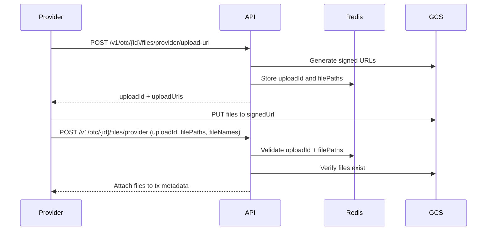

---

### Provider Transaction File Confirm

Confirms OTC provider files and attaches them to the transaction metadata.

**Endpoint:** `POST /v1/otc/[id]/files/provider`

#### Headers

```json
{
    "x-api-key": "string (required)",
    "Authorization": "Bearer {SESSION_TOKEN} (optional)",
    "x-team-id": "string (required)"
}
```

#### Request Body

```json
{
    "uploadId": "upload-uuid",
    "filePaths": ["tx-files/tx-123/1234567890-receipt.pdf"],
    "fileNames": ["receipt.pdf"]
}
```

**Notes:**

-   Uploads are verified against Redis state for the `uploadId`
-   Files are validated in storage before metadata updates
-   Max file size is 5MB per file

#### Response

**Success (200)**

```json
{
    "success": true,
    "data": {
        "tx": {
            "id": "tx-123",
            "metadata": {
                "files": [
                    {
                        "filePath": "tx-files/tx-123/1234567890-receipt.pdf",
                        "fileName": "receipt.pdf",
                        "uploadedAt": "2024-01-01T01:00:00Z",
                        "uploadedBy": "team-uuid-123",
                        "providerTeamId": "team-uuid-123"
                    }
                ]
            }
        }
    }
}
```

---

### Signature Endpoints

The OTC API provides signature endpoints for generating EIP712 signatures for various escrow operations. These endpoints support both backend signing (via Redis keypair) and frontend signing (returns EIP712 data for wallet signing).

#### Approve Split Signature

Generates EIP712 signature for approving escrow splits.

**Endpoint:** `POST /v1/otc/signatures/approve-split`

#### Headers

```json
{
    "x-api-key": "string (required)",
    "Authorization": "Bearer {SESSION_TOKEN} (required)",
    "x-profile-id": "string (required)",
    "x-team-id": "string (required)"
}
```

**Note:** The `Authorization` header with a valid JWT token is optional for backend signing. If not provided, the endpoint returns EIP712 data for frontend signing.

#### Request Body

```json
{
    "otcRequestId": "otc-123",
    "splitIndex": 0,
    "userWalletAddress": "0x742d35Cc6634C0532925a3b8D4C9db96C4b4d8b6"
}
```

#### Field Descriptions

| Field             | Type   | Required | Description                                     |
| ----------------- | ------ | -------- | ----------------------------------------------- |
| otcRequestId      | string | Yes      | OTC request UUID                                |
| splitIndex        | number | Yes      | Index of the split to approve (non-negative)    |
| userWalletAddress | string | Yes      | Wallet address (must be valid Ethereum address) |

#### Response

**Success (200) - Backend Signing**

```json
{
    "success": true,
    "data": {
        "signature": "0x123abc...",
        "signed": true
    }
}
```

**Success (200) - Frontend Signing**

```json
{
    "success": true,
    "data": {
        "domain": {
            "name": "Escrow",
            "version": "1",
            "chainId": "1",
            "verifyingContract": "0x..."
        },
        "types": {
            "ApproveSplit": [{ "name": "index", "type": "uint256" }],
            "EIP712Domain": [
                { "name": "name", "type": "string" },
                { "name": "version", "type": "string" },
                { "name": "chainId", "type": "uint256" },
                { "name": "verifyingContract", "type": "address" }
            ]
        },
        "message": {
            "index": "0"
        },
        "primaryType": "ApproveSplit",
        "signed": false
    }
}
```

**Error Codes**

-   `1` - OTC request not found (404)
-   `2` - Missing escrow address (400)
-   `3` - Missing buy or sell token data (500)
-   `4` - Failed to get escrow domain (500)
-   `5` - Failed to sign with backend (500)

**Bubbled Errors (from other functions):**

-   `VALIDATION_PROFILE-CHECK_*` - Profile/team validation errors (403) - from `validateProfileAndTeam`
-   `VALIDATION_API-AUTH_*` - API key validation errors (403) - from `validateApiKey`

**Notes**

-   Requires `x-profile-id` and `x-team-id` headers for profile/team validation
-   If backend signing fails (e.g., wallet client unavailable), the endpoint automatically falls back to returning EIP712 data for frontend signing

---

#### Deny Split Signature

Generates EIP712 signature for denying escrow splits.

**Endpoint:** `POST /v1/otc/signatures/deny-split`

#### Headers

```json
{
    "x-api-key": "string (required)",
    "Authorization": "Bearer {SESSION_TOKEN} (required)",
    "x-profile-id": "string (required)",
    "x-team-id": "string (required)"
}
```

**Note:** The `Authorization` header with a valid JWT token is optional for backend signing. If not provided, the endpoint returns EIP712 data for frontend signing.

#### Request Body

```json
{
    "otcRequestId": "otc-123",
    "splitIndex": 0,
    "userWalletAddress": "0x742d35Cc6634C0532925a3b8D4C9db96C4b4d8b6"
}
```

#### Field Descriptions

Same as Approve Split Signature.

#### Response

Same format as Approve Split Signature, with `primaryType: "DenySplit"` and `types.DenySplit` instead of `types.ApproveSplit`.

**Error Codes**

Same as Approve Split Signature.

**Bubbled Errors (from other functions):**

Same as Approve Split Signature.

**Notes**

Same as Approve Split Signature.

---

#### Create Escrow - User Signature

Generates EIP712 signature for user escrow approval.

**Endpoint:** `POST /v1/otc/signatures/create-escrow/user`

#### Headers

```json
{
    "x-api-key": "string (required)",
    "Authorization": "Bearer {SESSION_TOKEN} (required)",
    "x-profile-id": "string (required)",
    "x-team-id": "string (required)"
}
```

**Note:** The `Authorization` header with a valid JWT token is optional for backend signing. If not provided, the endpoint returns EIP712 data for frontend signing.

#### Request Body

```json
{
    "otcRequestId": "otc-123",
    "offerId": "offer-123"
}
```

#### Field Descriptions

| Field        | Type   | Required | Description      |
| ------------ | ------ | -------- | ---------------- |
| otcRequestId | string | Yes      | OTC request UUID |
| offerId      | string | Yes      | Offer UUID       |

#### Response

Same format as Approve Split Signature, with `primaryType: "escrowApproval"`.

**Error Codes**

-   `1` - Offer not found (404)
-   `2` - Missing buy or sell token data (500)
-   `3` - Failed to sign with backend (500)

**Bubbled Errors (from other functions):**

-   `VALIDATION_PROFILE-CHECK_*` - Profile/team validation errors (403) - from `validateProfileAndTeam`
-   `VALIDATION_API-AUTH_*` - API key validation errors (403) - from `validateApiKey`

**Notes**

-   Requires `x-profile-id` and `x-team-id` headers for profile/team validation
-   If backend signing fails (e.g., wallet client unavailable), the endpoint automatically falls back to returning EIP712 data for frontend signing

---

#### Create Escrow - Provider Signature

Generates EIP712 signature for provider escrow approval.

**Endpoint:** `POST /v1/otc/signatures/create-escrow/provider`

#### Headers

```json
{
    "x-api-key": "string (required)",
    "Authorization": "Bearer {SESSION_TOKEN} (required)",
    "x-profile-id": "string (required)",
    "x-team-id": "string (required)"
}
```

**Note:** The `Authorization` header with a valid JWT token is optional for backend signing. If not provided, the endpoint returns EIP712 data for frontend signing.

#### Request Body

```json
{
    "otcRequestId": "otc-request-uuid",
    "providerWalletAddress": "0x742d35Cc6634C0532925a3b8D4C9db96C4b4d8b6",
    "offerAmount": 1000.5
}
```

#### Field Descriptions

| Field                 | Type   | Required | Description                                                                 |
| --------------------- | ------ | -------- | --------------------------------------------------------------------------- |
| otcRequestId          | string | Yes      | OTC request UUID                                                            |
| providerWalletAddress | string | Yes      | Wallet address (must be valid Ethereum address)                             |
| offerAmount           | number | No       | Amount of the offer (required for buy requests, optional for sell requests) |

#### Response

Same format as Approve Split Signature, with `primaryType: "escrowApproval"`.

**Error Codes**

-   `1` - OTC request not found (404)
-   `2` - Missing buy or sell token data / Offer amount required for buy requests (500/400)
-   `3` - Failed to sign with backend (500)

**Bubbled Errors (from other functions):**

-   `VALIDATION_PROFILE-CHECK_*` - Profile/team validation errors (403) - from `validateProfileAndTeam`
-   `VALIDATION_API-AUTH_*` - API key validation errors (403) - from `validateApiKey`

**Notes**

-   Requires `x-profile-id` and `x-team-id` headers for profile/team validation
-   If backend signing fails (e.g., wallet client unavailable), the endpoint automatically falls back to returning EIP712 data for frontend signing

**Note:** All signature endpoints require `WRITE` permission (except Create Escrow - Provider which requires `OTC_PROVIDER`) and `x-profile-id`/`x-team-id` headers for profile/team validation. For backend signing, include the `Authorization` header with a valid JWT token. The orgId is automatically extracted from the JWT token's `organization_id` claim. If backend signing fails (e.g., wallet client unavailable or invalid JWT), all endpoints automatically fall back to returning EIP712 data for frontend signing.

---

## Token Structure

Both `buyToken` and `sellToken` follow the same structure when present in responses. They contain three nested objects: `token`, `chain`, and `token_by_chain`.

### Token Object

The `token` object contains global token information:

| Field    | Type    | Description                                |
| -------- | ------- | ------------------------------------------ |
| id       | string  | Unique token UUID                          |
| name     | string  | Token name (e.g., "Ethereum", "USD Coin")  |
| symbol   | string  | Token symbol (e.g., "ETH", "USDC")         |
| image    | string  | Token logo/image URL (nullable)            |
| accepted | boolean | Whether token is accepted for transactions |

### Chain Object

The `chain` object contains blockchain network information:

| Field          | Type   | Description                                                               |
| -------------- | ------ | ------------------------------------------------------------------------- |
| id             | string | Unique chain UUID                                                         |
| slug           | string | Unique chain identifier (e.g., "ethereum", "polygon")                     |
| name           | string | Human-readable chain name (e.g., "Ethereum", "Polygon")                   |
| chainId        | number | Numeric chain identifier (e.g., 1 for Ethereum mainnet, 137 for Polygon)  |
| image          | string | Chain logo/image URL (nullable)                                           |
| type           | string | Blockchain type: `"EVM"`, `"SVM"`, `"BTC"`, or `"FIAT"`                   |
| chainSpecifics | object | Type-specific configuration (JSON object, structure varies by chain type) |
| createdAt      | string | ISO 8601 creation timestamp                                               |

### Token By Chain Object

The `token_by_chain` object contains chain-specific token information:

| Field    | Type   | Description                                                                                                                                                            |
| -------- | ------ | ---------------------------------------------------------------------------------------------------------------------------------------------------------------------- |
| tokenId  | string | Foreign key to the token UUID                                                                                                                                          |
| chainId  | string | Foreign key to the chain UUID                                                                                                                                          |
| address  | string | Token contract address on the chain (e.g., `"0xA0b86991c6218b36c1d19D4a2e9Eb0cE3606eB48"` for USDC on Ethereum). For native tokens, this is typically the zero address |
| decimals | number | Number of decimal places for the token (e.g., 18 for ETH, 6 for USDC)                                                                                                  |
| type     | string | Token type on this specific chain: `"native"`, `"token"`, `"stable"`, or `"fiat"`                                                                                      |
| metadata | object | Chain-specific token metadata (JSON object, structure varies)                                                                                                          |

### Example Token Structure

```json
{
    "buyToken": {
        "token": {
            "id": "550e8400-e29b-41d4-a716-446655440000",
            "name": "Ethereum",
            "symbol": "ETH",
            "image": "https://example.com/tokens/eth.png",
            "accepted": true
        },
        "chain": {
            "id": "660e8400-e29b-41d4-a716-446655440000",
            "slug": "ethereum",
            "name": "Ethereum",
            "chainId": 1,
            "image": "https://example.com/chains/ethereum.png",
            "type": "EVM",
            "chainSpecifics": {
                "rpcUrl": "https://eth.llamarpc.com",
                "explorerUrl": "https://etherscan.io"
            },
            "createdAt": "2024-01-01T00:00:00Z"
        },
        "token_by_chain": {
            "tokenId": "550e8400-e29b-41d4-a716-446655440000",
            "chainId": "660e8400-e29b-41d4-a716-446655440000",
            "address": "0x0000000000000000000000000000000000000000",
            "decimals": 18,
            "type": "native",
            "metadata": {
                "isNative": true
            }
        }
    }
}
```

**Notes:**

-   `buyToken` and `sellToken` may be `null` if the token data is not available
-   The `address` field for native tokens (like ETH) is typically the zero address (`0x0000000000000000000000000000000000000000`)
-   The `decimals` field is crucial for amount calculations (e.g., 1 ETH = 1e18 wei when decimals = 18)
-   The `type` field in `token_by_chain` indicates the token type on that specific chain, which may differ from the global token type

---

#### Check Allowance

Checks ERC20 token allowance for the escrow factory contract.

**Endpoint:** `POST /v1/otc/allowance/check`

#### Headers

```json
{
    "x-api-key": "string (required)"
}
```

#### Request Body

```json
{
    "chainId": 1,
    "tokenAddress": "0xA0b86a91c6218b36c1d19D4a2e9eb0ce3606eb48",
    "senderAddress": "0x742d35Cc6634C0532925a3b8D4C9db96C4b4d8b6",
    "amountToCheck": "1000.5"
}
```

#### Field Descriptions

| Field         | Type   | Required | Description                                    |
| ------------- | ------ | -------- | ---------------------------------------------- |
| chainId       | number | Yes      | Blockchain chain ID (must be positive integer) |
| tokenAddress  | string | Yes      | ERC20 token contract address                   |
| senderAddress | string | Yes      | Wallet address to check allowance for          |
| amountToCheck | string | Yes      | Amount to check (as decimal string)            |

#### Response

**Success (200)**

```json
{
    "success": true,
    "data": {
        "allowanceOk": true,
        "currentAllowance": "1000.5",
        "necessaryAllowance": "0"
    }
}
```

**Error Codes**

-   `1` - Invalid chain ID (400)
-   `2` - Chain not found (400)
-   `3` - Factory address not found for chain (500)
-   `4` - Token decimals not found (500)
-   `5` - Failed to get EVM client (500)
-   `6` - Failed to get allowance (500)

**Notes**

-   `allowanceOk` indicates if current allowance is sufficient
-   `currentAllowance` is returned as a string in human-readable token units (formatted using token decimals)
-   `necessaryAllowance` shows how much more allowance is needed (0 if sufficient, also formatted in human-readable token units)

---

#### Approve Token

Approves ERC20 token for the escrow factory contract. Supports both frontend signing (returns transaction data) and backend signing (auto-signs and sends).

**Endpoint:** `POST /v1/otc/signatures/approve`

#### Headers

```json
{
    "x-api-key": "string (required)",
    "Authorization": "Bearer {SESSION_TOKEN} (required)",
    "x-profile-id": "string (required)",
    "x-team-id": "string (required)"
}
```

**Note:** The `Authorization` header with a valid JWT token is optional for backend signing when `autoSign` is true. If not provided or `autoSign` is false, transaction data is returned for frontend signing.

#### Request Body (Frontend Signing with Max Amount)

```json
{
    "chainId": 1,
    "tokenAddress": "0xA0b86a91c6218b36c1d19D4a2e9eb0ce3606eb48",
    "senderWallet": "0x742d35Cc6634C0532925a3b8D4C9db96C4b4d8b6",
    "amount": "max",
    "autoSign": false
}
```

#### Request Body (Frontend Signing with Specific Amount)

```json
{
    "chainId": 1,
    "tokenAddress": "0xA0b86a91c6218b36c1d19D4a2e9eb0ce3606eb48",
    "senderWallet": "0x742d35Cc6634C0532925a3b8D4C9db96C4b4d8b6",
    "amount": 1000.5,
    "autoSign": false
}
```

#### Request Body (Backend Signing)

```json
{
    "chainId": 1,
    "tokenAddress": "0xA0b86a91c6218b36c1d19D4a2e9eb0ce3606eb48",
    "senderWallet": "0x742d35Cc6634C0532925a3b8D4C9db96C4b4d8b6",
    "amount": "max",
    "autoSign": true
}
```

#### Field Descriptions

| Field        | Type            | Required | Description                                                                        |
| ------------ | --------------- | -------- | ---------------------------------------------------------------------------------- |
| chainId      | number          | Yes      | Blockchain chain ID (must be positive integer)                                     |
| tokenAddress | string          | Yes      | ERC20 token contract address                                                       |
| senderWallet | string          | Yes      | Wallet address to approve from                                                     |
| amount       | number \| "max" | Yes      | Amount to approve: number (converted using token decimals) or "max" for maxUint256 |
| autoSign     | boolean         | No       | Whether to auto-sign and send (default: false)                                     |

#### Response

**Success (200) - Backend Signing**

```json
{
    "success": true,
    "data": {
        "txHash": "0x123abc...",
        "signed": true
    }
}
```

**Success (200) - Frontend Signing**

```json
{
    "success": true,
    "data": {
        "to": "0xA0b86a91c6218b36c1d19D4a2e9eb0ce3606eb48",
        "data": "0x095ea7b3...",
        "value": "0",
        "chainId": 1,
        "signed": false
    }
}
```

**Error Codes**

-   `1` - Invalid chain ID (400)
-   `2` - Factory address not found for chain (500)
-   `3` - Token decimals not found (500)
-   `4` - Failed to get wallet client (500)
-   `5` - Failed to send transaction (500)

**Bubbled Errors (from other functions):**

-   `VALIDATION_PROFILE-CHECK_*` - Profile/team validation errors (403) - from `validateProfileAndTeam`
-   `VALIDATION_API-AUTH_*` - API key validation errors (403) - from `validateApiKey`

**Notes**

-   Requires `x-profile-id` and `x-team-id` headers for profile/team validation
-   When `autoSign` is `true` and `Authorization` header with valid JWT is provided, the orgId is extracted from the JWT and the transaction is signed and sent automatically using the user's Turnkey wallet
-   When `autoSign` is `false` or `Authorization` header is not provided, transaction data is returned for frontend signing
-   `amount` can be a number (will be converted to bigint using token decimals) or `"max"` for maximum approval (`maxUint256`)
-   Transaction data can be sent directly to the blockchain using a wallet provider
-   Addresses are automatically normalized to checksummed format

---

## Offer Status Flow

```
new → accepted → completed
    ↓
rejected
```

## Required Permissions

-   **Create Offer**: `OTC_PROVIDER`
-   **List Offers**: `OTC_PROVIDER`
-   **List Requests**: `OTC_PROVIDER`
-   **List Requests by Status**: `OTC_PROVIDER`
-   **Get Proof URLs**: `READ` (or `MASTER` for unrestricted access)
-   **Withdraw Offer**: `OTC_PROVIDER`
-   **All Signature Endpoints**: `WRITE` (except Create Escrow - Provider which requires `OTC_PROVIDER`)
-   **Check Allowance**: `WRITE`
-   **Approve Token**: `WRITE`

## Status Transition Rules

-   New offers can be accepted or rejected
-   Accepted offers cannot be modified
-   Providers can withdraw their own offers at any time
-   Signature validation is required for all offer operations

## Error Response Format

All error responses follow this structure:

```json
{
    "success": false,
    "error": {
        "code": "ERROR_CODE",
        "message": "Human-readable error message",
        "details": "Additional error details (optional)"
    }
}
```

## Security Notes

-   All offers require cryptographic approval signatures
-   Provider ownership is validated for withdrawal operations using team ID
-   Expired offers are automatically marked as rejected
-   Bank account validation is performed at offer creation
-   Teams must have `otcApproved: true` in their metadata to create offers
-   Team metadata validation is performed before offer creation

## Support

For OTC operations issues, contact the Vudy support team.

---

# Profile Management API

> Source: `app/v1/profile/README.md`

## 📋 Table of Contents

-   [Overview](#overview)
-   [Authentication](#authentication)
-   [Base URL](#base-url)
-   [Endpoints](#endpoints)
    -   [Get Profile](#get-profile)
    -   [Update Username](#update-username)
    -   [Update Metadata](#update-metadata)
-   [Image Upload](#image-upload)
    -   [Get Upload URL](#get-upload-url)
    -   [Confirm Upload](#confirm-upload)
-   [Bank Account Management](#bank-account-management)
    -   [Add Bank Account](#add-bank-account)
    -   [List Bank Accounts](#list-bank-accounts)
    -   [Get Bank Account](#get-bank-account)
    -   [Update Bank Account](#update-bank-account)
    -   [Delete Bank Account](#delete-bank-account)
-   [Notes](#notes)
-   [Error Response Format](#error-response-format)
-   [Support](#support)

## Overview

The Profile Management API provides endpoints for managing user profiles, updating usernames and metadata, and managing bank accounts associated with profiles. The main profile endpoint returns profile details along with associated bank accounts, user information (country, firstName, lastName, language, username), KYC verification status, and associated wallets. All operations require proper authentication and authorization.

## Authentication

All endpoints require API key and session authentication (Pattern C). See [GET_STARTED.md](../../GET_STARTED.md) for detailed authentication patterns.

**Header Example (Pattern C):**

```json
{
    "x-api-key": "string (required)",
    "Authorization": "Bearer {SESSION_TOKEN}"
}
```

**Note:** When using session authentication, `x-profile-id` and `x-team-id` headers are **NOT required** - the session contains the user's current profile context.

## Base URL

```
/v1/profile
```

## Endpoints

### Get Profile

Retrieves profile details with associated bank accounts, user information, KYC verification status, and wallets.

**Endpoint:** `GET /v1/profile`

#### Headers

```json
{
    "x-api-key": "string (required)",
    "Authorization": "Bearer {SESSION_TOKEN}"
}
```

#### Response

**Success (200)**

```json
{
    "success": true,
    "data": {
        "profile": {
            "id": "profile-123",
            "nickname": "johndoe",
            "metadata": {
                "name": "John Doe",
                "image": "https://example.com/avatar.jpg"
            },
            "createdAt": "2024-01-01T00:00:00Z"
        },
        "banks": [
            {
                "bank": {
                    "id": "bank-456",
                    "accountAlias": "Main Checking",
                    "accountType": "CHECKING",
                    "country": "US",
                    "currencyId": "token-uuid",
                    "createdAt": "2024-01-01T00:00:00Z"
                },
                "currency": {
                    "id": "token-uuid",
                    "name": "US Dollar",
                    "symbol": "USD",
                    "image": "https://example.com/usd.png",
                    "accepted": true
                }
            }
        ],
        "user": {
            "country": "US",
            "firstName": "John",
            "lastName": "Doe",
            "language": "en",
            "username": "johndoe"
        },
        "kyc": {
            "isVerified": true,
            "status": "approved"
        },
        "wallets": [
            {
                "address": "0x1234567890123456789012345678901234567890",
                "walletType": "EVM",
                "turnkeyId": "turnkey-wallet-123",
                "turnkeyAddress": "0x1234567890123456789012345678901234567890",
                "profileId": "profile-123",
                "teamId": "team-456",
                "metadata": {},
                "createdAt": "2024-01-01T00:00:00Z",
                "updatedAt": "2024-01-01T00:00:00Z"
            }
        ],
        "imageUrl": "/profile/profile-123/abc123"
    }
}
```

**Response Fields**

| Field                     | Type    | Description                                                              |
| ------------------------- | ------- | ------------------------------------------------------------------------ |
| profile                   | object  | Profile details including nickname, metadata, and creation timestamp     |
| profile.id                | string  | Unique profile ID                                                        |
| profile.nickname          | string  | Profile username/nickname                                                |
| profile.metadata          | object  | Profile metadata (name, image, custom fields)                            |
| profile.createdAt         | string  | ISO 8601 creation timestamp                                              |
| banks                     | array   | Array of bank accounts with associated currency information              |
| banks[].bank              | object  | Bank account details                                                     |
| banks[].bank.id           | string  | Bank account ID                                                          |
| banks[].bank.accountAlias | string  | Friendly name for the account                                            |
| banks[].bank.accountType  | string  | Account type (CHECKING or SAVINGS)                                       |
| banks[].bank.country      | string  | 2-letter ISO country code                                                |
| banks[].bank.currencyId   | string  | Currency token ID                                                        |
| banks[].bank.createdAt    | string  | ISO 8601 creation timestamp                                              |
| banks[].currency          | object  | Currency/token information                                               |
| banks[].currency.id       | string  | Currency token ID                                                        |
| banks[].currency.name     | string  | Currency name (e.g., "US Dollar")                                        |
| banks[].currency.symbol   | string  | Currency symbol (e.g., "USD")                                            |
| banks[].currency.image    | string  | Currency image URL (nullable)                                            |
| banks[].currency.accepted | boolean | Whether currency is accepted for transactions                            |
| user                      | object  | User information associated with the profile                             |
| user.country              | string  | User's country code                                                      |
| user.firstName            | string  | User's first name                                                        |
| user.lastName             | string  | User's last name                                                         |
| user.language             | string  | User's preferred language                                                |
| user.username             | string  | User's username                                                          |
| kyc                       | object  | KYC verification status                                                  |
| kyc.isVerified            | boolean | Whether the user has completed KYC verification                          |
| kyc.status                | string  | Current verification status (none, pending, approved, declined, etc.)    |
| wallets                   | array   | Array of wallets associated with the profile                             |
| wallets[].address         | string  | Wallet address                                                           |
| wallets[].walletType      | string  | Blockchain type (EVM, SVM, BTC, FIAT)                                    |
| wallets[].turnkeyId       | string  | Turnkey wallet ID (nullable)                                             |
| wallets[].turnkeyAddress  | string  | Turnkey address reference (nullable)                                     |
| wallets[].profileId       | string  | Profile ID                                                               |
| wallets[].teamId          | string  | Team ID                                                                  |
| wallets[].metadata        | object  | Additional wallet metadata                                               |
| wallets[].createdAt       | string  | ISO 8601 creation timestamp                                              |
| wallets[].updatedAt       | string  | ISO 8601 last update timestamp                                           |
| imageUrl                  | string  | Profile image proxy URL (optional, only present if profile has an image) |

**Error Codes**

**Endpoint-Specific Errors:**

-   None (no endpoint-specific errors)

**Bubbled Errors (from other functions):**

-   `VALIDATION_API-AUTH_01` through `VALIDATION_API-AUTH_10` - API key validation errors (403/500) - from `validateApiKey`
-   `VALIDATION_SESSION-AUTH_*` - Session validation errors (403) - from `validateSession`
-   `VALIDATION_PROFILE-CHECK_*` - Profile validation errors (403) - from `validateProfile`
-   Various database operation errors (500) - from profile retrieval functions

---

### Update Username

Updates the profile's username/nickname. Ensures uniqueness within the app.

**Endpoint:** `PATCH /v1/profile/username`

#### Headers

```json
{
    "x-api-key": "string (required)",
    "Authorization": "Bearer {SESSION_TOKEN} (required)",
    "x-profile-id": "string (required)"
}
```

#### Request Body

```json
{
    "nickname": "new-username"
}
```

#### Field Descriptions

| Field    | Type   | Required | Description                                                   |
| -------- | ------ | -------- | ------------------------------------------------------------- |
| nickname | string | Yes      | New username (4-50 chars, alphanumeric + underscores/hyphens) |

#### Response

**Success (200)**

```json
{
    "success": true,
    "data": {
        "id": "profile-123",
        "nickname": "new-username",
        "updatedAt": "2024-01-01T00:00:00Z"
    }
}
```

**Error Codes**

**Endpoint-Specific Errors:**

-   `PROFILE_USERNAME_ROUTE_01` - Session data is required for profile operations (400)

**Bubbled Errors (from other functions):**

-   `VALIDATION_API-AUTH_01` through `VALIDATION_API-AUTH_10` - API key validation errors (403/500) - from `validateApiKey`
-   `VALIDATION_SESSION-AUTH_*` - Session validation errors (403) - from `validateSession`
-   `VALIDATION_PROFILE-CHECK_*` - Profile validation errors (403) - from `validateProfile`
-   `BODY-PARSE_01`, `BODY-PARSE_02` - Request body parsing/validation errors (400) - from `parseBodyWithSchema`
-   Various database operation errors (500) - from profile update functions

---

### Update Metadata

Updates profile metadata, merging with existing metadata to preserve custom fields.

**Endpoint:** `PATCH /v1/profile/metadata`

#### Headers

```json
{
    "x-api-key": "string (required)",
    "Authorization": "Bearer {SESSION_TOKEN} (required)",
    "x-profile-id": "string (required)"
}
```

#### Request Body

```json
{
    "name": "John Doe",
    "image": "https://example.com/avatar.jpg",
    "customField": "value"
}
```

#### Field Descriptions

| Field | Type   | Required | Description                       |
| ----- | ------ | -------- | --------------------------------- |
| name  | string | No       | Display name                      |
| image | string | No       | Profile image URL                 |
| \*    | any    | No       | Additional custom metadata fields |

#### Response

**Success (200)**

```json
{
    "success": true,
    "data": {
        "id": "profile-123",
        "metadata": {
            "name": "John Doe",
            "image": "https://example.com/avatar.jpg",
            "customField": "value",
            "existingField": "preserved"
        },
        "updatedAt": "2024-01-01T00:00:00Z"
    }
}
```

**Error Codes**

**Endpoint-Specific Errors:**

-   None (no endpoint-specific errors)

**Bubbled Errors (from other functions):**

-   `VALIDATION_API-AUTH_01` through `VALIDATION_API-AUTH_10` - API key validation errors (403/500) - from `validateApiKey`
-   `VALIDATION_SESSION-AUTH_*` - Session validation errors (403) - from `validateSession`
-   `VALIDATION_PROFILE-CHECK_*` - Profile validation errors (403) - from `validateProfile`
-   `BODY-PARSE_01`, `BODY-PARSE_02` - Request body parsing/validation errors (400) - from `parseBodyWithSchema`
-   Various database operation errors (500) - from profile metadata update functions

---

## Image Upload

The image upload workflow is a two-step process:

1. **Get Upload URL**: Request a signed URL for direct upload to Google Cloud Storage
2. **Confirm Upload**: After uploading the image, confirm the upload to update the profile

#### Workflow Example

```javascript
// Step 1: Get upload URL
const uploadUrlResponse = await fetch("/v1/profile/image/upload-url", {
    method: "POST",
    headers: {
        "x-api-key": "your-api-key",
        Authorization: "Bearer your-session-token",
        "x-profile-id": "profile-123",
        "Content-Type": "application/json",
    },
    body: JSON.stringify({
        fileName: "avatar.jpg",
        contentType: "image/jpeg",
    }),
});

const {
    data: { uploadUrl, filePath },
} = await uploadUrlResponse.json();

// Step 2: Upload image directly to GCS using the signed URL
const imageFile = document.querySelector('input[type="file"]').files[0];
const uploadResponse = await fetch(uploadUrl, {
    method: "PUT",
    headers: {
        "Content-Type": "image/jpeg",
    },
    body: imageFile,
});

if (uploadResponse.ok) {
    // Step 3: Confirm upload and update profile
    const confirmResponse = await fetch("/v1/profile/image", {
        method: "POST",
        headers: {
            "x-api-key": "your-api-key",
            Authorization: "Bearer your-session-token",
            "x-profile-id": "profile-123",
            "Content-Type": "application/json",
        },
        body: JSON.stringify({
            filePath: filePath,
        }),
    });

    const {
        data: { imageUrl },
    } = await confirmResponse.json();
    console.log("Profile image updated:", imageUrl); // e.g., "/profile/profile-123/abc123"
}
```

### Get Upload URL

Generates a signed upload URL that allows the frontend to upload an image directly to Google Cloud Storage.

**Endpoint:** `POST /v1/profile/image/upload-url`

#### Headers

```json
{
    "x-api-key": "string (required)",
    "Authorization": "Bearer {SESSION_TOKEN} (required)",
    "x-profile-id": "string (required)"
}
```

#### Request Body

```json
{
    "fileName": "avatar.jpg",
    "contentType": "image/jpeg"
}
```

#### Field Descriptions

| Field       | Type   | Required | Description                                                         |
| ----------- | ------ | -------- | ------------------------------------------------------------------- |
| fileName    | string | Yes      | Image file name (must have extension: jpg, jpeg, png, webp, gif)    |
| contentType | string | Yes      | MIME type (image/jpeg, image/jpg, image/png, image/webp, image/gif) |

#### Response

**Success (200)**

```json
{
    "success": true,
    "data": {
        "uploadUrl": "https://storage.googleapis.com/bucket/profile-images/profile-123/1234567890-abc123.jpg?X-Goog-Algorithm=...",
        "filePath": "profile-images/profile-123/1234567890-abc123.jpg",
        "expiresAt": "2024-01-01T12:00:00Z"
    }
}
```

**Error Codes**

**Endpoint-Specific Errors:**

-   `V1_PROFILE_IMAGE_UPLOAD_URL_02` - Failed to generate upload URL (500)

**Bubbled Errors (from other functions):**

-   `VALIDATION_API-AUTH_01` through `VALIDATION_API-AUTH_10` - API key validation errors (403/500) - from `validateApiKey`
-   `VALIDATION_SESSION-AUTH_*` - Session validation errors (403) - from `validateSession`
-   `VALIDATION_PROFILE-CHECK_*` - Profile validation errors (403) - from `validateProfile`
-   `BODY-PARSE_01`, `BODY-PARSE_02` - Request body parsing/validation errors (400) - from `parseBodyWithSchema`

---

### Confirm Upload

Confirms an image upload and updates the profile with the new image. Called after the frontend uploads the image to GCS using the signed URL.

**Endpoint:** `POST /v1/profile/image`

#### Headers

```json
{
    "x-api-key": "string (required)",
    "Authorization": "Bearer {SESSION_TOKEN} (required)",
    "x-profile-id": "string (required)"
}
```

#### Request Body

```json
{
    "filePath": "profile-images/profile-123/1234567890-abc123.jpg"
}
```

#### Field Descriptions

| Field    | Type   | Required | Description                                     |
| -------- | ------ | -------- | ----------------------------------------------- |
| filePath | string | Yes      | File path returned from the upload URL endpoint |

#### Response

**Success (200)**

```json
{
    "success": true,
    "data": {
        "imageUrl": "/profile/profile-123/abc123"
    }
}
```

**Error Codes**

**Endpoint-Specific Errors:**

-   `V1_PROFILE_IMAGE_CONFIRM_02` - Failed to update profile image (500)

**Bubbled Errors (from other functions):**

-   `VALIDATION_API-AUTH_01` through `VALIDATION_API-AUTH_10` - API key validation errors (403/500) - from `validateApiKey`
-   `VALIDATION_SESSION-AUTH_*` - Session validation errors (403) - from `validateSession`
-   `VALIDATION_PROFILE-CHECK_*` - Profile validation errors (403) - from `validateProfile`
-   `BODY-PARSE_01`, `BODY-PARSE_02` - Request body parsing/validation errors (400) - from `parseBodyWithSchema`
-   Various database operation errors (500) - from profile image update functions

---

## Bank Account Management

### Add Bank Account

Adds a new bank account linked to the profile.

**Endpoint:** `POST /v1/profile/banks`

#### Headers

```json
{
    "x-api-key": "string (required)",
    "Authorization": "Bearer {SESSION_TOKEN} (required)",
    "x-profile-id": "string (required)"
}
```

#### Request Body

```json
{
    "accountName": "John Doe",
    "accountAlias": "Main Checking",
    "accountType": "CHECKING",
    "accountNumber": "1234567890",
    "country": "US",
    "currencySymbol": "USD",
    "bankSlug": "chase",
    "additionalData": {
        "routingNumber": "021000021"
    }
}
```

#### Field Descriptions

| Field          | Type   | Required | Description                                           |
| -------------- | ------ | -------- | ----------------------------------------------------- |
| accountName    | string | Yes      | Account holder name                                   |
| accountAlias   | string | Yes      | Friendly name for the account                         |
| accountType    | string | Yes      | CHECKING or SAVINGS                                   |
| accountNumber  | string | Yes      | Bank account number                                   |
| country        | string | Yes      | 2-letter ISO country code                             |
| currencySymbol | string | Yes      | 3-letter currency code                                |
| bankSlug       | string | Yes      | Bank identifier                                       |
| additionalData | object | No       | Country-specific fields (routing number, SWIFT, etc.) |

#### Response

**Success (201)**

```json
{
    "success": true,
    "data": {
        "id": "bank-456",
        "accountAlias": "Main Checking",
        "accountType": "CHECKING",
        "country": "US",
        "currency": "USD",
        "createdAt": "2024-01-01T00:00:00Z"
    }
}
```

**Error Codes**

**Endpoint-Specific Errors:**

-   `PROFILE_BANKS_ROUTE_01` - Invalid currency symbol (400)

**Bubbled Errors (from other functions):**

-   `VALIDATION_API-AUTH_01` through `VALIDATION_API-AUTH_10` - API key validation errors (403/500) - from `validateApiKey`
-   `VALIDATION_SESSION-AUTH_*` - Session validation errors (403) - from `validateSession`
-   `VALIDATION_PROFILE-CHECK_*` - Profile validation errors (403) - from `validateProfile`
-   `BODY-PARSE_01`, `BODY-PARSE_02` - Request body parsing/validation errors (400) - from `parseBodyWithSchema`
-   Various database operation errors (500) - from bank account creation functions

---

### List Bank Accounts

Retrieves all bank accounts associated with the profile.

**Endpoint:** `GET /v1/profile/banks`

#### Response

**Success (200)**

```json
{
    "success": true,
    "data": [
        {
            "id": "bank-123",
            "accountAlias": "Main Checking",
            "accountType": "CHECKING",
            "country": "US",
            "createdAt": "2024-01-01T00:00:00Z"
        }
    ]
}
```

**Error Codes**

**Endpoint-Specific Errors:**

-   None (no endpoint-specific errors)

**Bubbled Errors (from other functions):**

-   `VALIDATION_API-AUTH_01` through `VALIDATION_API-AUTH_10` - API key validation errors (403/500) - from `validateApiKey`
-   `VALIDATION_SESSION-AUTH_*` - Session validation errors (403) - from `validateSession`
-   `VALIDATION_PROFILE-CHECK_*` - Profile validation errors (403) - from `validateProfile`
-   Various database operation errors (500) - from bank account retrieval functions

---

### Get Bank Account

Retrieves a specific bank account by ID.

**Endpoint:** `GET /v1/profile/banks/[id]`

#### Path Parameters

-   `id` (string, required) - Bank account ID

#### Response

**Success (200)**

```json
{
    "success": true,
    "data": {
        "id": "bank-123",
        "accountName": "John Doe",
        "accountAlias": "Main Checking",
        "accountType": "CHECKING",
        "bankSlug": "chase",
        "country": "US",
        "createdAt": "2024-01-01T00:00:00Z"
    }
}
```

**Error Codes**

**Endpoint-Specific Errors:**

-   `PROFILE_BANKS_ROUTE_01` - Bank account not found (404)

**Bubbled Errors (from other functions):**

-   `VALIDATION_API-AUTH_01` through `VALIDATION_API-AUTH_10` - API key validation errors (403/500) - from `validateApiKey`
-   `VALIDATION_SESSION-AUTH_*` - Session validation errors (403) - from `validateSession`
-   `VALIDATION_PROFILE-CHECK_*` - Profile validation errors (403) - from `validateProfile`
-   Various database operation errors (500) - from bank account retrieval functions

---

### Update Bank Account

Updates bank account details (only account name and alias can be updated).

**Endpoint:** `PATCH /v1/profile/banks/[id]`

#### Path Parameters

-   `id` (string, required) - Bank account ID

#### Request Body

```json
{
    "accountName": "John Doe",
    "accountAlias": "Updated Alias"
}
```

#### Response

**Success (200)**

```json
{
    "success": true,
    "data": {
        "id": "bank-123",
        "accountName": "John Doe",
        "accountAlias": "Updated Alias",
        "updatedAt": "2024-01-01T00:00:00Z"
    }
}
```

**Error Codes**

**Endpoint-Specific Errors:**

-   None (no endpoint-specific errors)

**Bubbled Errors (from other functions):**

-   `VALIDATION_API-AUTH_01` through `VALIDATION_API-AUTH_10` - API key validation errors (403/500) - from `validateApiKey`
-   `VALIDATION_SESSION-AUTH_*` - Session validation errors (403) - from `validateSession`
-   `VALIDATION_PROFILE-CHECK_*` - Profile validation errors (403) - from `validateProfile`
-   `BODY-PARSE_01`, `BODY-PARSE_02` - Request body parsing/validation errors (400) - from `parseBodyWithSchema`
-   Various database operation errors (500) - from bank account update functions

---

### Delete Bank Account

Deletes a bank account. Requires proper permissions.

**Endpoint:** `DELETE /v1/profile/banks/[id]`

#### Path Parameters

-   `id` (string, required) - Bank account ID

#### Response

**Success (200)**

```json
{
    "success": true,
    "data": {
        "deleted": true
    }
}
```

**Error Codes**

**Endpoint-Specific Errors:**

-   None (no endpoint-specific errors)

**Bubbled Errors (from other functions):**

-   `VALIDATION_API-AUTH_01` through `VALIDATION_API-AUTH_10` - API key validation errors (403/500) - from `validateApiKey`
-   `VALIDATION_SESSION-AUTH_*` - Session validation errors (403) - from `validateSession`
-   `VALIDATION_PROFILE-CHECK_*` - Profile validation errors (403) - from `validateProfile`
-   Various database operation errors (500) - from bank account deletion functions

---

## Notes

-   Bank account data is encrypted at rest
-   Only account name and alias can be updated; other fields require deletion and recreation
-   Country-specific validation is applied based on the country field
-   API keys must have appropriate permissions for bank operations

## Error Response Format

All error responses follow this structure:

```json
{
    "success": false,
    "error": {
        "code": "ERROR_CODE",
        "message": "Human-readable error message",
        "details": "Additional error details (optional)"
    }
}
```

## Support

For profile management issues, contact the Vudy support team.

---

# Team Management API

> Source: `app/v1/teams/README.md`

## 📋 Table of Contents

-   [Overview](#overview)
-   [Authentication](#authentication)
-   [Base URL](#base-url)
-   [Endpoints](#endpoints)
    -   [List Team Members](#list-team-members)
    -   [Update Team Member Role](#update-team-member-role)
    -   [Block Team Member](#block-team-member)
    -   [Create Team Invitation](#create-team-invitation)
    -   [List Pending Invitations](#list-pending-invitations)
    -   [Cancel Invitation](#cancel-invitation)
    -   [Update Team Type](#update-team-type)
    -   [Add Team Country](#add-team-country)
    -   [Remove Team Country](#remove-team-country)
    -   [List Team Bank Accounts](#list-team-bank-accounts)
    -   [Create Team API Key](#create-team-api-key)
    -   [List Team API Keys](#list-team-api-keys)
    -   [Update Team API Key Webhook](#update-team-api-key-webhook)
    -   [Delete Team API Key](#delete-team-api-key)
    -   [Create Webhook](#create-webhook)
    -   [Update Webhook Notification Types](#update-webhook-notification-types)
    -   [Delete Webhook](#delete-webhook)
    -   [Update Team Metadata](#update-team-metadata)
-   [Update Team Tax Info](#update-team-tax-info)
-   [Set Default Team Tax Info](#set-default-team-tax-info)
    -   [Request Developer Access](#request-developer-access)
    -   [Get Team Activity](#get-team-activity)
-   [Image Upload](#image-upload)
    -   [Get Upload URL](#get-upload-url)
    -   [Confirm Upload](#confirm-upload)
-   [Team Roles](#team-roles)
-   [Permission Levels](#permission-levels)
-   [Error Response Format](#error-response-format)
-   [Support](#support)

## Overview

The Team Management API provides endpoints for managing team members, invitations, roles, and accessing team resources. Supports team member listing, role updates, blocking members, and invitation management.

## Authentication

All endpoints require API key authentication via the `x-api-key` header. See [GET_STARTED.md](../../GET_STARTED.md) for detailed authentication patterns.

**Header Patterns:**

### Pattern A: API Key Only

```json
{
    "x-api-key": "string (required)"
}
```

**Example Endpoints:**
- `PUT /v1/teams/type` - Update team type

### Pattern B: API Key + Profile/Team Headers

Use for server-to-server calls without user sessions.

```json
{
    "x-api-key": "string (required)",
    "x-profile-id": "string (required)",
    "x-team-id": "string (required)"
}
```

**Example Endpoints:**
- `GET /v1/teams/members` - List team members
- `GET /v1/teams/banks` - List team bank accounts
- `PUT /v1/teams/members/[profileId]/role` - Update team member role

### Pattern C: API Key + Authorization Token

Use for user-authenticated operations. **No profile/team headers needed** - session contains profile context.

```json
{
    "x-api-key": "string (required)",
    "Authorization": "Bearer {SESSION_TOKEN}"
}
```

**Example Endpoints:**
- `POST /v1/teams/api/create` - Create team API key
- `GET /v1/teams/api/keys` - List team API keys
- `GET /v1/teams/[teamId]/activity` - Get team activity

## Base URL

```
/v1/teams
```

## Endpoints

### List Team Members

Retrieves all team members with their roles, join dates, profile data, user information, and profile image URLs.

**Endpoint:** `GET /v1/teams/members`

#### Headers

```json
{
    "x-api-key": "string (required)",
    "x-profile-id": "string (required)",
    "x-team-id": "string (required)"
}
```

#### Response

**Success (200)**

```json
{
    "success": true,
    "data": [
        {
            "profileId": "profile-123",
            "role": "admin",
            "joinedAt": "2024-01-01T00:00:00Z",
            "addedBy": "profile-456",
            "profile": {
                "id": "profile-123",
                "nickname": "johndoe",
                "metadata": {},
                "createdAt": "2024-01-01T00:00:00Z",
                "updatedAt": "2024-01-01T00:00:00Z"
            },
            "user": {
                "id": "user-123",
                "username": "johndoe",
                "email": "john@example.com",
                "firstName": "John",
                "lastName": "Doe",
                "country": "US",
                "language": "en"
            },
            "imageUrl": "/profile/profile-123/abc123"
        }
    ]
}
```

#### Response Fields

| Field             | Type   | Description                                                 |
| ----------------- | ------ | ----------------------------------------------------------- |
| profileId         | string | Profile ID of the team member                               |
| role              | string | Team role (admin, developer, or member)                     |
| joinedAt          | string | ISO 8601 timestamp when member joined                       |
| addedBy           | string | Profile ID of the user who added this member                |
| profile           | object | Profile information                                         |
| profile.id        | string | Profile ID                                                  |
| profile.nickname  | string | Profile nickname                                            |
| profile.metadata  | object | Profile metadata (custom fields)                            |
| profile.createdAt | string | ISO 8601 timestamp when profile was created                 |
| profile.updatedAt | string | ISO 8601 timestamp when profile was last updated (nullable) |
| user              | object | User information                                            |
| user.id           | string | User ID                                                     |
| user.username     | string | Username                                                    |
| user.email        | string | Email address                                               |
| user.firstName    | string | First name                                                  |
| user.lastName     | string | Last name                                                   |
| user.country      | string | Country code                                                |
| user.language     | string | Language code                                               |
| imageUrl          | string | Profile image URL (optional, only if image exists)          |

**Error Codes**

**Endpoint-Specific Errors:**

-   None (no endpoint-specific errors)

**Bubbled Errors (from other functions):**

-   `VALIDATION_API-AUTH_01` through `VALIDATION_API-AUTH_10` - API key validation errors (403/500) - from `validateApiKey`
-   `VALIDATION_PROFILE-AND-TEAM_*` - Team context validation errors (403) - from `validateProfileAndTeam`
-   Various database operation errors (500) - from team member retrieval functions

---

### Update Team Member Role

Updates a team member's role. Requires admin privileges.

**Endpoint:** `PATCH /v1/teams/members/[profileId]/role`

#### Path Parameters

-   `profileId` (string, required) - Profile ID of the member

#### Headers

```json
{
    "x-api-key": "string (required)",
    "x-profile-id": "string (required)",
    "x-team-id": "string (required)"
}
```

#### Request Body

```json
{
    "role": "member | developer | admin"
}
```

#### Field Descriptions

| Field | Type   | Required | Description                            |
| ----- | ------ | -------- | -------------------------------------- |
| role  | string | Yes      | New role (member, developer, or admin) |

#### Response

**Success (200)**

```json
{
    "success": true,
    "data": {
        "profileId": "profile-123",
        "role": "developer"
    }
}
```

**Error Codes**

**Endpoint-Specific Errors:**

-   `TEAMS_MEMBERS_ROUTE_01` - Insufficient permissions (401)

**Bubbled Errors (from other functions):**

-   `VALIDATION_API-AUTH_01` through `VALIDATION_API-AUTH_10` - API key validation errors (403/500) - from `validateApiKey`
-   `VALIDATION_PROFILE-AND-TEAM_*` - Team context validation errors (403) - from `validateProfileAndTeam`
-   `BODY-PARSE_01`, `BODY-PARSE_02` - Request body parsing/validation errors (400) - from `parseBodyWithSchema`
-   Various database operation errors (500) - from role update functions

---

### Block Team Member

Blocks a team member by changing their role to "blocked". Blocked users can login but have no access to team resources.

**Endpoint:** `DELETE /v1/teams/members/[profileId]`

#### Path Parameters

-   `profileId` (string, required) - Profile ID of the member to block

#### Headers

```json
{
    "x-api-key": "string (required)",
    "x-profile-id": "string (required)",
    "x-team-id": "string (required)"
}
```

#### Response

**Success (200)**

```json
{
    "success": true,
    "data": {
        "profileId": "profile-123",
        "blocked": true
    }
}
```

**Error Codes**

**Endpoint-Specific Errors:**

-   `TEAMS_MEMBERS_ROUTE_01` - Insufficient permissions (401)

**Bubbled Errors (from other functions):**

-   `VALIDATION_API-AUTH_01` through `VALIDATION_API-AUTH_10` - API key validation errors (403/500) - from `validateApiKey`
-   `VALIDATION_PROFILE-AND-TEAM_*` - Team context validation errors (403) - from `validateProfileAndTeam`
-   Various database operation errors (500) - from member blocking functions

---

### Create Team Invitation

Creates a team invitation with a specific role. Requires admin privileges.

**Endpoint:** `POST /v1/teams/invitations`

#### Headers

```json
{
    "x-api-key": "string (required)",
    "x-profile-id": "string (required)",
    "x-team-id": "string (required)"
}
```

#### Request Body

```json
{
    "email": "user@example.com",
    "role": "member"
}
```

#### Field Descriptions

| Field | Type   | Required | Description                                 |
| ----- | ------ | -------- | ------------------------------------------- |
| email | string | Yes      | Email address of invitee                    |
| role  | string | Yes      | Role for the invitee (defaults to "member") |

#### Response

**Success (201)**

```json
{
    "success": true,
    "data": {
        "id": "invitation-123",
        "email": "user@example.com",
        "role": "member",
        "expiresAt": "2024-01-08T00:00:00Z"
    }
}
```

**Error Codes**

**Endpoint-Specific Errors:**

-   `TEAMS_INVITATIONS_ROUTE_01` - Insufficient permissions (401)
-   `TEAMS_INVITATIONS_ROUTE_02` - User already in team (409)

**Bubbled Errors (from other functions):**

-   `VALIDATION_API-AUTH_01` through `VALIDATION_API-AUTH_10` - API key validation errors (403/500) - from `validateApiKey`
-   `VALIDATION_PROFILE-AND-TEAM_*` - Team context validation errors (403) - from `validateProfileAndTeam`
-   `BODY-PARSE_01`, `BODY-PARSE_02` - Request body parsing/validation errors (400) - from `parseBodyWithSchema`
-   Various database operation errors (500) - from invitation creation, email sending functions

---

### List Pending Invitations

Retrieves all pending invitations for the team. Requires admin privileges.

**Endpoint:** `GET /v1/teams/invitations`

#### Headers

```json
{
    "x-api-key": "string (required)",
    "x-profile-id": "string (required)",
    "x-team-id": "string (required)"
}
```

#### Response

**Success (200)**

```json
{
    "success": true,
    "data": [
        {
            "id": "invitation-123",
            "email": "user@example.com",
            "role": "member",
            "expiresAt": "2024-01-08T00:00:00Z",
            "createdAt": "2024-01-01T00:00:00Z"
        }
    ]
}
```

**Error Codes**

**Endpoint-Specific Errors:**

-   None (no endpoint-specific errors)

**Bubbled Errors (from other functions):**

-   `VALIDATION_API-AUTH_01` through `VALIDATION_API-AUTH_10` - API key validation errors (403/500) - from `validateApiKey`
-   `VALIDATION_PROFILE-AND-TEAM_*` - Team context validation errors (403) - from `validateProfileAndTeam`
-   Various database operation errors (500) - from invitation retrieval functions

---

### Cancel Invitation

Cancels a pending invitation. Requires admin privileges.

**Endpoint:** `DELETE /v1/teams/invitations/[id]`

#### Path Parameters

-   `id` (string, required) - Invitation ID

#### Headers

```json
{
    "x-api-key": "string (required)",
    "x-profile-id": "string (required)",
    "x-team-id": "string (required)"
}
```

#### Response

**Success (200)**

```json
{
    "success": true,
    "data": {
        "id": "invitation-123",
        "status": "rejected",
        "updatedAt": "2024-01-01T00:00:00Z"
    }
}
```

**Error Codes**

**Endpoint-Specific Errors:**

-   `TEAMS_INVITATIONS_ROUTE_01` - Insufficient permissions (401)
-   `TEAMS_INVITATIONS_ROUTE_02` - Invitation not found (404)

**Bubbled Errors (from other functions):**

-   `VALIDATION_API-AUTH_01` through `VALIDATION_API-AUTH_10` - API key validation errors (403/500) - from `validateApiKey`
-   `VALIDATION_PROFILE-AND-TEAM_*` - Team context validation errors (403) - from `validateProfileAndTeam`
-   Various database operation errors (500) - from invitation cancellation functions

---

### Update Team Type

Updates a team's type. Currently only accessible by master team.

**Endpoint:** `PATCH /v1/teams/type`

#### Headers

```json
{
    "x-api-key": "string (required)"
}
```

#### Request Body

```json
{
    "teamId": "team-uuid",
    "type": ["OTC", "vudy", "third", "master"]
}
```

#### Field Descriptions

| Field  | Type     | Required | Description                                                         |
| ------ | -------- | -------- | ------------------------------------------------------------------- |
| teamId | string   | Yes      | Team ID to update                                                   |
| type   | string[] | Yes      | Array of team types. Valid values: "OTC", "vudy", "third", "master" |

#### Response

**Success (200)**

```json
{
    "success": true,
    "data": {
        "id": "team-123",
        "name": "Team Name",
        "type": "OTC,vudy",
        "updatedAt": "2024-01-01T12:00:00Z"
    }
}
```

**Error Codes**

**Endpoint-Specific Errors:**

-   None (no endpoint-specific errors)

**Bubbled Errors (from other functions):**

-   `VALIDATION_API-AUTH_01` through `VALIDATION_API-AUTH_10` - API key validation errors (403/500) - from `validateApiKey`
-   `BODY-PARSE_01`, `BODY-PARSE_02` - Request body parsing/validation errors (400) - from `parseBodyWithSchema`
-   Various database operation errors (500) - from team type update functions

**Notes**

-   Team type supports multiple values as comma-separated string in database
-   Valid types: "OTC", "vudy", "third", "master"
-   Teams with "OTC" in type can create OTC offers
-   Currently only master team can update team types (TODO: implement authorization)

---

### Add Team Country

Adds a country to the team's allowed countries. Requires admin privileges.

**Endpoint:** `POST /v1/teams/countries`

#### Headers

```json
{
    "x-api-key": "string (required)",
    "x-profile-id": "string (required)",
    "x-team-id": "string (required)"
}
```

#### Request Body

```json
{
    "country": "US"
}
```

#### Field Descriptions

| Field   | Type   | Required | Description                          |
| ------- | ------ | -------- | ------------------------------------ |
| country | string | Yes      | ISO 3166-1 alpha-2 country code      |

#### Response

**Success (200)**

```json
{
    "success": true,
    "data": {
        "id": "team-123",
        "countries": ["US", "AR"],
        "updatedAt": "2024-01-01T12:00:00Z"
    }
}
```

**Error Codes**

**Endpoint-Specific Errors:**

-   `APP_V1_TEAMS_COUNTRIES_01` - Missing profile or team (400)
-   `APP_V1_TEAMS_COUNTRIES_02` - Insufficient permissions (403)
-   `APP_V1_TEAMS_COUNTRIES_03` - Unsupported country code (400)

**Bubbled Errors (from other functions):**

-   `VALIDATION_API-AUTH_01` through `VALIDATION_API-AUTH_10` - API key validation errors (403/500)
-   `VALIDATION_PROFILE-AND-TEAM_*` - Team context validation errors (403)
-   `BODY-PARSE_01`, `BODY-PARSE_02` - Request body parsing/validation errors (400)
-   Various database operation errors (500) - from team update functions

---

### Remove Team Country

Removes a country from the team's allowed countries. Requires admin privileges.

**Endpoint:** `DELETE /v1/teams/countries`

#### Headers

```json
{
    "x-api-key": "string (required)",
    "x-profile-id": "string (required)",
    "x-team-id": "string (required)"
}
```

#### Request Body

```json
{
    "country": "US"
}
```

#### Field Descriptions

| Field   | Type   | Required | Description                          |
| ------- | ------ | -------- | ------------------------------------ |
| country | string | Yes      | ISO 3166-1 alpha-2 country code      |

#### Response

**Success (200)**

```json
{
    "success": true,
    "data": {
        "id": "team-123",
        "countries": ["AR"],
        "updatedAt": "2024-01-01T12:00:00Z"
    }
}
```

**Error Codes**

**Endpoint-Specific Errors:**

-   `APP_V1_TEAMS_COUNTRIES_01` - Missing profile or team (400)
-   `APP_V1_TEAMS_COUNTRIES_02` - Insufficient permissions (403)

**Bubbled Errors (from other functions):**

-   `VALIDATION_API-AUTH_01` through `VALIDATION_API-AUTH_10` - API key validation errors (403/500)
-   `VALIDATION_PROFILE-AND-TEAM_*` - Team context validation errors (403)
-   `BODY-PARSE_01`, `BODY-PARSE_02` - Request body parsing/validation errors (400)
-   Various database operation errors (500) - from team update functions

---

### List Team Bank Accounts

Retrieves all bank accounts for team members. Requires admin privileges.

**Endpoint:** `GET /v1/teams/banks`

#### Headers

```json
{
    "x-api-key": "string (required)",
    "x-profile-id": "string (required)",
    "x-team-id": "string (required)"
}
```

#### Response

**Success (200)**

```json
{
    "success": true,
    "data": [
        {
            "profile": {
                "id": "profile-123",
                "nickname": "johndoe"
            },
            "banks": [
                {
                    "id": "bank-789",
                    "accountAlias": "Main Checking",
                    "accountType": "CHECKING"
                }
            ]
        }
    ]
}
```

**Error Codes**

**Endpoint-Specific Errors:**

-   None (no endpoint-specific errors)

**Bubbled Errors (from other functions):**

-   `VALIDATION_API-AUTH_01` through `VALIDATION_API-AUTH_10` - API key validation errors (403/500) - from `validateApiKey`
-   `VALIDATION_PROFILE-AND-TEAM_*` - Team context validation errors (403) - from `validateProfileAndTeam`
-   Various database operation errors (500) - from bank account retrieval functions

---

### Create Team API Key

Creates a new team-level API key. Requires both API key authentication and session authentication. The team is automatically extracted from the user's profile based on the session's organization ID and the login-selected profile (`currentProfileId`) stored in the session.

**Endpoint:** `POST /v1/teams/api/create`

#### Headers

```json
{
    "x-api-key": "string (required)",
    "Authorization": "Bearer <session-token> (required)"
}
```

#### Request Body

```json
{
    "name": "Team Production API Key",
    "permissions": ["READ", "WRITE", "WEBHOOK"],
    "webhookUrl": "https://example.com/webhook",
    "secret": "my-webhook-secret"
}
```

#### Field Descriptions

| Field       | Type     | Required | Description                                                                                                                            |
| ----------- | -------- | -------- | -------------------------------------------------------------------------------------------------------------------------------------- |
| name        | string   | Yes      | API key name (minimum 1 character)                                                                                                     |
| permissions | string[] | Yes      | Array of permissions. Valid values: "READ", "WRITE", "WEBHOOK", "ADMIN", "DELETE". Cannot include "MASTER", "OTC_PROVIDER", or "EMAIL" |
| webhookUrl  | string   | No       | Webhook URL for team-level webhook notifications. Must be a valid URL if provided.                                                     |
| secret      | string   | No       | Webhook secret for authentication. Will be encrypted before storage.                                                                   |

#### Response

**Success (201)**

```json
{
    "success": true,
    "data": {
        "id": "api-key-123",
        "key": "vudy_live_abc123...xyz789",
        "keyPrefix": "vudy_live_abc123",
        "environment": "production",
        "permissions": ["READ", "WRITE", "WEBHOOK"],
        "expiresAt": null
    }
}
```

**Error Codes**

**Endpoint-Specific Errors:**

-   `APP_V1_TEAMS_API_CREATE_01` - Invalid session (401)
-   `APP_V1_TEAMS_API_CREATE_02` - Invalid request body (400)
-   `APP_V1_TEAMS_API_CREATE_03` - Profile not found for organization (403)
-   `APP_V1_TEAMS_API_CREATE_04` - Team not found (403)
-   `APP_V1_TEAMS_API_CREATE_05` - Failed to create API key (500)
-   `APP_V1_TEAMS_API_CREATE_06` - Failed to get team (500)
-   `APP_V1_TEAMS_API_CREATE_07` - Developer access not enabled for team (403)

**Bubbled Errors (from other functions):**

-   `VALIDATION_API-AUTH_01` through `VALIDATION_API-AUTH_10` - API key validation errors (403/500) - from `validateApiKey`
-   `BODY-PARSE_01`, `BODY-PARSE_02` - Request body parsing/validation errors (400) - from `parseBodyWithSchema`
-   Various database operation errors (500) - from API key creation functions

**Notes:**

-   Requires both API key authentication and session authentication
-   The team is automatically extracted from the user's profile based on the session's organization ID
-   Only teams with `team.metadata.devAccess === true` can create team API keys
-   The environment is automatically set based on `ENV_TYPE` environment variable (production or sandbox)
-   The plaintext API key (`key`) is only returned once during creation - store it securely
-   Cannot create API keys with MASTER, OTC_PROVIDER, or EMAIL permissions
-   Valid permissions: READ, WRITE, WEBHOOK, ADMIN, DELETE
-   If `webhookUrl` is provided, webhooks will be sent to this URL for transactions created with this API key
-   The `secret` is encrypted using AES-GCM before storage and decrypted when sending webhooks

---

### List Team API Keys

Lists all team-level API keys. Requires both API key authentication and session authentication. The team is automatically extracted from the user's profile based on the session's organization ID and the login-selected profile (`currentProfileId`) stored in the session.

**Endpoint:** `GET /v1/teams/api/keys`

#### Headers

```json
{
    "x-api-key": "string (required)",
    "Authorization": "Bearer <session-token> (required)"
}
```

#### Response

**Success (200)**

```json
{
    "success": true,
    "data": [
        {
            "id": "api-key-123",
            "appId": "app-456",
            "teamId": "team-789",
            "name": "Team Production API Key",
            "keyPrefix": "vudy_live_abc123",
            "environment": "production",
            "permissions": ["READ", "WRITE", "WEBHOOK"],
            "rateLimit": 1200,
            "burstLimit": 100,
            "expiresAt": null,
            "lastUsedAt": "2024-01-15T10:30:00Z",
            "isEnabled": true,
            "metadata": {},
            "createdAt": "2024-01-01T00:00:00Z",
            "updatedAt": "2024-01-15T10:30:00Z"
        }
    ]
}
```

**Error Codes**

**Endpoint-Specific Errors:**

-   `APP_V1_TEAMS_API_KEYS_01` - Invalid session (401)
-   `APP_V1_TEAMS_API_KEYS_02` - Profile not found for organization (403)
-   `APP_V1_TEAMS_API_KEYS_03` - Team not found (403)
-   `APP_V1_TEAMS_API_KEYS_04` - Failed to get team (500)
-   `APP_V1_TEAMS_API_KEYS_05` - Failed to get API keys (500)

**Bubbled Errors (from other functions):**

-   `VALIDATION_API-AUTH_01` through `VALIDATION_API-AUTH_10` - API key validation errors (403/500) - from `validateApiKey`
-   Various database operation errors (500) - from API key retrieval functions

**Notes:**

-   Requires both API key authentication and session authentication
-   The team is automatically extracted from the user's profile based on the session's organization ID
-   Returns all API keys for the team (excluding `keyHash` for security)
-   Any team member can list API keys

---

### Update Team API Key Webhook

Updates the webhook URL and/or secret for a team-level API key. Requires both API key authentication (with MASTER permission) and session authentication with admin role. Verifies the API key belongs to the team before updating.

**Endpoint:** `PATCH /v1/teams/api/keys/[keyId]`

#### Path Parameters

-   `keyId` (string, required) - API key ID to update

#### Headers

```json
{
    "x-api-key": "string (required, must include MASTER permission)",
    "Authorization": "Bearer <session-token> (required)"
}
```

#### Request Body

```json
{
    "webhookUrl": "https://example.com/new-webhook",
    "secret": "new-webhook-secret"
}
```

#### Field Descriptions

| Field      | Type   | Required | Description                                                                     |
| ---------- | ------ | -------- | ------------------------------------------------------------------------------- |
| webhookUrl | string | No       | New webhook URL. Provide `null` to remove. Must be a valid URL if provided.     |
| secret     | string | No       | New webhook secret. Provide `null` to remove. Will be encrypted before storage. |

**Note:** At least one of `webhookUrl` or `secret` must be provided in the request.

#### Response

**Success (200)**

```json
{
    "success": true,
    "data": {
        "id": "api-key-123",
        "appId": "app-456",
        "teamId": "team-789",
        "name": "Team Production API Key",
        "keyPrefix": "vudy_live_abc123",
        "environment": "production",
        "permissions": ["READ", "WRITE", "WEBHOOK"],
        "webhookUrl": "https://example.com/new-webhook",
        "isEnabled": true,
        "createdAt": "2024-01-01T00:00:00Z",
        "updatedAt": "2024-01-15T10:30:00Z"
    }
}
```

**Error Codes**

**Endpoint-Specific Errors:**

-   `APP_V1_TEAMS_API_KEYS_03` - Invalid request body (400)
-   `APP_V1_TEAMS_API_KEYS_04` - Failed to update API key (500)

**Bubbled Errors (from other functions):**

-   `VALIDATION_API-AUTH_01` through `VALIDATION_API-AUTH_10` - API key validation errors (403/500) - from `validateApiKey`
-   `DB_API_KEYS_UPDATE_*` - Database operation errors (500) - from update functions

**Notes:**

-   Requires API key with MASTER permission and session authentication with admin role
-   Verifies the API key belongs to the team before updating
-   The `secret` is encrypted using AES-GCM before storage
-   Cache is invalidated after update to ensure fresh data on next validation
-   Partial updates are supported - only provided fields are updated

---

### Delete Team API Key

Deletes a team-level API key. Requires only API key authentication. Uses the team context embedded in the authorization API key to verify ownership.

**Endpoint:** `DELETE /v1/teams/api/keys/[keyId]`

#### Path Parameters

-   `keyId` (string, required) - API key ID to delete

#### Headers

```json
{
    "x-api-key": "string (required)"
}
```

#### Response

**Success (200)**

```json
{
    "success": true,
    "data": {
        "id": "api-key-123",
        "appId": "app-456",
        "teamId": "team-789",
        "name": "Team Production API Key",
        "keyPrefix": "vudy_live_abc123",
        "environment": "production",
        "permissions": ["READ", "WRITE", "WEBHOOK"],
        "isEnabled": false,
        "createdAt": "2024-01-01T00:00:00Z",
        "updatedAt": "2024-01-15T10:30:00Z"
    }
}
```

**Error Codes**

**Endpoint-Specific Errors:**

-   `APP_V1_TEAMS_API_KEYS_DELETE_01` - API key missing team context (403)
-   `APP_V1_TEAMS_API_KEYS_DELETE_02` - Failed to delete API key (500)

**Bubbled Errors (from other functions):**

-   `VALIDATION_API-AUTH_01` through `VALIDATION_API-AUTH_10` - API key validation errors (403/500) - from `validateApiKey`
-   `DB_API_KEYS_DELETE_*` - Database operation errors (500) - from delete functions

**Notes:**

-   Requires only API key authentication (no session required)
-   Uses the teamId embedded in the authorization API key to determine team context
-   Performs soft delete by setting `isEnabled` to `false`
-   Verifies the API key belongs to the team before deletion

---

### Create Webhook

Creates a new webhook for the team's app (app-level webhook). Requires both API key authentication and session authentication. Requires admin or developer role. The team is automatically extracted from the user's profile based on the session's organization ID and the login-selected profile (`currentProfileId`) stored in the session.

**Note:** This creates an app-level webhook that receives notifications for all transactions in the app. For team-specific webhooks tied to a specific API key, use the API key webhook configuration (see [Create Team API Key](#create-team-api-key) and [Update Team API Key Webhook](#update-team-api-key-webhook)).

**Endpoint:** `POST /v1/teams/api/webhooks`

#### Headers

```json
{
    "x-api-key": "string (required)",
    "Authorization": "Bearer <session-token> (required)"
}
```

#### Request Body

```json
{
    "url": "https://example.com/webhook",
    "validEvents": ["requestPaid", "requestCancelled", "deploymentPaid"]
}
```

#### Field Descriptions

| Field       | Type     | Required | Description                                                                                                                                                         |
| ----------- | -------- | -------- | ------------------------------------------------------------------------------------------------------------------------------------------------------------------- |
| url         | string   | Yes      | Webhook endpoint URL (must be valid URL format)                                                                                                                     |
| validEvents | string[] | Yes      | Array of event types. Valid values: "requestPaid", "requestCancelled", "requestClientEmailSet", "deploymentPaid", "deploymentIssue". At least one event is required |

#### Response

**Success (201)**

```json
{
    "success": true,
    "data": {
        "id": "webhook-123",
        "appId": "app-456",
        "url": "https://example.com/webhook",
        "validEvents": ["requestPaid", "requestCancelled", "deploymentPaid"],
        "secret": "encrypted-secret",
        "createdAt": "2024-01-01T00:00:00Z"
    }
}
```

**Error Codes**

**Endpoint-Specific Errors:**

-   `APP_V1_TEAMS_API_WEBHOOKS_01` - Invalid session (401)
-   `APP_V1_TEAMS_API_WEBHOOKS_02` - Invalid request body (400)
-   `APP_V1_TEAMS_API_WEBHOOKS_03` - Profile not found for organization (403)
-   `APP_V1_TEAMS_API_WEBHOOKS_04` - Team not found (403)
-   `APP_V1_TEAMS_API_WEBHOOKS_05` - Failed to get team (500)
-   `APP_V1_TEAMS_API_WEBHOOKS_06` - Insufficient permissions (401)
-   `APP_V1_TEAMS_API_WEBHOOKS_07` - Failed to create webhook (500)

**Bubbled Errors (from other functions):**

-   `VALIDATION_API-AUTH_01` through `VALIDATION_API-AUTH_10` - API key validation errors (403/500) - from `validateApiKey`
-   `VALIDATION_PROFILE-AND-TEAM_*` - Team context validation errors (403) - from `validateProfileAndTeam`
-   `BODY-PARSE_01`, `BODY-PARSE_02` - Request body parsing/validation errors (400) - from `parseBodyWithSchema`
-   `DB_WEBHOOKS_CREATE_*` - Database operation errors (500) - from webhook creation functions

**Notes:**

-   Requires both API key authentication and session authentication
-   Requires admin or developer role
-   The team is automatically extracted from the user's profile based on the session's organization ID
-   Webhook secret is automatically generated and encrypted in the database
-   Webhooks are tied to the team's app (`appId`), not directly to the team
-   **Dual Webhook System**: This creates an app-level webhook. The system also supports team-level webhooks configured at the API key level. When a transaction event occurs, both app-level and team-level (API key) webhooks are sent if configured. Team-level webhooks only receive notifications for transactions created with that specific API key.

---

### Update Webhook Notification Types

Updates the notification event types for a webhook. Requires both API key authentication and session authentication. Requires admin or developer role. Verifies the webhook belongs to the team's app before updating, using the login-selected profile (`currentProfileId`) from the session to derive team context.

**Endpoint:** `PATCH /v1/teams/api/webhooks/[webhookId]`

#### Path Parameters

-   `webhookId` (string, required) - Webhook ID to update

#### Headers

```json
{
    "x-api-key": "string (required)",
    "Authorization": "Bearer <session-token> (required)"
}
```

#### Request Body

```json
{
    "validEvents": ["requestPaid", "deploymentPaid"]
}
```

#### Field Descriptions

| Field       | Type     | Required | Description                                                                                                                                                         |
| ----------- | -------- | -------- | ------------------------------------------------------------------------------------------------------------------------------------------------------------------- |
| validEvents | string[] | Yes      | Array of event types. Valid values: "requestPaid", "requestCancelled", "requestClientEmailSet", "deploymentPaid", "deploymentIssue". At least one event is required |

#### Response

**Success (200)**

```json
{
    "success": true,
    "data": {
        "id": "webhook-123",
        "appId": "app-456",
        "url": "https://example.com/webhook",
        "validEvents": ["requestPaid", "deploymentPaid"],
        "secret": "encrypted-secret",
        "createdAt": "2024-01-01T00:00:00Z"
    }
}
```

**Error Codes**

**Endpoint-Specific Errors:**

-   `APP_V1_TEAMS_API_WEBHOOKS_ID_01` - Invalid session (401)
-   `APP_V1_TEAMS_API_WEBHOOKS_ID_02` - Invalid request body (400)
-   `APP_V1_TEAMS_API_WEBHOOKS_ID_03` - Profile not found for organization (403)
-   `APP_V1_TEAMS_API_WEBHOOKS_ID_04` - Team not found (403)
-   `APP_V1_TEAMS_API_WEBHOOKS_ID_05` - Failed to get team (500)
-   `APP_V1_TEAMS_API_WEBHOOKS_ID_06` - Insufficient permissions (401)
-   `APP_V1_TEAMS_API_WEBHOOKS_ID_07` - Failed to update webhook (500)
-   `APP_V1_TEAMS_API_WEBHOOKS_ID_09` - Webhook not found (403)
-   `APP_V1_TEAMS_API_WEBHOOKS_ID_10` - Webhook does not belong to team (403)

**Bubbled Errors (from other functions):**

-   `VALIDATION_API-AUTH_01` through `VALIDATION_API-AUTH_10` - API key validation errors (403/500) - from `validateApiKey`
-   `VALIDATION_PROFILE-AND-TEAM_*` - Team context validation errors (403) - from `validateProfileAndTeam`
-   `BODY-PARSE_01`, `BODY-PARSE_02` - Request body parsing/validation errors (400) - from `parseBodyWithSchema`
-   `DB_WEBHOOKS_UPDATE_*` - Database operation errors (500) - from webhook update functions

**Notes:**

-   Requires both API key authentication and session authentication
-   Requires admin or developer role
-   Verifies the webhook belongs to the team's app before updating
-   Replaces the entire `validEvents` array (not additive)

---

### Delete Webhook

Deletes a webhook. Requires both API key authentication and session authentication. Requires admin or developer role. Verifies the webhook belongs to the team's app before deletion, using the login-selected profile (`currentProfileId`) from the session to derive team context.

**Endpoint:** `DELETE /v1/teams/api/webhooks/[webhookId]`

#### Path Parameters

-   `webhookId` (string, required) - Webhook ID to delete

#### Headers

```json
{
    "x-api-key": "string (required)",
    "Authorization": "Bearer <session-token> (required)"
}
```

#### Response

**Success (200)**

```json
{
    "success": true,
    "data": {
        "id": "webhook-123",
        "appId": "app-456",
        "url": "https://example.com/webhook",
        "validEvents": ["requestPaid", "requestCancelled"],
        "secret": "encrypted-secret",
        "createdAt": "2024-01-01T00:00:00Z"
    }
}
```

**Error Codes**

**Endpoint-Specific Errors:**

-   `APP_V1_TEAMS_API_WEBHOOKS_ID_01` - Invalid session (401)
-   `APP_V1_TEAMS_API_WEBHOOKS_ID_03` - Profile not found for organization (403)
-   `APP_V1_TEAMS_API_WEBHOOKS_ID_04` - Team not found (403)
-   `APP_V1_TEAMS_API_WEBHOOKS_ID_05` - Failed to get team (500)
-   `APP_V1_TEAMS_API_WEBHOOKS_ID_06` - Insufficient permissions (401)
-   `APP_V1_TEAMS_API_WEBHOOKS_ID_08` - Failed to delete webhook (500)

**Bubbled Errors (from other functions):**

-   `VALIDATION_API-AUTH_01` through `VALIDATION_API-AUTH_10` - API key validation errors (403/500) - from `validateApiKey`
-   `VALIDATION_PROFILE-AND-TEAM_*` - Team context validation errors (403) - from `validateProfileAndTeam`
-   `DB_WEBHOOKS_DELETE_*` - Database operation errors (500) - from webhook delete functions

**Notes:**

-   Requires both API key authentication and session authentication
-   Requires admin or developer role
-   Verifies the webhook belongs to the team's app before deletion
-   Performs hard delete (permanently removes from database)

---

### Update Team Metadata

Updates a team's metadata. Requires admin privileges. Supports custom metadata fields, but some keys are restricted to prevent bypassing dedicated flows.

**Endpoint:** `PATCH /v1/teams/metadata`

#### Headers

```json
{
    "x-api-key": "string (required)",
    "x-profile-id": "string (required)",
    "x-team-id": "string (required)"
}
```

#### Request Body

```json
{
    "name": "optional string",
    "description": "optional string",
    "anyCustomKey": "any"
}
```

#### Restricted Fields

-   `devAccess`
-   `devAccessRequest`

If either is provided, the request will be rejected with 400.

---

### Update Team Tax Info

Adds or updates a team's tax info entry. Requires admin privileges.

**Endpoint:** `POST /v1/teams/tax-info`

#### Headers

```json
{
    "x-api-key": "string (required)",
    "x-profile-id": "string (required)",
    "x-team-id": "string (required)"
}
```

#### Request Body

```json
{
    "country": "US",
    "taxId": "A1B2C3",
    "name": "Optional Business Name",
    "address": "Optional Address",
    "setAsDefaultForCountry": true,
    "setAsGlobalDefault": false
}
```

#### Response

**Success (200)**

```json
{
    "success": true,
    "data": {
        "id": "team-123",
        "metadata": {
            "taxInfo": {
                "byCountry": {
                    "US": [
                        {
                            "taxId": "A1B2C3",
                            "name": "Optional Business Name",
                            "address": "Optional Address"
                        }
                    ]
                },
                "default": { "country": "US", "taxId": "A1B2C3" },
                "defaultByCountry": { "US": "A1B2C3" }
            }
        }
    }
}
```

---

### Set Default Team Tax Info

Sets the team's global default tax info entry. Requires admin privileges.

**Endpoint:** `PATCH /v1/teams/tax-info/default`

#### Headers

```json
{
    "x-api-key": "string (required)",
    "x-profile-id": "string (required)",
    "x-team-id": "string (required)"
}
```

#### Request Body

```json
{
    "country": "US",
    "taxId": "A1B2C3"
}
```

#### Response

**Success (200)**

```json
{
    "success": true,
    "data": {
        "id": "team-123",
        "metadata": {
            "taxInfo": {
                "default": { "country": "US", "taxId": "A1B2C3" }
            }
        }
    }
}
```

---

### Request Developer Access

Requests API/developer access for the authenticated user's team. Requires a MASTER-permission API key and a valid session. Team/profile are derived from the session based on the login-selected profile (`currentProfileId`) (no `x-profile-id` / `x-team-id` headers required).

**Endpoint:** `POST /v1/teams/dev-access/request`

#### Headers

```json
{
    "x-api-key": "string (required, must include MASTER permission)",
    "Authorization": "Bearer <session-token> (required)"
}
```

#### Request Body

```json
{
    "description": "string (min 10)"
}
```

#### Response

**Success (200)**

```json
{
    "success": true,
    "data": {
        "devAccessRequest": "requested"
    }
}
```

**Error Codes**

**Endpoint-Specific Errors:**

-   `APP_V1_TEAMS_DEV_ACCESS_REQUEST_01` - Invalid session (401)
-   `APP_V1_TEAMS_DEV_ACCESS_REQUEST_02` - Invalid request body (400)
-   `APP_V1_TEAMS_DEV_ACCESS_REQUEST_03` - Profile not found for organization (403)
-   `APP_V1_TEAMS_DEV_ACCESS_REQUEST_04` - Admin required (403)
-   `APP_V1_TEAMS_DEV_ACCESS_REQUEST_05` - Team not found (403)
-   `APP_V1_TEAMS_DEV_ACCESS_REQUEST_06` - Request already exists/processed (409)
-   `APP_V1_TEAMS_DEV_ACCESS_REQUEST_07` - Failed to create ClickUp task (500)

**Bubbled Errors (from other functions):**

-   `VALIDATION_API-AUTH_*` - API key validation/permission errors (403/500) - from `validateApiKey`
-   `VALIDATION_SESSION_AUTH_*` - Session validation errors (401/500) - from `validateSession`

---

## Image Upload

The image upload workflow is a two-step process:

1. **Get Upload URL**: Request a signed URL for direct upload to Google Cloud Storage
2. **Confirm Upload**: After uploading the image, confirm the upload to update the team

#### Workflow Example

```javascript
// Step 1: Get upload URL
const uploadUrlResponse = await fetch("/v1/teams/team-123/image/upload-url", {
    method: "POST",
    headers: {
        "x-api-key": "your-api-key",
        "x-profile-id": "profile-123",
        "x-team-id": "team-123",
        "Content-Type": "application/json",
    },
    body: JSON.stringify({
        fileName: "logo.jpg",
        contentType: "image/jpeg",
    }),
});

const {
    data: { uploadUrl, filePath },
} = await uploadUrlResponse.json();

// Step 2: Upload image directly to GCS using the signed URL
const imageFile = document.querySelector('input[type="file"]').files[0];
const uploadResponse = await fetch(uploadUrl, {
    method: "PUT",
    headers: {
        "Content-Type": "image/jpeg",
    },
    body: imageFile,
});

if (uploadResponse.ok) {
    // Step 3: Confirm upload and update team
    const confirmResponse = await fetch("/v1/teams/team-123/image", {
        method: "POST",
        headers: {
            "x-api-key": "your-api-key",
            "x-profile-id": "profile-123",
            "x-team-id": "team-123",
            "Content-Type": "application/json",
        },
        body: JSON.stringify({
            filePath: filePath,
        }),
    });

    const {
        data: { imageUrl },
    } = await confirmResponse.json();
    console.log("Team image updated:", imageUrl); // e.g., "/team/team-123/abc123"
}
```

### Get Upload URL

Generates a signed upload URL that allows the frontend to upload an image directly to Google Cloud Storage.

**Endpoint:** `POST /v1/teams/[teamId]/image/upload-url`

#### Path Parameters

-   `teamId` (string, required) - Team ID

#### Headers

```json
{
    "x-api-key": "string (required)",
    "x-profile-id": "string (required)",
    "x-team-id": "string (required)"
}
```

#### Request Body

```json
{
    "fileName": "logo.jpg",
    "contentType": "image/jpeg"
}
```

#### Field Descriptions

| Field       | Type   | Required | Description                                                         |
| ----------- | ------ | -------- | ------------------------------------------------------------------- |
| fileName    | string | Yes      | Image file name (must have extension: jpg, jpeg, png, webp, gif)    |
| contentType | string | Yes      | MIME type (image/jpeg, image/jpg, image/png, image/webp, image/gif) |

#### Response

**Success (200)**

```json
{
    "success": true,
    "data": {
        "uploadUrl": "https://storage.googleapis.com/bucket/team-images/team-123/1234567890-abc123.jpg?X-Goog-Algorithm=...",
        "filePath": "team-images/team-123/1234567890-abc123.jpg",
        "expiresAt": "2024-01-01T12:00:00Z"
    }
}
```

**Error Codes**

**Endpoint-Specific Errors:**

-   `V1_TEAM_IMAGE_UPLOAD_URL_01` - Invalid session or team context (401/403)
-   `V1_TEAM_IMAGE_UPLOAD_URL_02` - Failed to generate upload URL (500)

**Bubbled Errors (from other functions):**

-   `VALIDATION_API-AUTH_01` through `VALIDATION_API-AUTH_10` - API key validation errors (403/500) - from `validateApiKey`
-   `VALIDATION_PROFILE-AND-TEAM_*` - Team context validation errors (403) - from `validateProfileAndTeam`
-   `BODY-PARSE_01`, `BODY-PARSE_02` - Request body parsing/validation errors (400) - from `parseBodyWithSchema`

**Notes:**

-   Requires admin role in the team
-   Team ID in path must match the team ID in headers

---

### Confirm Upload

Confirms an image upload and updates the team with the new image. Called after the frontend uploads the image to GCS using the signed URL.

**Endpoint:** `POST /v1/teams/[teamId]/image`

#### Path Parameters

-   `teamId` (string, required) - Team ID

#### Headers

```json
{
    "x-api-key": "string (required)",
    "x-profile-id": "string (required)",
    "x-team-id": "string (required)"
}
```

#### Request Body

```json
{
    "filePath": "team-images/team-123/1234567890-abc123.jpg"
}
```

#### Field Descriptions

| Field    | Type   | Required | Description                                     |
| -------- | ------ | -------- | ----------------------------------------------- |
| filePath | string | Yes      | File path returned from the upload URL endpoint |

#### Response

**Success (200)**

```json
{
    "success": true,
    "data": {
        "imageUrl": "/team/team-123/abc123"
    }
}
```

**Error Codes**

**Endpoint-Specific Errors:**

-   `V1_TEAM_IMAGE_CONFIRM_01` - Invalid session or team context (401/403)
-   `V1_TEAM_IMAGE_CONFIRM_02` - Failed to update team image (500)

**Bubbled Errors (from other functions):**

-   `VALIDATION_API-AUTH_01` through `VALIDATION_API-AUTH_10` - API key validation errors (403/500) - from `validateApiKey`
-   `VALIDATION_PROFILE-AND-TEAM_*` - Team context validation errors (403) - from `validateProfileAndTeam`
-   `BODY-PARSE_01`, `BODY-PARSE_02` - Request body parsing/validation errors (400) - from `parseBodyWithSchema`
-   Various database operation errors (500) - from team image update functions

**Notes:**

-   Requires admin role in the team
-   Team ID in path must match the team ID in headers

---

### Get Team Activity

Retrieves activity logs for a team from DynamoDB. Supports filtering by profileId and pagination. Requires both API key and session authentication.

**Endpoint:** `GET /v1/teams/[teamId]/activity`

#### Headers

```json
{
    "x-api-key": "string (required)",
    "Authorization": "Bearer {SESSION_TOKEN} (required)"
}
```

#### Path Parameters

-   `teamId` (string, required) - Team ID to get activity for

#### Query Parameters

| Parameter         | Type   | Required | Description                                                |
| ----------------- | ------ | -------- | ---------------------------------------------------------- |
| profileId         | string | No       | Filter activity logs by profile ID                         |
| limit             | number | No       | Maximum number of results to return (1-100, default: 50)   |
| exclusiveStartKey | string | No       | Pagination token from previous response to fetch next page |

#### Example Requests

```bash
# Get all team activity
GET /v1/teams/team-123/activity

# Filter by profileId
GET /v1/teams/team-123/activity?profileId=profile-456

# With pagination
GET /v1/teams/team-123/activity?limit=20&exclusiveStartKey=<STRING_FROM_RESPONSE>
```

#### Response

**Success (200)**

```json
{
    "success": true,
    "data": {
        "items": [
            {
                "PK": "TEAM#team-123",
                "SK": "TIMESTAMP#2024-01-01T00:00:00Z",
                "ActionType": "transaction",
                "ActionName": "tx_completed",
                "Status": "completed",
                "TeamId": "team-123",
                "ProfileId": "profile-456",
                "TranslationKey": "action.transaction.tx_completed",
                "TxId": "tx-789",
                "Amount": 100.5,
                "AmountCurrency": "USDC",
                "AmountUsd": 100.5,
                "Direction": "fund",
                "CreatedAt": "2024-01-01T00:00:00Z"
            },
            {
                "PK": "TEAM#team-123",
                "SK": "TIMESTAMP#2024-01-01T01:00:00Z",
                "ActionType": "webhook",
                "ActionName": "webhook_notified",
                "Status": "success",
                "TeamId": "team-123",
                "ProfileId": "profile-456",
                "TranslationKey": "action.webhook.webhook_notified",
                "WebhookUrl": "https://example.com/webhook",
                "WebhookEvent": "transaction.completed",
                "WebhookStatus": "success",
                "TxId": "tx-789",
                "CreatedAt": "2024-01-01T01:00:00Z"
            }
        ],
        "lastEvaluatedKey": "STRING_WITH_KEY_AS_CURSOR"
    }
}
```

**Error Codes**

**Endpoint-Specific Errors:**

-   `APP_V1_TEAMS_ACTIVITY_01` - Team not found or no access (404)
-   `APP_V1_TEAMS_ACTIVITY_02` - Failed to get activity (500)
-   `APP_V1_TEAMS_ACTIVITY_03` - Invalid limit parameter (400)
-   `APP_V1_TEAMS_ACTIVITY_04` - Session required (401)

**Bubbled Errors (from other functions):**

-   `VALIDATION_API-AUTH_01` through `VALIDATION_API-AUTH_10` - API key validation errors (403/500) - from `validateApiKey`
-   `VALIDATION_SESSION-AUTH_*` - Session validation errors (401) - from `validateSession`

**Notes:**

-   Activity logs are stored in DynamoDB and sorted by timestamp (newest first)
-   Results include all action types: transaction, auth, webhook, wallet, amount
-   Use `profileId` query parameter to filter activity for a specific profile
-   Supports pagination using `exclusiveStartKey`
-   All timestamps are in ISO 8601 format (UTC)

---

## Team Roles

| Role          | Permissions                                                                    |
| ------------- | ------------------------------------------------------------------------------ |
| **admin**     | Full team management, can add/remove members, manage invitations, update roles |
| **developer** | Can access team resources and make changes to team apps                        |
| **member**    | Basic team access, can view team resources                                     |

## Permission Levels

-   **List Members**: Any team member
-   **Update Role**: Admin only
-   **Block Member**: Admin only
-   **Create Invitation**: Admin only
-   **List Invitations**: Admin only
-   **Cancel Invitation**: Admin only
-   **List Team Banks**: Admin only

## Error Response Format

All error responses follow this structure:

```json
{
    "success": false,
    "error": {
        "code": "ERROR_CODE",
        "message": "Human-readable error message",
        "details": "Additional error details (optional)"
    }
}
```

## Support

For team management issues, contact the Vudy support team.

---

# Transaction History API

> Source: `app/v1/txs/README.md`

## 📋 Table of Contents

-   [Overview](#overview)
-   [Authentication](#authentication)
-   [Base URL](#base-url)
-   [Endpoints](#endpoints)
    -   [Get Today Transaction Count](#get-today-transaction-count)
    -   [Get Transaction History](#get-transaction-history)
    -   [Create Transaction File Upload URLs](#create-transaction-file-upload-urls)
    -   [Confirm Transaction File Uploads](#confirm-transaction-file-uploads)
    -   [Get Transaction Files](#get-transaction-files)
-   [Transaction Data Structure](#transaction-data-structure)
-   [Filtering and Pagination](#filtering-and-pagination)
-   [Error Response Format](#error-response-format)
-   [Permission Requirements](#permission-requirements)
-   [Integration Notes](#integration-notes)
-   [Support](#support)

## Overview

The Transaction History API provides endpoints for retrieving transaction records for profiles and teams. This API enables users to query their payment history across different channels and blockchain networks.

## Authentication

All endpoints require API key authentication. Session authentication is optional if the API key has a `teamId` associated with it. If the API key doesn't have a `teamId`, session authentication is required.

**Header Examples:**

### API Key + Session Token + Profile/Team Headers

```json
{
    "x-api-key": "string (required)",
    "Authorization": "Bearer {SESSION_TOKEN} (required)",
    "x-profile-id": "string (required)",
    "x-team-id": "string (required)"
}
```

**Use Case:** When using an API key without a `teamId`, session authentication and profile/team headers are required.

### API Key + Profile/Team Headers (when API key has teamId)

```json
{
    "x-api-key": "string (required)",
    "x-profile-id": "string (required)",
    "x-team-id": "string (required)"
}
```

**Use Case:** When using an API key with an associated `teamId`, session authentication is optional.

## Base URL

```
/v1/txs
```

## Endpoints

### Get Today Transaction Count

Retrieves the total count of transactions created on a specific day (24-hour time frame).

**Endpoint:** `GET /v1/txs/tx-count-today`

#### Headers

**API Key Only**

```json
{
    "x-api-key": "string (required)"
}
```

**Note:** This endpoint only requires API key authentication. Session tokens and profile/team headers are not required.

#### Query Parameters

| Parameter | Type   | Required | Description                                                                 |
| --------- | ------ | -------- | --------------------------------------------------------------------------- |
| date      | string | No       | Date to count transactions for in ISO 8601 format (YYYY-MM-DD). Defaults to today |

#### Example Requests

```bash
# Get transaction count for today (default)
GET /v1/txs/tx-count-today

# Get transaction count for a specific date
GET /v1/txs/tx-count-today?date=2024-01-15
```

#### Response

**Success (200)**

```json
{
    "success": true,
    "data": 42
}
```

**Error Codes**

**Endpoint-Specific Errors:**

-   `GET_TODAY_TRANSACTION_COUNT_ROUTE_01` - Invalid date parameter (400)

**Bubbled Errors (from other functions):**

-   `VALIDATION_API-AUTH_01` through `VALIDATION_API-AUTH_10` - API key validation errors (403/500) - from `validateApiKey`
-   `TX_READ_09` - Failed to get transaction count by date (500) - from `getTodayTransactionCount`

---

### Get Transaction History

Retrieves transaction history for profiles or teams with proper authorization and filtering.

**Endpoint:** `GET /v1/txs`

#### Headers

**Option 1: API Key + Session Token + Profile/Team Headers**

```json
{
    "x-api-key": "string (required)",
    "Authorization": "Bearer {SESSION_TOKEN} (required)",
    "x-profile-id": "string (required)",
    "x-team-id": "string (required)"
}
```

**Option 2: API Key + Profile/Team Headers (when API key has teamId)**

```json
{
    "x-api-key": "string (required)",
    "x-profile-id": "string (required)",
    "x-team-id": "string (required)"
}
```

#### Query Parameters

| Parameter | Type   | Required | Description                                             |
| --------- | ------ | -------- | ------------------------------------------------------- |
| type      | string | No       | Query type: "profile" or "team" (defaults to "profile") |

#### Example Requests

```bash
# Get transactions for a profile
GET /v1/txs?type=profile

# Get transactions for a team
GET /v1/txs?type=team
```

#### Response

**Success (200) - Profile Transactions**

```json
{
    "success": true,
    "data": {
        "txs": [
            {
                "tx": {
                    "id": "550e8400-e29b-41d4-a716-446655440000",
                    "profileId": "550e8400-e29b-41d4-a716-446655440001",
                    "channelId": "550e8400-e29b-41d4-a716-446655440002",
                    "channelMethod": "createRequest",
                    "channelParams": {},
                    "chainId": "550e8400-e29b-41d4-a716-446655440003",
                    "tokenId": "550e8400-e29b-41d4-a716-446655440004",
                    "targetAddress": "0x742d35Cc6634C0532925a3b8D4C9db96C4b4d8b6",
                    "type": "fund",
                    "amount": 100.5,
                    "feeInfo": {
                        "vudy": 0
                    },
                    "status": "completed",
                    "note": null,
                    "metadata": {},
                    "creatorApiKey": null,
                    "createdAt": "2024-01-01T00:00:00.000Z",
                    "updatedAt": "2024-01-01T00:05:00.000Z"
                },
                "token": {
                    "id": "550e8400-e29b-41d4-a716-446655440004",
                    "name": "USD Coin",
                    "symbol": "USDC",
                    "image": "https://example.com/usdc.png",
                    "accepted": true
                },
                "chain": {
                    "id": "550e8400-e29b-41d4-a716-446655440003",
                    "slug": "ethereum",
                    "name": "Ethereum",
                    "chainId": 1,
                    "image": "https://example.com/ethereum.png",
                    "type": "EVM",
                    "chainSpecifics": {},
                    "createdAt": "2024-01-01T00:00:00.000Z"
                },
                "txCorrelation": {
                    "id": "550e8400-e29b-41d4-a716-446655440005",
                    "txId": "550e8400-e29b-41d4-a716-446655440000",
                    "tableType": "ch_vudy_request",
                    "recordId": "550e8400-e29b-41d4-a716-446655440006"
                }
            }
        ],
        "count": 1
    }
}
```

**Success (200) - Team Transactions**

```json
{
    "success": true,
    "data": {
        "txs": [
            {
                "tx": {
                    "id": "550e8400-e29b-41d4-a716-446655440010",
                    "profileId": "550e8400-e29b-41d4-a716-446655440011",
                    "channelId": "550e8400-e29b-41d4-a716-446655440002",
                    "channelMethod": "send",
                    "channelParams": {},
                    "chainId": "550e8400-e29b-41d4-a716-446655440012",
                    "tokenId": "550e8400-e29b-41d4-a716-446655440013",
                    "targetAddress": "0x742d35Cc6634C0532925a3b8D4C9db96C4b4d8b6",
                    "type": "withdraw",
                    "amount": 50.25,
                    "feeInfo": {
                        "vudy": 0
                    },
                    "status": "pending",
                    "note": null,
                    "metadata": {},
                    "creatorApiKey": null,
                    "createdAt": "2024-01-02T00:00:00.000Z",
                    "updatedAt": "2024-01-02T00:00:00.000Z"
                },
                "token": {
                    "id": "550e8400-e29b-41d4-a716-446655440013",
                    "name": "Tether USD",
                    "symbol": "USDT",
                    "image": "https://example.com/usdt.png",
                    "accepted": true
                },
                "chain": {
                    "id": "550e8400-e29b-41d4-a716-446655440012",
                    "slug": "polygon",
                    "name": "Polygon",
                    "chainId": 137,
                    "image": "https://example.com/polygon.png",
                    "type": "EVM",
                    "chainSpecifics": {},
                    "createdAt": "2024-01-01T00:00:00.000Z"
                },
                "txCorrelation": {
                    "id": "550e8400-e29b-41d4-a716-446655440014",
                    "txId": "550e8400-e29b-41d4-a716-446655440010",
                    "tableType": "ch_vudy_send",
                    "recordId": "550e8400-e29b-41d4-a716-446655440015"
                }
            }
        ],
        "count": 1
    }
}
```

**Note:** The `token`, `chain`, and `txCorrelation` fields can be `null` if the transaction doesn't have associated chain/token data or correlation records.

#### Transaction Types

| Type      | Description                    |
| --------- | ------------------------------ |
| fund      | Funding transaction (deposit)  |
| withdraw  | Withdrawal transaction         |
| exchange  | Exchange/swap transaction      |

#### Transaction Statuses

| Status    | Description                        |
| --------- | ---------------------------------- |
| pending   | Transaction in progress            |
| completed | Transaction completed successfully |
| failed    | Transaction failed                 |

**Error Codes**

**Endpoint-Specific Errors:**

-   `TXS_ROUTE_01` - Invalid type parameter (400)

**Bubbled Errors (from other functions):**

-   `VALIDATION_API-AUTH_01` through `VALIDATION_API-AUTH_10` - API key validation errors (403/500) - from `validateApiKey`
-   `VALIDATION_SESSION-AUTH_*` - Session validation errors (401) - from `validateSession` (when session is required)
-   Various database operation errors (500) - from transaction retrieval functions

---

### Create Transaction File Upload URLs

Generates signed upload URLs for attaching files to a transaction.

**Endpoint:** `POST /v1/txs/{txId}/files/upload-url`

#### Headers

```json
{
    "x-api-key": "string (required)",
    "Authorization": "Bearer {SESSION_TOKEN} (optional)",
    "x-profile-id": "string (optional)",
    "x-team-id": "string (optional)"
}
```

#### Request Body

```json
{
    "fileNames": ["receipt.pdf", "invoice.png"]
}
```

#### Response

**Success (200)**

```json
{
    "success": true,
    "data": {
        "uploadId": "550e8400-e29b-41d4-a716-446655440020",
        "uploadUrls": [
            {
                "fileName": "receipt.pdf",
                "signedUrl": "https://storage.googleapis.com/bucket-name/tx-files/tx-123/1234567890-receipt.pdf?X-Goog-Algorithm=...",
                "expiresAt": "2024-01-01T01:00:00.000Z",
                "filePath": "tx-files/tx-123/1234567890-receipt.pdf"
            },
            {
                "fileName": "invoice.png",
                "signedUrl": "https://storage.googleapis.com/bucket-name/tx-files/tx-123/1234567890-invoice.png?X-Goog-Algorithm=...",
                "expiresAt": "2024-01-01T01:00:00.000Z",
                "filePath": "tx-files/tx-123/1234567890-invoice.png"
            }
        ]
    }
}
```

#### Sequence Diagram

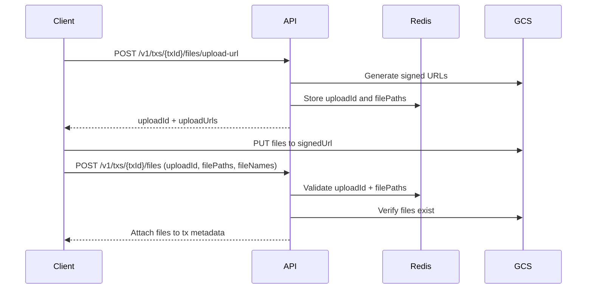

---

### Confirm Transaction File Uploads

Confirms uploaded files and attaches them to transaction metadata.

**Endpoint:** `POST /v1/txs/{txId}/files`

#### Headers

```json
{
    "x-api-key": "string (required)",
    "Authorization": "Bearer {SESSION_TOKEN} (optional)",
    "x-profile-id": "string (optional)",
    "x-team-id": "string (optional)"
}
```

#### Request Body

```json
{
    "uploadId": "upload-uuid",
    "filePaths": ["tx-files/tx-123/1234567890-receipt.pdf"],
    "fileNames": ["receipt.pdf"]
}
```

**Notes:**

-   Uploads are verified against Redis state for the `uploadId`
-   Files are validated in storage before metadata updates
-   Max file size is 5MB per file

#### Response

**Success (200)**

```json
{
    "success": true,
    "data": {
        "tx": {
            "id": "550e8400-e29b-41d4-a716-446655440000",
            "profileId": "550e8400-e29b-41d4-a716-446655440001",
            "channelId": "550e8400-e29b-41d4-a716-446655440002",
            "channelMethod": "createRequest",
            "channelParams": {},
            "chainId": "550e8400-e29b-41d4-a716-446655440003",
            "tokenId": "550e8400-e29b-41d4-a716-446655440004",
            "targetAddress": "0x742d35Cc6634C0532925a3b8D4C9db96C4b4d8b6",
            "type": "fund",
            "amount": 100.5,
            "feeInfo": {
                "vudy": 0
            },
            "status": "completed",
            "note": null,
            "metadata": {
                "files": [
                    {
                        "filePath": "tx-files/tx-123/1234567890-receipt.pdf",
                        "fileName": "receipt.pdf",
                        "uploadedAt": "2024-01-01T01:00:00.000Z",
                        "uploadedBy": "550e8400-e29b-41d4-a716-446655440001"
                    }
                ]
            },
            "creatorApiKey": null,
            "createdAt": "2024-01-01T00:00:00.000Z",
            "updatedAt": "2024-01-01T01:00:00.000Z"
        }
    }
}
```

---

### Get Transaction Files

Retrieves signed URLs for files attached to a transaction.

**Endpoint:** `GET /v1/txs/{txId}/files`

#### Headers

```json
{
    "x-api-key": "string (required)",
    "Authorization": "Bearer {SESSION_TOKEN} (optional)",
    "x-profile-id": "string (optional)",
    "x-team-id": "string (optional)"
}
```

#### Response

**Success (200)**

```json
{
    "success": true,
    "data": {
        "files": [
            {
                "filePath": "tx-files/tx-123/1234567890-receipt.pdf",
                "fileName": "receipt.pdf",
                "uploadedAt": "2024-01-01T01:00:00.000Z",
                "uploadedBy": "550e8400-e29b-41d4-a716-446655440001",
                "signedUrl": "https://storage.googleapis.com/bucket-name/tx-files/tx-123/1234567890-receipt.pdf?X-Goog-Algorithm=...",
                "expiresAt": "2024-01-01T02:00:00.000Z"
            }
        ]
    }
}
```

**Note:** If no files are attached to the transaction, the response will be:

```json
{
    "success": true,
    "data": {
        "files": []
    }
}
```

## Transaction Data Structure

### Transaction Object (`tx`)

| Field           | Type                    | Description                                           |
| --------------- | ----------------------- | ----------------------------------------------------- |
| id              | string (UUID)           | Transaction ID                                        |
| profileId       | string (UUID)           | Profile that owns the transaction                     |
| channelId       | string (UUID)           | Channel used for the transaction                      |
| channelMethod   | string                  | Channel-specific method name                          |
| channelParams   | object                  | Channel-specific parameters                           |
| chainId         | string (UUID) \| null   | Chain ID (null if not applicable)                     |
| tokenId         | string (UUID) \| null   | Token ID (null if not applicable)                     |
| targetAddress   | string                  | Destination address for the transaction               |
| type            | "fund" \| "withdraw" \| "exchange" | Transaction type                      |
| amount          | number                  | Transaction amount                                    |
| feeInfo         | object                  | Fee information (default: `{ vudy: 0 }`)               |
| status          | "pending" \| "completed" \| "failed" | Transaction status            |
| note            | string \| null          | Optional transaction note                             |
| metadata        | object                  | Additional metadata (may include `files` array)        |
| creatorApiKey   | string (UUID) \| null   | API key that created this transaction                 |
| createdAt       | string (ISO 8601)       | Creation timestamp                                    |
| updatedAt       | string (ISO 8601)       | Last update timestamp                                 |

### Token Object (`token`)

| Field    | Type          | Description                        |
| -------- | ------------- | ---------------------------------- |
| id       | string (UUID) | Token ID                           |
| name     | string        | Token name (e.g., "USD Coin")      |
| symbol   | string        | Token symbol (e.g., "USDC")        |
| image    | string \| null | Token logo/image URL               |
| accepted | boolean       | Whether token is accepted          |

### Chain Object (`chain`)

| Field          | Type                    | Description                        |
| -------------- | ----------------------- | ---------------------------------- |
| id             | string (UUID)           | Chain ID                           |
| slug           | string                  | Chain identifier (e.g., "ethereum") |
| name           | string                  | Chain name (e.g., "Ethereum")       |
| chainId        | number                  | Numeric chain identifier           |
| image          | string \| null          | Chain logo/image URL               |
| type           | "EVM" \| "SVM" \| "BTC" \| "FIAT" | Chain type          |
| chainSpecifics | object                  | Type-specific configuration        |
| createdAt      | string (ISO 8601)       | Creation timestamp                 |

### Transaction Correlation Object (`txCorrelation`)

| Field     | Type   | Description                                    |
| --------- | ------ | ---------------------------------------------- |
| id        | string (UUID) | Correlation record ID                          |
| txId      | string (UUID) | Transaction ID                                 |
| tableType | string | Channel-specific table type (e.g., "ch_vudy_request") |
| recordId  | string (UUID) | ID of the record in the channel-specific table |

**Note:** `token`, `chain`, and `txCorrelation` can be `null` if not applicable to the transaction.

## Filtering and Pagination

**Note:** Current implementation does not support pagination or advanced filtering. All transactions for the specified profile or team are returned.

**Future Enhancements:**

-   Pagination support
-   Date range filtering
-   Status filtering
-   Amount range filtering
-   Channel filtering

## Error Response Format

All error responses follow this structure:

```json
{
    "success": false,
    "error": {
        "code": "ERROR_CODE",
        "message": "Human-readable error message",
        "details": "Additional error details (optional)"
    }
}
```

## Permission Requirements

-   **Profile Transactions**: User must be the profile owner
-   **Team Transactions**: User must be a team member with appropriate role

## Integration Notes

-   Transaction data is retrieved from the database, not directly from blockchain
-   Transaction hashes allow for blockchain verification
-   Pending transactions may not have a transaction hash
-   All timestamps are in ISO 8601 format (UTC)

## Support

For transaction history issues, contact the Vudy support team or consult the main API documentation.

---

# Vudy Request API

> Source: `app/v1/vudy/README.md`

## 📋 Table of Contents

-   [Overview](#overview)
-   [Authentication](#authentication)
-   [Base URL](#base-url)
-   [Endpoints](#endpoints)
    -   [Send Confirmation Email](#send-confirmation-email)
    -   [Download Invoice PDF](#download-invoice-pdf)
-   [Error Response Format](#error-response-format)
-   [Support](#support)

## Overview

The Vudy Request API provides endpoints for managing completed payment requests, including sending confirmation emails and generating invoice PDFs.

## Authentication

All endpoints require API key authentication.

**Header Example:**

### API Key Only

```json
{
    "x-api-key": "string (required)"
}
```

**Note:** All Vudy Request API endpoints use the same header format - API key only.

## Base URL

```
/v1/vudy/request
```

## Endpoints

### Send Confirmation Email

Sends a confirmation email for a completed vudy request. Can be triggered multiple times. Tracks notification counts per email address in the request's feeInfo.

**Endpoint:** `POST /v1/vudy/request/{id}/notify-client`

#### Headers

```json
{
    "x-api-key": "string (required)"
}
```

#### Path Parameters

| Parameter | Type   | Required | Description                    |
| --------- | ------ | -------- | ------------------------------ |
| id        | string | Yes      | The vudy request ID            |

#### Request Body

```json
{
    "email": "user@example.com",
    "language": "en"
}
```

#### Field Descriptions

| Field    | Type                | Required | Description                                    |
| -------- | ------------------- | -------- | ---------------------------------------------- |
| email    | string              | Yes      | Valid email address to send confirmation to    |
| language | "en" \| "es"        | No       | Language for email template (defaults to "en") |

#### Response

**Success (200)**

```json
{
    "success": true,
    "data": {
        "email": "user@example.com",
        "notificationCount": 1,
        "requestId": "req-123"
    }
}
```

#### Error Codes

**Endpoint-Specific Errors:**

-   `APP_V1_VUDY_REQUEST_NOTIFY_CLIENT#1` - Request not found (404)
-   `APP_V1_VUDY_REQUEST_NOTIFY_CLIENT#2` - Request not completed (400)
-   `APP_V1_VUDY_REQUEST_NOTIFY_CLIENT#3` - Invalid email (400)
-   `APP_V1_VUDY_REQUEST_NOTIFY_CLIENT#4` - Failed to update notification tracking (500)
-   `APP_V1_VUDY_REQUEST_NOTIFY_CLIENT#5` - Failed to send email (500)

**Bubbled Errors:**

-   `VALIDATION_API-AUTH_01` through `VALIDATION_API-AUTH_10` - API key validation errors (403/500)
-   Various database operation errors (500) - from request lookup, chain/token retrieval functions

#### Implementation Details

-   **Request Validation**: Only completed requests can receive confirmation emails
-   **Notification Tracking**: Email addresses and notification counts are stored in `feeInfo.notifications` object
-   **Team Action Logging**: All email sends are logged as team actions with metadata
-   **Language Support**: Uses `enRequestInvoice` (18) or `esRequestInvoice` (19) Brevo templates based on language parameter

---

### Download Invoice PDF

Generates and downloads a PDF invoice for a completed vudy request. The PDF is generated from an HTML template with request transaction details.

**Endpoint:** `GET /v1/vudy/request/{id}/invoice-pdf`

#### Headers

```json
{
    "x-api-key": "string (required)"
}
```

#### Path Parameters

| Parameter | Type   | Required | Description         |
| --------- | ------ | -------- | ------------------- |
| id        | string | Yes      | The vudy request ID |

#### Query Parameters

| Parameter | Type         | Required | Description                                    |
| --------- | ------------ | -------- | ---------------------------------------------- |
| language  | "en" \| "es" | No       | Language for PDF content (defaults to "en")    |

#### Response

**Success (200)**

Returns a binary PDF file with the following headers:

-   `Content-Type: application/pdf`
-   `Content-Disposition: attachment; filename="invoice_{requestId}.pdf"`

#### Error Codes

**Endpoint-Specific Errors:**

-   `APP_V1_VUDY_REQUEST_INVOICE_PDF#1` - Request not found (404)
-   `APP_V1_VUDY_REQUEST_INVOICE_PDF#2` - Request not completed (400)
-   `APP_V1_VUDY_REQUEST_INVOICE_PDF#3` - Failed to read template (500)
-   `APP_V1_VUDY_REQUEST_INVOICE_PDF#4` - Failed to generate PDF (500)

**Bubbled Errors:**

-   `VALIDATION_API-AUTH_01` through `VALIDATION_API-AUTH_10` - API key validation errors (403/500)
-   Various database operation errors (500) - from request lookup, chain/token retrieval functions

#### Implementation Details

-   **Request Validation**: Only completed requests can generate invoice PDFs
-   **PDF Generation**: Uses headless Chrome (@sparticuz/chromium) optimized for AWS Lambda
-   **Template**: PDF is generated from `lib/vudy/request/invoice.html` with parameter substitution
-   **Template Parameters**: Extracted automatically from template using regex pattern `{{params.<property>}}`

#### PDF Template Parameters

The following parameters are used in the invoice template:

-   `amount_usd` - Request amount in USD
-   `amount_token` - Token amount (formatted)
-   `token` - Token symbol
-   `network` - Blockchain network name
-   `recipient_name` - Team name or profile nickname
-   `description` - Request note or empty string
-   `payment_id` - Request customId
-   `txn_url` - Blockchain explorer URL (if transaction hash exists)
-   `txn_hash` - Transaction hash (if exists)

---

## Error Response Format

All errors follow a consistent format:

```json
{
    "success": false,
    "data": null,
    "error": {
        "code": "FILE_CODE#ERROR_NUMBER",
        "message": "Human-readable error message",
        "details": {
            "additional": "context"
        }
    }
}
```

## Support

For issues or questions, contact support@vudy.me

---

# Wallet Management API

> Source: `app/v1/wallet/README.md`

## 📋 Table of Contents

-   [Overview](#overview)
-   [Authentication](#authentication)
-   [Base URL](#base-url)
-   [Endpoints](#endpoints)
    -   [Add External Wallet](#add-external-wallet)
    -   [List Wallets](#list-wallets)
    -   [Get Default Receiver Wallet](#get-default-receiver-wallet)
    -   [Set Default Receiver Wallet](#set-default-receiver-wallet)
    -   [Update Wallet Alias](#update-wallet-alias)
    -   [Get Wallet Portfolio](#get-wallet-portfolio)
-   [Check EVM Token Allowance](#check-evm-token-allowance)
-   [Check Native Balance for Gas](#check-native-balance-for-gas)
-   [Approve EVM Token Allowance](#approve-evm-token-allowance)
-   [Revoke EVM Token Allowance](#revoke-evm-token-allowance)
-   [Sponsor Gas Fees](#sponsor-gas-fees)
-   [Supported Wallet Types](#supported-wallet-types)
-   [Compliance](#compliance)
-   [Error Response Format](#error-response-format)
-   [Support](#support)

## Overview

The Wallet Management API provides endpoints for managing wallets, adding external wallets, retrieving wallet lists, managing default receiver wallets, and getting wallet portfolio data across multiple EVM chains.

## Authentication

All endpoints require API key authentication. Some endpoints require session authentication and profile/team headers.

**Header Examples:**

### API Key Only

```json
{
    "x-api-key": "string (required)"
}
```

**Example Endpoints:**
- `POST /v1/wallet/external` - Add external wallet
- `GET /v1/wallet/list` - List wallets
- `GET /v1/wallet/default` - Get default receiver wallet
- `PATCH /v1/wallet/alias` - Update wallet alias
- `GET /v1/wallet/portfolio` - Get wallet portfolio
- `GET /v1/wallet/evm/allowance/[action]` - Check EVM token allowance

### API Key + Session Token + Profile/Team Headers

```json
{
    "x-api-key": "string (required)",
    "Authorization": "Bearer {SESSION_TOKEN} (required)",
    "x-profile-id": "string (required)",
    "x-team-id": "string (required)"
}
```

**Example Endpoints:**
- `POST /v1/wallet/evm/allowance/[action]` - Approve EVM token allowance
- `DELETE /v1/wallet/evm/allowance/[action]` - Revoke EVM token allowance
- `POST /v1/wallet/evm/gas-sponsor` - Sponsor gas fees

**Note:** For approval/revoke endpoints, the `Authorization` header is optional for backend signing. If not provided, transaction data is returned for frontend signing.

## Base URL

```
/v1/wallet
```

## Endpoints

### Add External Wallet

Adds an external wallet to a profile with compliance checks.

**Endpoint:** `POST /v1/wallet/external`

#### Headers

```json
{
    "x-api-key": "string (required)"
}
```

#### Request Body

```json
{
    "teamId": "uuid (required)",
    "profileId": "uuid (required)",
    "address": "string (required)",
    "walletType": "EVM | SVM | BTC | FIAT",
    "label": "string (optional)",
    "metadata": {}
}
```

#### Field Descriptions

| Field      | Type   | Required | Description                              |
| ---------- | ------ | -------- | ---------------------------------------- |
| teamId     | uuid   | Yes      | Team ID                                  |
| profileId  | uuid   | Yes      | Profile ID                               |
| address    | string | Yes      | Wallet address (validated by walletType) |
| walletType | enum   | Yes      | Blockchain type                          |
| label      | string | No       | Wallet label                             |
| metadata   | object | No       | Additional metadata                      |

#### Address Validation

-   **EVM**: Ethereum addresses (checksummed, starting with 0x)
-   **SVM**: Solana addresses (base58 encoded, 32-44 chars)
-   **BTC**: Bitcoin addresses (bech32 or legacy)
-   **FIAT**: Any string value

#### Response

**Success (201)**

```json
{
    "success": true,
    "data": {
        "address": "0x742d35Cc6634C0532925a3b8D4C9db96C4b4d8b6",
        "walletType": "EVM",
        "profileId": "profile-123",
        "teamId": "team-456",
        "alias": null,
        "metadata": {
            "label": "My Trading Wallet",
            "source": "external"
        },
        "createdAt": "2024-01-01T00:00:00Z"
    }
}
```

**Error Codes**

**Endpoint-Specific Errors:**

-   `WALLET_EXTERNAL_ROUTE_01` - Invalid wallet address format (400)
-   `WALLET_EXTERNAL_ROUTE_02` - Wallet already exists (409)

**Bubbled Errors (from other functions):**

-   `VALIDATION_API-AUTH_01` through `VALIDATION_API-AUTH_10` - API key validation errors (403/500) - from `validateApiKey`
-   `BODY-PARSE_01`, `BODY-PARSE_02` - Request body parsing/validation errors (400) - from `parseBodyWithSchema`
-   Various database operation errors (500) - from wallet creation functions

---

### List Wallets

Retrieves wallet list for a profile or team.

**Endpoint:** `GET /v1/wallet/list`

#### Query Parameters

| Parameter         | Type    | Required | Description                  |
| ----------------- | ------- | -------- | ---------------------------- |
| profileId         | uuid    | Yes\*    | Profile ID to filter wallets |
| teamId            | uuid    | Yes\*    | Team ID to filter wallets    |
| includeCompliance | boolean | No       | Include compliance records   |

\*Either profileId or teamId must be provided, not both.

#### Example Requests

```bash
# Get wallets for a profile
GET /v1/wallet/list?profileId=profile-123&includeCompliance=true

# Get wallets for a team
GET /v1/wallet/list?teamId=team-456
```

#### Response

**Success (200)**

```json
{
    "success": true,
    "data": {
        "wallets": [
            {
                "address": "0x742d35Cc6634C0532925a3b8D4C9db96C4b4d8b6",
                "walletType": "EVM",
                "profileId": "profile-123",
                "teamId": "team-456",
                "alias": "Primary Wallet",
                "isDefault": true,
                "metadata": {
                    "label": "Trading Wallet"
                },
                "createdAt": "2024-01-01T00:00:00Z",
                "complianceRecords": []
            }
        ],
        "total": 1
    }
}
```

**Error Codes**

**Endpoint-Specific Errors:**

-   `WALLET_LIST_ROUTE_01` - Invalid query parameters (400)

**Bubbled Errors (from other functions):**

-   `VALIDATION_API-AUTH_01` through `VALIDATION_API-AUTH_10` - API key validation errors (403/500) - from `validateApiKey`
-   Various database operation errors (500) - from wallet retrieval functions

---

### Get Default Receiver Wallet

Retrieves the team's default receiver wallet.

**Endpoint:** `GET /v1/wallet/default`

#### Query Parameters

| Parameter | Type | Required | Description |
| --------- | ---- | -------- | ----------- |
| teamId    | uuid | Yes      | Team ID     |

#### Example Request

```bash
GET /v1/wallet/default?teamId=team-456
```

#### Response

**Success (200) - With default wallet**

```json
{
    "success": true,
    "data": {
        "defaultWallet": {
            "address": "0x742d35Cc6634C0532925a3b8D4C9db96C4b4d8b6",
            "walletType": "EVM",
            "profileId": "profile-123",
            "teamId": "team-456",
            "alias": "Primary Wallet",
            "metadata": {
                "label": "Trading Wallet"
            },
            "createdAt": "2024-01-01T00:00:00Z"
        }
    }
}
```

**Success (200) - No default wallet**

```json
{
    "success": true,
    "data": {
        "defaultWallet": null
    }
}
```

**Error Codes**

**Endpoint-Specific Errors:**

-   `WALLET_DEFAULT_ROUTE_01` - Team ID is required (400)

**Bubbled Errors (from other functions):**

-   `VALIDATION_API-AUTH_01` through `VALIDATION_API-AUTH_10` - API key validation errors (403/500) - from `validateApiKey`
-   Various database operation errors (500) - from wallet retrieval functions

---

### Set Default Receiver Wallet

Sets the team's default receiver wallet.

**Endpoint:** `POST /v1/wallet/default`

#### Query Parameters

| Parameter | Type | Required | Description |
| --------- | ---- | -------- | ----------- |
| teamId    | uuid | Yes      | Team ID     |

#### Request Body

```json
{
    "walletAddress": "0x742d35Cc6634C0532925a3b8D4C9db96C4b4d8b6"
}
```

#### Response

**Success (200)**

```json
{
    "success": true,
    "data": {
        "message": "Default wallet updated successfully",
        "walletAddress": "0x742d35Cc6634C0532925a3b8D4C9db96C4b4d8b6"
    }
}
```

**Error Codes**

**Endpoint-Specific Errors:**

-   `WALLET_DEFAULT_ROUTE_02` - Team ID is required (400)
-   `WALLET_DEFAULT_ROUTE_03` - Wallet does not exist (404)
-   `WALLET_DEFAULT_ROUTE_04` - Wallet does not belong to team (403)

**Bubbled Errors (from other functions):**

-   `VALIDATION_API-AUTH_01` through `VALIDATION_API-AUTH_10` - API key validation errors (403/500) - from `validateApiKey`
-   `BODY-PARSE_01`, `BODY-PARSE_02` - Request body parsing/validation errors (400) - from `parseBodyWithSchema`
-   Various database operation errors (500) - from wallet lookup, update functions

---

### Update Wallet Alias

Updates a wallet alias for a specific team.

**Endpoint:** `PATCH /v1/wallet/alias`

#### Headers

```json
{
    "x-api-key": "string (required)"
}
```

#### Request Body

```json
{
    "walletAddress": "0x742d35Cc6634C0532925a3b8D4C9db96C4b4d8b6",
    "teamId": "uuid (required)",
    "alias": "Primary Wallet"
}
```

#### Field Descriptions

| Field         | Type          | Required | Description                         |
| ------------- | ------------- | -------- | ----------------------------------- |
| walletAddress | string        | Yes      | Wallet address to update            |
| teamId        | uuid          | Yes      | Team ID that owns the wallet        |
| alias         | string \| null | Yes      | Alias string or null to clear alias |

#### Response

**Success (200)**

```json
{
    "success": true,
    "data": {
        "walletAddress": "0x742d35Cc6634C0532925a3b8D4C9db96C4b4d8b6",
        "teamId": "team-456",
        "alias": "Primary Wallet"
    }
}
```

**Error Codes**

**Endpoint-Specific Errors:**

-   `APP_V1_WALLET_ALIAS_ROUTE_01` - Invalid request body (400)
-   `APP_V1_WALLET_ALIAS_ROUTE_02` - Wallet not found (404)
-   `APP_V1_WALLET_ALIAS_ROUTE_03` - Wallet does not belong to team (403)
-   `APP_V1_WALLET_ALIAS_ROUTE_04` - Failed to update wallet alias (500)

**Bubbled Errors (from other functions):**

-   `VALIDATION_API-AUTH_01` through `VALIDATION_API-AUTH_10` - API key validation errors (403/500) - from `validateApiKey`
-   Various database operation errors (500) - from wallet update functions

---

### Get Wallet Portfolio

Retrieves comprehensive wallet portfolio data across multiple EVM chains.

**Endpoint:** `GET /v1/wallet/portfolio`

#### Query Parameters

| Parameter | Type   | Required | Description                      |
| --------- | ------ | -------- | -------------------------------- |
| wallets   | string | Yes      | Comma-separated wallet addresses |

#### Example Request

```bash
GET /v1/wallet/portfolio?wallets=0x123...,0x456...
```

#### Response

**Success (200)**

```json
{
    "success": true,
    "data": [
        {
            "wallet": "0x123...",
            "totalUsdBalance": 1500.5,
            "tokens": {
                "USDC": {
                    "totalUsdBalance": 1000.0,
                    "totalBalance": 1000.0,
                    "tokenLogo": "https://example.com/usdc-logo.png",
                    "chains": {
                        "ethereum": {
                            "address": "0xA0b86a33E6...",
                            "balance": 500.0,
                            "price": 1.0,
                            "chainLogo": "https://example.com/ethereum-logo.png",
                            "chainId": 1
                        },
                        "polygon": {
                            "address": "0x2791Bca1f2...",
                            "balance": 500.0,
                            "price": 1.0,
                            "chainLogo": "https://example.com/polygon-logo.png",
                            "chainId": 137
                        }
                    }
                }
            }
        }
    ]
}
```

**Error Codes**

**Endpoint-Specific Errors:**

-   `WALLET_PORTFOLIO_ROUTE_01` - No wallets provided (400)

**Bubbled Errors (from other functions):**

-   `VALIDATION_API-AUTH_01` through `VALIDATION_API-AUTH_10` - API key validation errors (403/500) - from `validateApiKey`
-   Various external API errors (500) - from portfolio data retrieval functions

---

### Check EVM Token Allowance

Retrieves the current ERC20 token allowance for a specific executor address on EVM chains. Supports checking allowances for different contract types (send, request, otc) or custom executors.

**Endpoint:** `GET /v1/wallet/evm/allowance/{action}`

#### Path Parameters

| Parameter | Type   | Required | Description                                                                                               |
| --------- | ------ | -------- | --------------------------------------------------------------------------------------------------------- |
| action    | string | Yes      | Action type: `send`, `request`, `otc`, `general`, `all`, or `multiple`. `all`/`multiple` checks all three |

#### Query Parameters

| Parameter       | Type   | Required | Description                                                                     |
| --------------- | ------ | -------- | ------------------------------------------------------------------------------- |
| chainId         | number | Yes      | EVM chain ID (e.g., 1 for Ethereum, 137 for Polygon)                            |
| userWallet      | string | Yes      | User wallet address (0x format)                                                 |
| tokenAddress    | string | Yes      | ERC20 token contract address (0x format, cannot be zero address or ETH)         |
| executorAddress | string | No       | Required when action is `general`. Custom executor address                      |
| amount          | string | No       | Optional amount to compare against allowance (formatted number, e.g., "1000.5") |

#### Headers

```json
{
    "x-api-key": "string (required)"
}
```

#### Example Requests

```bash
# Check allowance for send contract
GET /v1/wallet/evm/allowance/send?chainId=1&userWallet=0x...&tokenAddress=0x...

# Check allowance for general executor
GET /v1/wallet/evm/allowance/general?chainId=1&userWallet=0x...&tokenAddress=0x...&executorAddress=0x...

# Check all contracts with amount comparison
GET /v1/wallet/evm/allowance/all?chainId=1&userWallet=0x...&tokenAddress=0x...&amount=1000
```

#### Response

**Success (200) - Single executor**

```json
{
    "success": true,
    "data": {
        "executorAddress": "0xe107F44619C0153B6b5d69Ba47d7029acccde63c",
        "executorName": "send",
        "allowance": "1000.5",
        "allowanceOk": true,
        "difference": "500.0"
    }
}
```

**Success (200) - Multiple executors (all/multiple action)**

```json
{
    "success": true,
    "data": {
        "executors": [
            {
                "executorAddress": "0xe107F44619C0153B6b5d69Ba47d7029acccde63c",
                "executorName": "send",
                "allowance": "1000.5",
                "allowanceOk": true,
                "difference": "500.0"
            },
            {
                "executorAddress": "0x47b863138a2B0CB9135D678c301ed5E8C06f5598",
                "executorName": "request",
                "allowance": "2000.0",
                "allowanceOk": true,
                "difference": "1500.0"
            },
            {
                "executorAddress": "0xC07E54Ed0DFE3406294Ee5EbF6c011c65a9DD374",
                "executorName": "otcEscrow",
                "allowance": "500.0",
                "allowanceOk": false,
                "difference": "-500.0"
            }
        ]
    }
}
```

**Success (200) - No amount provided**

```json
{
    "success": true,
    "data": {
        "executorAddress": "0xe107F44619C0153B6b5d69Ba47d7029acccde63c",
        "executorName": "send",
        "allowance": "1000.5",
        "allowanceOk": undefined
    }
}
```

#### Field Descriptions

| Field           | Type    | Description                                                                      |
| --------------- | ------- | -------------------------------------------------------------------------------- |
| executorAddress | string  | The executor contract address                                                    |
| executorName    | string  | Contract type: `send`, `request`, `otcEscrow`, or `general`                      |
| allowance       | string  | Current formatted allowance amount                                               |
| allowanceOk     | boolean | `true` if allowance >= amount, `false` if not, `undefined` if no amount provided |
| difference      | string  | Formatted difference (allowance - amount), only present when amount provided     |

#### Error Codes

**Endpoint-Specific Errors:**

-   `APP_V1_WALLET_EVM_ALLOWANCE_01` - Invalid chain ID (400)
-   `APP_V1_WALLET_EVM_ALLOWANCE_02` - Missing executor address for general action (400)
-   `APP_V1_WALLET_EVM_ALLOWANCE_03` - Invalid executor address format (400)
-   `APP_V1_WALLET_EVM_ALLOWANCE_04` - Failed to get EVM client (500)
-   `APP_V1_WALLET_EVM_ALLOWANCE_05` - Failed to get token allowance (500)
-   `APP_V1_WALLET_EVM_ALLOWANCE_09` - Invalid action parameter (400)

**Bubbled Errors (from other functions):**

-   `VALIDATION_API-AUTH_01` through `VALIDATION_API-AUTH_10` - API key validation errors (403/500)

---

### Check Native Balance for Gas

Checks if EVM wallets have sufficient native token balance to cover gas costs for ERC20 transfers. Estimates gas requirements and compares against current native balances. Supports batch processing for multiple wallets.

**Endpoint:** `GET /v1/wallet/evm/check-gas-balance`

#### Query Parameters

| Parameter     | Type   | Required | Description                                                                 |
| ------------- | ------ | -------- | --------------------------------------------------------------------------- |
| wallet        | string | Yes      | Wallet address(es) - comma-separated for multiple (e.g., `?wallet=0x1,0x2,0x3`) |
| tokenAddress  | string | Yes      | ERC20 token contract address (0x format)                                    |
| chainSlug     | string | Yes      | Chain slug (e.g., "ethereum", "polygon") or chain ID (e.g., 1, 137)        |

#### Headers

```json
{
    "x-api-key": "string (required)"
}
```

#### Example Requests

```bash
# Single wallet
GET /v1/wallet/evm/check-gas-balance?wallet=0x123...&tokenAddress=0xToken&chainSlug=ethereum

# Multiple wallets (comma-separated)
GET /v1/wallet/evm/check-gas-balance?wallet=0x123...,0x456...,0x789...&tokenAddress=0xToken&chainSlug=ethereum

# Using chain ID
GET /v1/wallet/evm/check-gas-balance?wallet=0x123...&tokenAddress=0xToken&chainSlug=1
```

#### Response

**Success (200)**

```json
{
    "success": true,
    "data": [
        {
            "wallet": "0x742d35Cc6634C0532925a3b8D4C9db96C4b4d8b6",
            "minimumGasWei": "21000000000000",
            "nativeBalance": "50000000000000000",
            "sufficient": true,
            "difference": "29000000000000000"
        },
        {
            "wallet": "0x456...",
            "minimumGasWei": "21000000000000",
            "nativeBalance": "10000000000000",
            "sufficient": false,
            "difference": "-11000000000000",
            "error": {
                "code": "SERVER_EVM_CHECK_NATIVE_BALANCE_FOR_GAS_02",
                "message": "Failed to estimate gas for ERC20 transfer"
            }
        }
    ]
}
```

#### Field Descriptions

| Field          | Type    | Description                                                                      |
| -------------- | ------- | -------------------------------------------------------------------------------- |
| wallet         | string  | Wallet address that was checked                                                 |
| minimumGasWei  | string  | Minimum gas amount needed in wei (estimated gas with 10% buffer)                |
| nativeBalance  | string  | Current native token balance in wei                                              |
| sufficient     | boolean | `true` if native balance >= minimum gas, `false` otherwise                       |
| difference     | string  | Difference in wei (nativeBalance - minimumGasWei, negative if insufficient)    |
| error          | object  | Error details (only present if gas check failed)                                 |

#### Error Codes

**Endpoint-Specific Errors:**

-   `APP_V1_WALLET_EVM_CHECK_GAS_BALANCE_01` - Missing wallet parameter (400)
-   `APP_V1_WALLET_EVM_CHECK_GAS_BALANCE_02` - Invalid wallet address format (400)
-   `APP_V1_WALLET_EVM_CHECK_GAS_BALANCE_03` - Missing token address parameter (400)
-   `APP_V1_WALLET_EVM_CHECK_GAS_BALANCE_04` - Invalid token address format (400)
-   `APP_V1_WALLET_EVM_CHECK_GAS_BALANCE_05` - Missing chain slug parameter (400)
-   `APP_V1_WALLET_EVM_CHECK_GAS_BALANCE_06` - Invalid chain ID (400)
-   `APP_V1_WALLET_EVM_CHECK_GAS_BALANCE_07` - Chain not found (400)

**Bubbled Errors (from other functions):**

-   `VALIDATION_API-AUTH_01` through `VALIDATION_API-AUTH_10` - API key validation errors (403/500)
-   `SERVER_EVM_CHECK_NATIVE_BALANCE_FOR_GAS_01` - Failed to get EVM read client (500)
-   `SERVER_EVM_CHECK_NATIVE_BALANCE_FOR_GAS_02` - Failed to estimate gas for ERC20 transfer (500)
-   `SERVER_EVM_CHECK_NATIVE_BALANCE_FOR_GAS_03` - Failed to get native balance (500)

**Note:** The endpoint returns partial results if some wallets fail. Check the `error` field in individual results for failure details.

---

### Approve EVM Token Allowance

Creates an approval transaction for a specific amount. If a session token is provided and valid, signs and sends the transaction automatically. Otherwise, returns transaction data for frontend signing.

**Endpoint:** `POST /v1/wallet/evm/allowance/{action}`

#### Path Parameters

| Parameter | Type   | Required | Description                                                                                                                                           |
| --------- | ------ | -------- | ----------------------------------------------------------------------------------------------------------------------------------------------------- |
| action    | string | Yes      | Action type: `send`, `request`, `otc`, or `general`. Use `general` for custom executor addresses. Note: `all` and `multiple` are not allowed for POST |

#### Headers

```json
{
    "x-api-key": "string (required)",
    "x-profile-id": "uuid (required)",
    "x-team-id": "uuid (required)",
    "Authorization": "Bearer <JWT_TOKEN> (optional, required for auto-signing)"
}
```

#### Request Body

```json
{
    "chainId": 1,
    "userWallet": "0x742d35Cc6634C0532925a3b8D4C9db96C4b4d8b6",
    "tokenAddress": "0xA0b86a91c6218b36c1d19D4a2e9eb0ce3606eb48",
    "amount": "max",
    "executorAddress": "0x..."
}
```

#### Field Descriptions

| Field           | Type             | Required | Description                                                             |
| --------------- | ---------------- | -------- | ----------------------------------------------------------------------- |
| chainId         | number           | Yes      | EVM chain ID (e.g., 1 for Ethereum, 137 for Polygon)                    |
| userWallet      | string           | Yes      | User wallet address (0x format)                                         |
| tokenAddress    | string           | Yes      | ERC20 token contract address (0x format, cannot be zero address or ETH) |
| amount          | string \| number | Yes      | Amount to approve: `"max"` for maxUint256, or a positive number/string  |
| executorAddress | string           | No       | Required when action is `general`. Custom executor address              |

#### Example Requests

```bash
# Approve max amount for send contract (frontend signing)
POST /v1/wallet/evm/allowance/send
{
    "chainId": 1,
    "userWallet": "0x...",
    "tokenAddress": "0x...",
    "amount": "max"
}

# Approve specific amount for general executor (backend signing)
POST /v1/wallet/evm/allowance/general
Headers: Authorization: Bearer <JWT_TOKEN>
{
    "chainId": 1,
    "userWallet": "0x...",
    "tokenAddress": "0x...",
    "amount": "1000.5",
    "executorAddress": "0x..."
}
```

#### Response

**Success (200) - Backend signed**

```json
{
    "success": true,
    "data": {
        "txHash": "0x1234567890abcdef...",
        "signed": true
    }
}
```

**Success (200) - Frontend signing required**

```json
{
    "success": true,
    "data": {
        "to": "0xA0b86a91c6218b36c1d19D4a2e9eb0ce3606eb48",
        "data": "0x095ea7b3...",
        "value": "0",
        "chainId": 1,
        "signed": false
    }
}
```

#### Error Codes

**Endpoint-Specific Errors:**

-   `APP_V1_WALLET_EVM_ALLOWANCE_01` - Invalid chain ID (400)
-   `APP_V1_WALLET_EVM_ALLOWANCE_02` - Missing executor address for general action (400)
-   `APP_V1_WALLET_EVM_ALLOWANCE_03` - Invalid executor address format (400)
-   `APP_V1_WALLET_EVM_ALLOWANCE_06` - Token decimals not found (500)
-   `APP_V1_WALLET_EVM_ALLOWANCE_07` - Failed to get wallet client (500)
-   `APP_V1_WALLET_EVM_ALLOWANCE_08` - Failed to send transaction (500)
-   `APP_V1_WALLET_EVM_ALLOWANCE_09` - Invalid action parameter (400)

**Bubbled Errors (from other functions):**

-   `VALIDATION_API-AUTH_01` through `VALIDATION_API-AUTH_10` - API key validation errors (403/500)
-   `BODY-PARSE_01`, `BODY-PARSE_02` - Request body parsing/validation errors (400)

---

### Revoke EVM Token Allowance

Revokes token allowance by setting it to 0. Supports revoking for a single contract or all contracts (when action is `all` or `multiple`). If a session token is provided, signs and sends transactions automatically.

**Endpoint:** `DELETE /v1/wallet/evm/allowance/{action}`

#### Path Parameters

| Parameter | Type   | Required | Description                                                                                                |
| --------- | ------ | -------- | ---------------------------------------------------------------------------------------------------------- |
| action    | string | Yes      | Action type: `send`, `request`, `otc`, `general`, `all`, or `multiple`. `all`/`multiple` revokes all three |

#### Query Parameters

| Parameter       | Type   | Required | Description                                                             |
| --------------- | ------ | -------- | ----------------------------------------------------------------------- |
| chainId         | number | Yes      | EVM chain ID (e.g., 1 for Ethereum, 137 for Polygon)                    |
| userWallet      | string | Yes      | User wallet address (0x format)                                         |
| tokenAddress    | string | Yes      | ERC20 token contract address (0x format, cannot be zero address or ETH) |
| executorAddress | string | No       | Required when action is `general`. Custom executor address              |

#### Headers

```json
{
    "x-api-key": "string (required)",
    "Authorization": "Bearer {SESSION_TOKEN} (required)",
    "x-profile-id": "string (required)",
    "x-team-id": "string (required)"
}
```

**Note:** The `Authorization` header with a valid JWT token is optional for backend signing. If not provided, transaction data is returned for frontend signing.

#### Example Requests

```bash
# Revoke allowance for send contract
DELETE /v1/wallet/evm/allowance/send?chainId=1&userWallet=0x...&tokenAddress=0x...

# Revoke all allowances
DELETE /v1/wallet/evm/allowance/all?chainId=1&userWallet=0x...&tokenAddress=0x...

# Revoke general executor (backend signing)
DELETE /v1/wallet/evm/allowance/general?chainId=1&userWallet=0x...&tokenAddress=0x...&executorAddress=0x...
Headers: Authorization: Bearer <JWT_TOKEN>
```

#### Response

**Success (200) - Backend signed (single executor)**

```json
{
    "success": true,
    "data": {
        "transactions": [
            {
                "executorAddress": "0xe107F44619C0153B6b5d69Ba47d7029acccde63c",
                "txHash": "0x1234567890abcdef...",
                "success": true
            }
        ],
        "signed": true
    }
}
```

**Success (200) - Backend signed (multiple executors)**

```json
{
    "success": true,
    "data": {
        "transactions": [
            {
                "executorAddress": "0xe107F44619C0153B6b5d69Ba47d7029acccde63c",
                "txHash": "0x1234567890abcdef...",
                "success": true
            },
            {
                "executorAddress": "0x47b863138a2B0CB9135D678c301ed5E8C06f5598",
                "txHash": "0xabcdef1234567890...",
                "success": true
            },
            {
                "executorAddress": "0xC07E54Ed0DFE3406294Ee5EbF6c011c65a9DD374",
                "error": "Transaction failed",
                "success": false
            }
        ],
        "signed": true
    }
}
```

**Success (200) - Frontend signing required**

```json
{
    "success": true,
    "data": {
        "transactions": [
            {
                "to": "0xA0b86a91c6218b36c1d19D4a2e9eb0ce3606eb48",
                "data": "0x095ea7b3...",
                "value": "0",
                "chainId": 1,
                "executorAddress": "0xe107F44619C0153B6b5d69Ba47d7029acccde63c"
            }
        ],
        "signed": false
    }
}
```

#### Error Codes

**Endpoint-Specific Errors:**

-   `APP_V1_WALLET_EVM_ALLOWANCE_01` - Invalid chain ID (400)
-   `APP_V1_WALLET_EVM_ALLOWANCE_02` - Missing executor address for general action (400)
-   `APP_V1_WALLET_EVM_ALLOWANCE_03` - Invalid executor address format (400)
-   `APP_V1_WALLET_EVM_ALLOWANCE_07` - Failed to get wallet client (500)
-   `APP_V1_WALLET_EVM_ALLOWANCE_08` - Failed to send transaction (500)
-   `APP_V1_WALLET_EVM_ALLOWANCE_09` - Invalid action parameter (400)

**Bubbled Errors (from other functions):**

-   `VALIDATION_API-AUTH_01` through `VALIDATION_API-AUTH_10` - API key validation errors (403/500)

---

### Sponsor Gas Fees

Sponsors gas fees for users by transferring native tokens to user wallets and executing (Turnkey) or returning unsigned (external) ERC20 approve transactions. Valid actions are `send` and `otc` only. No `signedApproveTx` in request. Team block: only one unfulfilled sponsorship per (chain, token, executor); fulfillment is set to true only when allowance > maxUint256/2 (else 409 with blockingWallet/blockingChain/blockingToken/blockingSpender). Send/OTC status is irrelevant for fulfillment.

**Endpoint:** `POST /v1/wallet/evm/gas-sponsor`

#### Headers

```json
{
    "x-api-key": "string (required)",
    "Authorization": "Bearer {SESSION_TOKEN} (required)",
    "x-profile-id": "string (required)",
    "x-team-id": "string (required)"
}
```

#### Request Body

```json
{
    "walletAddress": "0x742d35Cc6634C0532925a3b8D4C9db96C4b4d8b6",
    "action": "send",
    "tokenAddress": "0xA0b86a91c6218b36c1d19D4a2e9eb0ce3606eb48",
    "chainSlug": "ethereum",
    "executeWithOwnGas": false
}
```

#### Field Descriptions

| Field             | Type    | Required | Description                                                                                                                              |
| ----------------- | ------- | -------- | ---------------------------------------------------------------------------------------------------------------------------------------- |
| walletAddress     | string  | Yes      | EVM wallet address to execute with (must belong to the authenticated profile)                                                         |
| action            | string  | Yes      | Action type: `send` or `otc` only                                                                                                        |
| tokenAddress      | string           | Yes      | ERC20 token contract address (0x format, must be an accepted token)                                                                      |
| chainSlug         | string \| number | Yes      | Chain slug (e.g., "ethereum", "polygon") or chain ID (e.g., 1, 137)                                                                      |
| executeWithOwnGas | boolean          | No       | If `true`: Execute approve if balance sufficient, otherwise sponsor gas. If `false`: Return message if balance sufficient (default: false) |

**Note:** `walletAddress` must be an EVM wallet owned by the profile (from `getWalletsByProfile`). Approval is always max (maxUint256). If the wallet is Turnkey but the backend does not have the keypair to sign, it is treated as external and the response includes `unsignedApproveTx` for the client to sign and broadcast.

#### Team Block and Fulfillment

-   **Requesting wallet block**: Before sponsoring, the endpoint checks the requesting wallet for any `gasSponsorFulfillment[key]=false`. For each such key (any chain/token/executor), it calls `getTokenAllowance`. If allowance **> maxUint256/2** → metadata is updated to `gasSponsorFulfillment[key]=true`. If allowance **≤ maxUint256/2** → request is blocked with 409 and `details: { blockingWallet, blockingChain, blockingToken, blockingSpender }`. This prevents the same wallet from requesting sponsorship for multiple tokens/chains while it has unfulfilled sponsorships.
-   **Team block**: After the requesting-wallet check, the endpoint loads all team wallets. For each EVM wallet with `gasSponsorApprovals[key]=true` and `gasSponsorFulfillment[key]=false` (same chain/token/executor as request), it calls `getTokenAllowance`. If allowance **> maxUint256/2** → metadata is updated to `gasSponsorFulfillment[key]=true`. If allowance **≤ maxUint256/2** → request is blocked with 409 and `details: { blockingWallet, blockingChain, blockingToken, blockingSpender }`.
-   **Fulfillment**: Fulfillment is set to true only when allowance > maxUint256/2 (checked in this route). Send/OTC status is irrelevant.
-   **Backward compatibility**: If a wallet has `gasSponsorApprovals[key]=true` but no `gasSponsorFulfillment[key]`, it is treated as fulfilled (does not block).

#### Behavior

-   **Turnkey wallet**: After gas transfer (if needed), backend signs and sends approve; response includes `approveTxHash` (and `transferTxHash` if sponsored).
-   **External wallet**: After gas transfer (if needed), backend does not execute approve; response includes `transferTxHash` and `unsignedApproveTx` (to, data, value, chainId, gasLimit, maxFeePerGas, maxPriorityFeePerGas) and a message to sign and broadcast.
-   **If `executeWithOwnGas === false`** and balance sufficient → Return success message (no sponsor, no approve).

#### Gas Sponsorship Limits

-   Gas sponsorship is only available if the chain has `chainSpecifics.allowGasSponsorship` configured with a value > 0.
-   The estimated gas cost in USD must not exceed the configured limit.

#### Rate Limiting and Approval Tracking

-   **5-minute cooldown**: Per user (Redis).
-   **Approval + fulfillment**: When sponsoring, metadata is updated with `gasSponsorApprovals[key]=true` and `gasSponsorFulfillment[key]=false`. Fulfillment is set to true only when allowance > maxUint256/2 (in this route).

#### Response

**Success (200) - Turnkey: approve executed**

```json
{
    "success": true,
    "data": {
        "transferTxHash": "0x123...",
        "approveTxHash": "0xabc...",
        "gasEstimated": "65000",
        "gasTransferred": "0.001",
        "gasPrice": "30000000000",
        "gasSponsored": true,
        "tokenAddress": "0xA0b86a91c6218b36c1d19D4a2e9eb0ce3606eb48",
        "chainSlug": "ethereum",
        "action": "send"
    }
}
```

**Success (200) - External: unsigned approve returned**

```json
{
    "success": true,
    "data": {
        "transferTxHash": "0x123...",
        "unsignedApproveTx": {
            "to": "0xA0b86a91c6218b36c1d19D4a2e9eb0ce3606eb48",
            "data": "0x095ea7b3...",
            "value": "0",
            "chainId": 1,
            "gasLimit": "65000",
            "maxFeePerGas": "30000000000",
            "maxPriorityFeePerGas": "1000000"
        },
        "gasPrice": "30000000000",
        "gasSponsored": true,
        "tokenAddress": "0xA0b86a91c6218b36c1d19D4a2e9eb0ce3606eb48",
        "chainSlug": "ethereum",
        "action": "send",
        "message": "Sign and broadcast the unsigned approve transaction to complete."
    }
}
```

**Success (200) - Balance sufficient, no sponsorship (executeWithOwnGas=false)**

```json
{
    "success": true,
    "data": {
        "message": "Wallet has sufficient balance for transaction. No gas sponsorship needed.",
        "walletBalance": "0.1",
        "requiredGas": "0.001",
        "gasPrice": "30000000000",
        "executeWithOwnGas": false,
        "gasSponsored": false
    }
}
```

#### Response Field Descriptions

| Field            | Type    | Description                                                                 |
| ---------------- | ------- | --------------------------------------------------------------------------- |
| transferTxHash   | string  | Native token transfer hash (null if not sponsored)                           |
| approveTxHash    | string  | Approve tx hash (Turnkey only)                                              |
| unsignedApproveTx | object | For external wallet: to, data, value, chainId, gasLimit, maxFeePerGas, maxPriorityFeePerGas |
| gasPrice         | string  | Current gas price in wei (for matching env conditions)                      |
| gasEstimated     | string  | Estimated gas (gas units)                                                    |
| gasTransferred   | string  | Native amount transferred (null if not sponsored)                            |
| gasSponsored     | boolean | Whether gas was sponsored                                                    |
| tokenAddress     | string  | Token contract address                                                       |
| chainSlug        | string  | Chain slug                                                                   |
| action           | string  | `send` or `otc`                                                              |
| message          | string  | Shown when balance sufficient (executeWithOwnGas=false) or external unsigned |

#### Error Codes

**Endpoint-Specific Errors:**

-   `APP_V1_WALLET_EVM_GAS_SPONSOR_01` - Invalid chain ID (400)
-   `APP_V1_WALLET_EVM_GAS_SPONSOR_02` - Invalid action (must be `send` or `otc`) (400)
-   `APP_V1_WALLET_EVM_GAS_SPONSOR_03` - Token not found (400)
-   `APP_V1_WALLET_EVM_GAS_SPONSOR_04` - Token not accepted for gas sponsorship (400)
-   `APP_V1_WALLET_EVM_GAS_SPONSOR_05` - Wallet not found (400)
-   `APP_V1_WALLET_EVM_GAS_SPONSOR_07` - Allowance already sufficient (409)
-   `APP_V1_WALLET_EVM_GAS_SPONSOR_08` - Failed to get EVM client (500)
-   `APP_V1_WALLET_EVM_GAS_SPONSOR_09` - Failed to estimate gas (500)
-   `APP_V1_WALLET_EVM_GAS_SPONSOR_10` - Failed to get gas price (500)
-   `APP_V1_WALLET_EVM_GAS_SPONSOR_11` - Failed to get wallet balance (500)
-   `APP_V1_WALLET_EVM_GAS_SPONSOR_12` - Gas sponsorship not enabled for chain (400)
-   `APP_V1_WALLET_EVM_GAS_SPONSOR_13` - Gas sponsorship limit exceeded (400)
-   `APP_V1_WALLET_EVM_GAS_SPONSOR_14` - Failed to get native token price (500)
-   `APP_V1_WALLET_EVM_GAS_SPONSOR_15` - Failed to generate wallet client (500)
-   `APP_V1_WALLET_EVM_GAS_SPONSOR_16` - Failed to transfer native tokens (500)
-   `APP_V1_WALLET_EVM_GAS_SPONSOR_17` - Failed to get user wallet client (500)
-   `APP_V1_WALLET_EVM_GAS_SPONSOR_18` - Failed to send approve transaction (500)
-   `APP_V1_WALLET_EVM_GAS_SPONSOR_19` - Failed to wait for transfer transaction (500)
-   `APP_V1_WALLET_EVM_GAS_SPONSOR_20` - Gas sponsorship cooldown active (429)
-   `APP_V1_WALLET_EVM_GAS_SPONSOR_21` - Already approved (409)
-   `APP_V1_WALLET_EVM_GAS_SPONSOR_22` - Failed to get executor address (400)
-   `APP_V1_WALLET_EVM_GAS_SPONSOR_37` - Unfulfilled sponsorship block (409) - details: `blockingWallet`, `blockingChain`, `blockingToken`, `blockingSpender`

**Bubbled Errors (from other functions):**

-   `VALIDATION_API-AUTH_01` through `VALIDATION_API-AUTH_10` - API key validation errors (403/500)
-   `BODY-PARSE_01`, `BODY-PARSE_02` - Request body parsing/validation errors (400)

---

## Supported Wallet Types

| Type | Description                     | Address Format                    |
| ---- | ------------------------------- | --------------------------------- |
| EVM  | Ethereum Virtual Machine chains | 0x followed by 40 hex characters  |
| SVM  | Solana Virtual Machine          | Base58 encoded, 32-44 characters  |
| BTC  | Bitcoin                         | Bech32 (bc1...) or legacy formats |
| FIAT | Traditional payment methods     | Any string                        |

## Compliance

All wallets are automatically checked for compliance. External wallets go through screening processes to ensure regulatory compliance.

## Error Response Format

All error responses follow this structure:

```json
{
    "success": false,
    "error": {
        "code": "ERROR_CODE",
        "message": "Human-readable error message",
        "details": "Additional error details (optional)"
    }
}
```

## Support

For wallet management issues, contact the Vudy support team.

---

# README

> Source: `developer-docs/README.md`

<!-- ---
title: "Developer Docs"
description: "Operational developer docs for Hydra tech-api."
tags: ["developer-docs", "overview"]
sourcePaths:
  - "/Users/semi/dev/Hydra/tech-api/app"
  - "/Users/semi/dev/Hydra/tech-api/docs"
lastReviewed: "2026-01-14"
--- -->


This folder is the operational, developer-facing documentation for Hydra tech-api.
It is tool-agnostic (Markdown + frontmatter) and can be imported into GitBook.

## What is in here

- **Flows**: step-by-step operational flows with copy/paste examples.
- **Reference**: stable rules (auth patterns, response format, webhooks).

## Conventions (AI-friendly)

- Each page starts with frontmatter and declares `sourcePaths`.
- Keep examples minimal and accurate; prefer linking to canonical docs for long lists.
- Include Mermaid diagrams when a flow has multiple steps.

## Mermaid

Mermaid is supported in Markdown here.

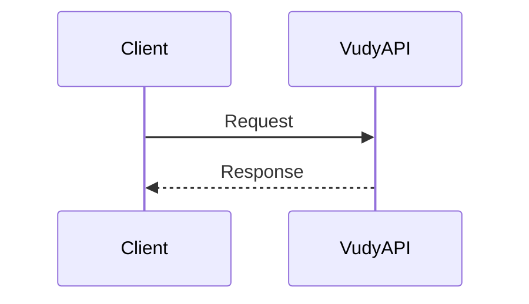

---

# Authentication Flow

> Source: `developer-docs/flows/01-authentication.md`

<!-- ---
title: "Authentication Flow"
description: "API key + user session authentication flow."
tags: ["flow", "auth"]
sourcePaths:
  - "./docs/AUTH-ENDPOINTS.md"
  - "./app/GET_STARTED.md"
  - "./docs/AUTHENTICATION-HEADER-MIGRATION.md"
lastReviewed: "2026-01-14"
--- -->


## TL;DR

- All auth endpoints require `x-api-key`.
- Use `send-otp` + `verify-otp` to obtain a session token.
- Optionally refresh/rotate the session via `GET /v1/auth/refresh-session` (Pattern C).
- Use Pattern C for user-authenticated calls: `x-api-key` + `Authorization: Bearer <session>`.

## Prerequisites

- API key (Pattern A header).
- User email address.

## Headers

Pattern A (API key only):
```json
{
  "x-api-key": "vudy_xxx"
}
```

Pattern C (session):
```json
{
  "x-api-key": "vudy_xxx",
  "Authorization": "Bearer <session_token>"
}
```

## Sequence (Mermaid)

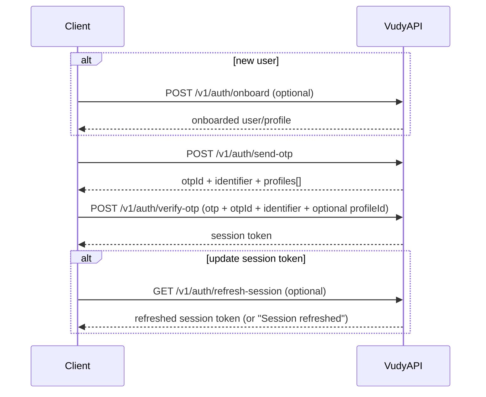
 
## Step-by-step API calls

### 1) Onboard (New users)
```bash
curl -X POST "https://api.vudy.app/v1/auth/onboard" \
  -H "x-api-key: vudy_prod_apikey" \
  -H "Content-Type: application/json" \
  -d '{
    "email": "user@example.com",
    "firstName": "John",
    "lastName": "Doe",
    "username": "johndoe",
    "country": "US",
    "language": "en",
    "isBusiness": false,
    "termsOfService": true
  }'
```

### 2) Send OTP
```bash
curl -X POST "https://api.vudy.app/v1/auth/send-otp" \
  -H "x-api-key: vudy_prod_apikey" \
  -H "Content-Type: application/json" \
  -d '{"email": "user@example.com", "language": "en"}'
```

**Persist these from the response (used in Verify OTP):**
- **`data.otpId`**: OTP session id (NOT the code).
- **`data.identifier`**: public key identifier to use for OTP login (pass it back on verify).
- **`data.profiles[]`**: available profiles/teams for this app; if multiple, pick one `profiles[].id` and pass it as `profileId` on verify.

Example success payload:
```json
{
  "success": true,
  "data": {
    "otpId": "otp-session-123",
    "identifier": "0x1234567890abcdef",
    "profiles": [
      { "id": "profile-456", "nickname": "john_doe", "team": "John's Team" }
    ]
  }
}
```

### 3) Verify OTP → get session token
```bash
curl -X POST "https://api.vudy.app/v1/auth/verify-otp" \
  -H "x-api-key: vudy_prod_apikey" \
  -H "Content-Type: application/json" \
  -d '{
    "otp": "123456789",
    "otpId": "otp-session-123",
    "email": "user@example.com",
    "identifier": "0x1234567890abcdef",
    "profileId": "profile-456"
  }'
```

Notes:
- **`otp`** is always a **9-digit string** (from the email).
- **`otpId`** must be **exactly** the `data.otpId` returned by Send OTP.
- **`identifier`** should be the `data.identifier` returned by Send OTP (recommended; avoids relying on server-side keypair lookup).
- **`profileId`** is **required only if** the user has multiple profiles for the app (`data.profiles.length > 1` from Send OTP).

### 4) Use session token (Pattern C)
```bash
curl -X GET "https://api.vudy.app/v1/profile" \
  -H "x-api-key: vudy_prod_apikey" \
  -H "Authorization: Bearer <session_token>"
```

### 5) Refresh session token (optional)
Use this to **rotate** the Turnkey session (returns a new token) and/or to **re-sync** server-side session cache if it drifted.

```bash
curl -X GET "https://api.vudy.app/v1/auth/refresh-session" \
  -H "x-api-key: vudy_prod_apikey" \
  -H "Authorization: Bearer <session_token>"
```

Example success payloads:

- Rotated session (new token returned):

```json
{
  "success": true,
  "data": {
    "session": "<new_session_token>",
    "expirationTimestamp": 1737060000
  }
}
```

- Cache re-sync only (no new token):

```json
{
  "success": true,
  "data": {
    "message": "Session refreshed",
    "expirationTimestamp": 1737060000
  }
}
```

## Common errors

- `VUDY#AU01` Invalid API key
- `VUDY#SO03` User not found
- `VUDY#VO06` Failed to verify OTP

## Related docs / code references

- `./docs/AUTH-ENDPOINTS.md`
- `./app/GET_STARTED.md`
- `./docs/AUTHENTICATION-HEADER-MIGRATION.md`
- `./app/v1/auth/refresh-session/route.ts`

---

# Onboarding Flow

> Source: `developer-docs/flows/02-onboarding.md`

<!-- ---
title: "Onboarding Flow"
description: "Developer/operator onboarding to become operational on the API."
tags: ["flow", "onboarding"]
sourcePaths:
  - "./app/GET_STARTED.md"
  - "./docs/AUTH-ENDPOINTS.md"
  - "./app/v1/profile/README.md"
  - "./app/v1/teams/README.md"
  - "./docs/API-KEY-SYSTEM.md"
lastReviewed: "2026-01-14"
--- -->


## TL;DR

1. Verify your API key works (Pattern A).
2. Create a user session (send + verify OTP).
3. Validate profile/team context via `/v1/profile` (Pattern C).
4. Optional: configure API key webhook and confirm delivery.

## Prerequisites

- API key (production or staging).
- User email address.

## Sequence (Mermaid)

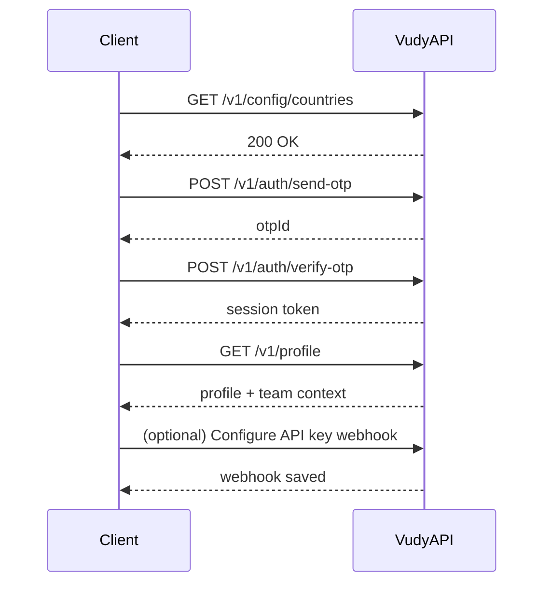

## Step-by-step API calls

### 1) Test API key (Pattern A)
```bash
curl -X GET "https://api.vudy.app/v1/config/countries" \
  -H "x-api-key: vudy_prod_apikey"
```

### 2) Create session (Pattern A)
```bash
curl -X POST "https://api.vudy.app/v1/auth/send-otp" \
  -H "x-api-key: vudy_prod_apikey" \
  -H "Content-Type: application/json" \
  -d '{"email": "user@example.com"}'
```

```bash
curl -X POST "https://api.vudy.app/v1/auth/verify-otp" \
  -H "x-api-key: vudy_prod_apikey" \
  -H "Content-Type: application/json" \
  -d '{"email": "user@example.com", "otp": "123456789", "otpId": "otp-session-123"}'
```

### 3) Verify profile/team context (Pattern C)
```bash
curl -X GET "https://api.vudy.app/v1/profile" \
  -H "x-api-key: vudy_prod_apikey" \
  -H "Authorization: Bearer <session_token>"
```

### 4) Optional: configure API key webhook

Use the API key webhook configuration described here:
- `../reference/api-key-webhooks.md`

### 5) Optional: confirm webhook delivery

Create a request or send with the same API key and confirm delivery logs:
- `webhook_notified` / `webhook_failed` in team logs events
- See: `/Users/semi/dev/Hydra/tech-api/docs/Events.md`

## Common errors

- `VALIDATION_API-AUTH_*` Invalid API key
- `VUDY#VO04` Multiple profiles (profile ID required)

## Related docs / code references

- `./app/GET_STARTED.md`
- `./docs/AUTH-ENDPOINTS.md`
- `./app/v1/profile/README.md`
- `./docs/Events.md`

---

# External Wallets Flow

> Source: `developer-docs/flows/03-external-wallets.md`

<!-- ---
title: "External Wallets Flow"
description: "Add an external wallet to a profile/team."
tags: ["flow", "wallets"]
sourcePaths:
  - "./app/v1/wallet/README.md"
lastReviewed: "2026-01-14"
--- -->


## TL;DR

- Use `POST /v1/wallet/external`.
- Auth: `x-api-key` only.
- Provide `teamId`, `profileId`, `address`, and `walletType` in body.

## Prerequisites

- API key (Pattern A).
- Known `teamId` and `profileId`.

## Sequence (Mermaid)

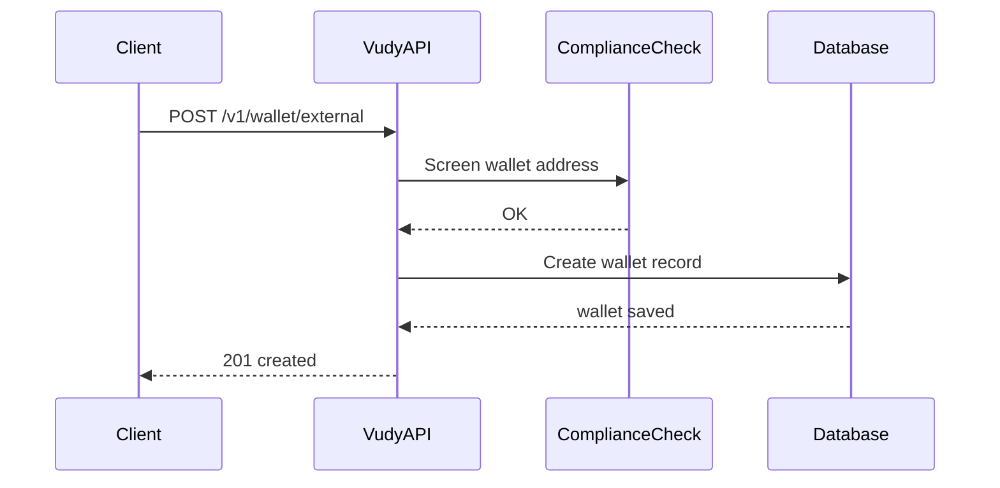

## Step-by-step API call

```bash
curl -X POST "https://api.vudy.app/v1/wallet/external" \
  -H "x-api-key: vudy_prod_apikey" \
  -H "Content-Type: application/json" \
  -d '{
    "teamId": "team-uuid",
    "profileId": "profile-uuid",
    "address": "0x742d35Cc6634C0532925a3b8D4C9db96C4b4d8b6",
    "walletType": "EVM",
    "label": "Treasury"
  }'
```

## Common errors

- `WALLET_EXTERNAL_ROUTE_01` Invalid wallet address format
- `WALLET_EXTERNAL_ROUTE_02` Wallet already exists
- `VALIDATION_API-AUTH_*` Invalid API key

## Related docs / code references

- `./app/v1/wallet/README.md`

---

# Vudy Request Create Flow

> Source: `developer-docs/flows/04-vudy-request-create.md`

<!-- ---
title: "Vudy Request Create Flow"
description: "Create a Vudy payment request via channel endpoint."
tags: ["flow", "vudy", "request"]
sourcePaths:
  - "./app/channel/vudy/README.md"
  - "./app/channel/vudy/request/create/route.ts"
  - "./app/GET_STARTED.md"
lastReviewed: "2026-01-14"
--- -->


## TL;DR

- Endpoint: `POST /channel/vudy/request/create`.
- Auth: Pattern B (profile/team headers) **or** Pattern C (session token).
- Payload: `targetAddress` (optional), `amount`, `channelParams`.

## Prerequisites

- API key with access to the Vudy channel.
- Profile/team context (session or headers).

## Headers

Pattern B (server-to-server):
```json
{
  "x-api-key": "vudy_xxx",
  "x-profile-id": "profile-uuid",
  "x-team-id": "team-uuid"
}
```

Pattern C (session):
```json
{
  "x-api-key": "vudy_xxx",
  "Authorization": "Bearer <session_token>"
}
```

## Sequence (Mermaid)

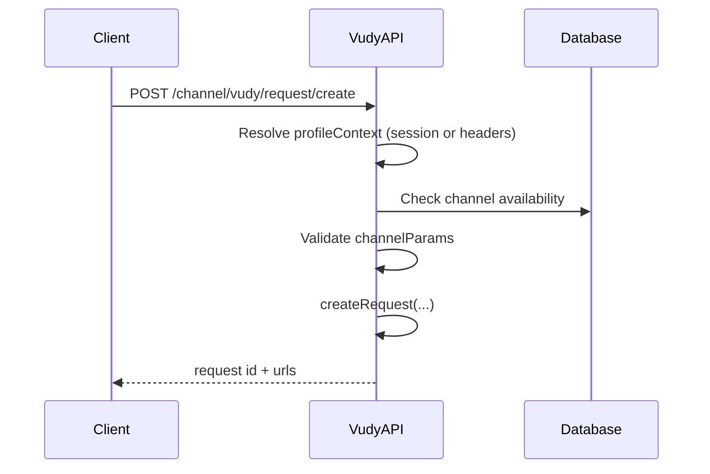

## Request payload

```json
{
  "targetAddress": "0x742d35Cc6634C0532925a3b8D4C9db96C4b4d8b6",
  "amount": 100.5,
  "channelParams": {
    "customId": "invoice-2024-001",
    "note": "Payment for services",
    "currencyToken": "USD",
    "requestedChain": "ethereum",
    "requestedToken": "USDC",
    "addedFee": {
      "bps": 150,
      "recipient": "0x1234567890123456789012345678901234567890"
    }
  }
}
```

Notes:
- `currencyToken` defaults to `USD` when omitted.
- If `targetAddress` is provided, it must be a wallet directly associated with the profile.
- If `targetAddress` is omitted, the team default receiver wallet is used.

## Example (Pattern C)

```bash
curl -X POST "https://api.vudy.app/channel/vudy/request/create" \
  -H "x-api-key: vudy_prod_apikey" \
  -H "Authorization: Bearer <session_token>" \
  -H "Content-Type: application/json" \
  -d '{
    "targetAddress": "0x742d35Cc6634C0532925a3b8D4C9db96C4b4d8b6",
    "amount": 100.5,
    "channelParams": {
      "customId": "invoice-2024-001",
      "note": "Payment for services",
      "currencyToken": "USD"
    }
  }'
```

## Common errors

- `CH-04` Channel not available for app
- `APP_CHANNEL_VUDY_REQUEST_CREATE#2` Invalid channel parameters
- `VUDY_REQUEST_METHODS#4` Missing target address and no default wallet
- `VUDY_REQUEST_METHODS#11` Target address not associated with profile

## Related docs / code references

- `./app/channel/vudy/README.md`
- `./app/channel/vudy/request/create/route.ts`

---

# Vudy Send Tokens (Executive Summary)

> Source: `developer-docs/flows/05-vudy-send-tokens-exec.md`

<!-- ---
title: "Vudy Send Tokens (Executive Summary)"
description: "High-level view of the Vudy send flow: checks, approvals, funding, execution, and confirmation."
tags: ["flow", "vudy", "send", "exec"]
sourceDoc: "./developer-docs/flows/05-vudy-send-tokens.md"
lastReviewed: "2026-01-22"
--- -->


## What this does (business view)

- **Goal**: move tokens from a sender wallet to one or more recipients, reliably, via seamless execution.
- **Key outcomes**: upfront “what will happen” preview, a created send plan, then execution + completion tracking.

## Simplified flow (phases)

- **1) Preview**: compute fees and validate the send intent.
- **2) Create send**: persist a send record and transaction plan (one or more txs).
- **3) Execute (seamless)**: Vudy executes the planned transactions.
- **4) Notify completion**: Vudy tracks progress internally and notifies client via webhook.

## Executive sequence (Mermaid)

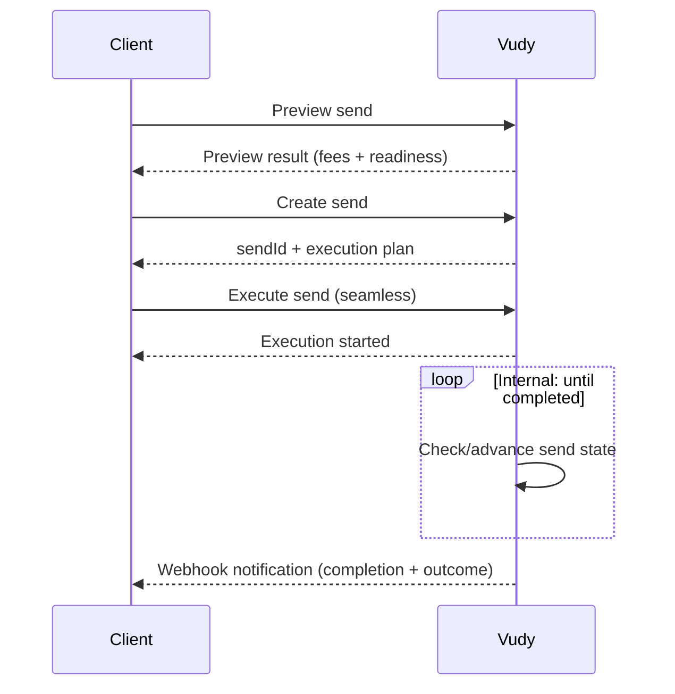

---

# Vudy Send Tokens Flow

> Source: `developer-docs/flows/05-vudy-send-tokens.md`

<!-- ---
title: "Vudy Send Tokens Flow"
description: "V2 send flow: preview, optional allowance/gas, create, and execute."
tags: ["flow", "vudy", "send"]
sourcePaths:
  - "./app/channel/vudy/send/preview/route.ts"
  - "./app/channel/vudy/send/create/route.ts"
  - "./app/channel/vudy/send/[id]/process-send-tx/route.ts"
  - "./app/channel/vudy/send/[id]/prepare-sponsored-tx/route.ts"
  - "./app/channel/vudy/send/[id]/process-sponsored-tx/route.ts"
  - "./app/v1/wallet/evm/allowance/[action]/route.ts"
  - "./app/v1/wallet/evm/gas-sponsor/route.ts"
  - "./app/v1/vudy/send/contracts/route.ts"
  - "./channels/vudy/schemas.ts"
  - "./channels/vudy/send-v2-methods.ts"
lastReviewed: "2026-01-17"
--- -->


## TL;DR

- Preview: `POST /channel/vudy/send/preview`
- Create: `POST /channel/vudy/send/create`
- Execute (regular/gas): `POST /channel/vudy/send/{sendId}/process-send-tx`
- Execute (sponsored): `POST /channel/vudy/send/{sendId}/process-sponsored-tx`
- Allowance: `GET/POST /v1/wallet/evm/allowance/send`
- Gas sponsor (optional): `POST /v1/wallet/evm/gas-sponsor`

## Prerequisites

- API key with access to Vudy channel.
- Profile/team context (session or headers).
- Sender wallet address, chain slug, and token symbol/address.
- Recipients list (at least one).

## Headers

Pattern B (server-to-server):
```json
{
  "x-api-key": "vudy_xxx",
  "x-profile-id": "profile-uuid",
  "x-team-id": "team-uuid"
}
```

Pattern C (session):
```json
{
  "x-api-key": "vudy_xxx",
  "Authorization": "Bearer <session_token>"
}
```

Notes:
- `process-send-tx` and `process-sponsored-tx` require a session (Pattern C).
- Allowance **POST** and gas-sponsor require session + WRITE permissions.

## Frontend inputs & validation

- `senderAddress`: required EVM address (preview).
- `targetAddress`: required EVM address (create; same as sender).
- `amount`: number > 0, **must equal sum(recipients.amount)** (currencyToken units).
- `channelParams.chain`: chain slug (e.g., `base`, `ethereum`).
- `channelParams.token`: token symbol or address.
- `channelParams.currencyToken`: optional, defaults to `USD`.
- `channelParams.gasConversionUsd`: optional, number >= 0.
- `channelParams.recipients[]`: min 1, each:
  - `address`: required EVM address
  - `amount`: number > 0
  - `email`: optional, **must be valid email**
  - `name`, `note`, `requiresGas`: optional
- `sendAutomatically`: optional boolean; if `true`, **`orgId` required**.

## Sequence (Mermaid)

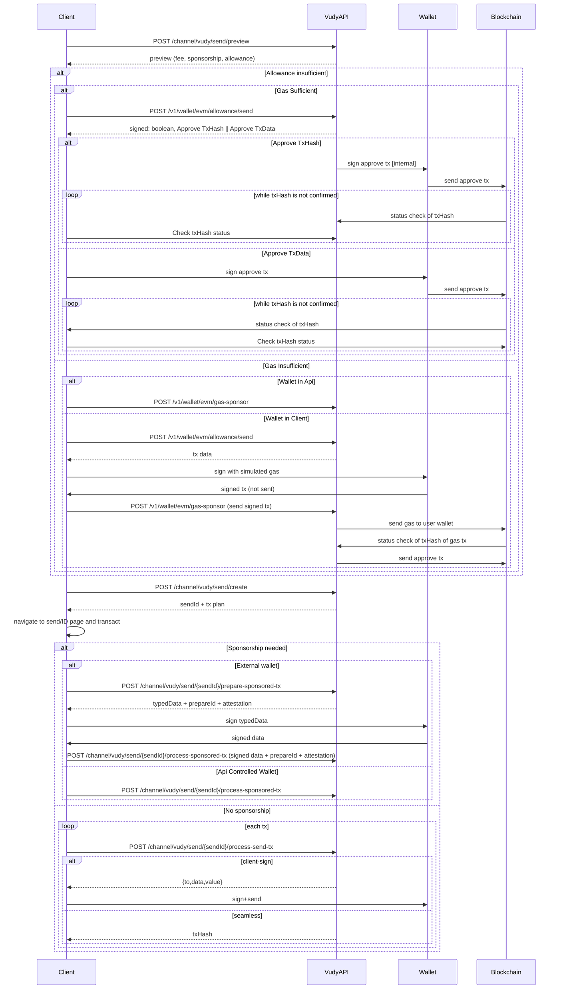

## Step-by-step API calls

### 1) Preview
```json
{
  "senderAddress": "0x742d35Cc6634C0532925a3b8D4C9db96C4b4d8b6",
  "amount": 1000,
  "channelParams": {
    "chain": "base",
    "token": "USDC",
    "currencyToken": "USD",
    "gasConversionUsd": 0,
    "recipients": [
      { "address": "0x123...", "amount": 600, "requiresGas": true },
      { "address": "0x456...", "amount": 400 }
    ]
  }
}
```

Persist for UI:
- `sponsorship.{eligible,needed,available}`
- `senderStatus.{tokenBalanceSufficient,allowanceSufficient,nativeBalanceSufficient}`
- `senderStatus.approvalAmount`
- `fee.totalInToken`
- `gas.totalGasInNative`

### 2) Allowance approval (when allowance insufficient)
Use the preview response (`senderStatus.allowanceSufficient=false`) to decide.
When calling allowance approval, set `amount` to `"max"` or the preview
`senderStatus.approvalAmount`.

Backend returns either:
- `signed: true` + `txHash` (API-controlled wallet)
- `signed: false` + tx data (client wallet)

Request:
```json
{
  "chainId": "8453",
  "userWallet": "0xSender...",
  "tokenAddress": "0xToken...",
  "amount": "max"
}
```

If you get tx data:
- Client signs and sends
- Client tracks confirmation on-chain

### 3) Gas sponsorship for approvals (when gas insufficient)
Two paths:
1) **Wallet in API**: call gas-sponsor directly (API signs + sends approve)
2) **Wallet in Client**: get approve tx data, sign locally, send signed tx to gas-sponsor

Request (wallet in API):
```json
{
  "action": "send",
  "tokenAddress": "0xToken...",
  "chainSlug": "base",
  "amount": "1000",
  "executeWithOwnGas": false
}
```

Request (wallet in Client):
```json
{
  "action": "send",
  "tokenAddress": "0xToken...",
  "chainSlug": "base",
  "amount": "1000",
  "executeWithOwnGas": false,
  "signedApproveTx": "0x..."
}
```

Notes:
- `signedApproveTx` required when signer keys are unavailable.
- API sponsors gas, then broadcasts approve tx.
- Track `approveTxHash` on-chain.

### 5) Create send (V2)
```json
{
  "targetAddress": "0xSender...",
  "amount": 1000,
  "channelParams": {
    "chain": "base",
    "token": "USDC",
    "currencyToken": "USD",
    "sendAutomatically": false,
    "recipients": [
      { "address": "0x123...", "amount": 600, "email": "a@example.com" },
      { "address": "0x456...", "amount": 400 }
    ]
  }
}
```

Persist from response:
- `sendId`, `txId`
- `transactions[]`, `gasTransactions[]`
- `needsSponsorship`, `allowanceOk`

### 6) Execute transactions (non-sponsored)
```json
{
  "txType": "regular",
  "txIndex": 0
}
```

Responses:
- **Seamless (sendAutomatically=true)**: `{ txHash, idHash, txType, txIndex }`
- **Client-sign**: `{ to, data, value, idHash, txType, txIndex }`

### 7) Sponsored txs

External wallet:
1) `POST /channel/vudy/send/{sendId}/prepare-sponsored-tx`
2) Sign `typedData`
3) `POST /channel/vudy/send/{sendId}/process-sponsored-tx` with:
```json
{
  "prepareId": "uuid",
  "attestation": "base64url",
  "userSignature": "0x...",
  "txIndex": 0
}
```

API controlled wallet (non-external):
```json
{
  "txIndex": 0
}
```

Requires session with `suborgId`. Backend signs EIP-712 and broadcasts.

**After process-sponsored-tx:** The client must execute the **gas** transactions (`gasTransactions[]`) so that recipients with `requiresGas` receive their native. Call `POST /channel/vudy/send/{sendId}/process-send-tx` for each gas tx with `txType: "gas"` and the corresponding `txIndex`.

### 8) Status tracking

Track tx confirmations on-chain using returned `txHash` values. Webhook updates mark txs as completed.

## Common errors

- `APP_CHANNEL_VUDY_SEND_PREVIEW#2` Invalid parameters
- `CHANNELS_VUDY_SEND_V2_METHODS#2` Total amount mismatch
- `APP_CHANNEL_VUDY_SEND_CREATE#2` Invalid channel params
- `APP_CHANNEL_VUDY_SEND_ID_PROCESS_SEND_TX#10` Sponsored txs must use `process-sponsored-tx`
- `APP_CHANNEL_VUDY_SEND_ID_PROCESS_SPONSORED_TX#11` Suborg ID required
- `APP_CHANNEL_VUDY_SEND_ID_PROCESS_SPONSORED_TX#15` Prepare payload not found/expired

## Related docs / code references

- `./app/channel/vudy/README.md`
- `./app/channel/vudy/send/preview/route.ts`
- `./app/channel/vudy/send/create/route.ts`
- `./app/channel/vudy/send/[id]/process-send-tx/route.ts`
- `./app/channel/vudy/send/[id]/prepare-sponsored-tx/route.ts`
- `./app/channel/vudy/send/[id]/process-sponsored-tx/route.ts`

---

# Vudy OTC Request Flow

> Source: `developer-docs/flows/06-vudy-otc-request-flow.md`

<!-- ---
title: "Vudy OTC Request Flow"
description: "Create OTC request → receive offers → accept offer → submit/verify fiat proof → release funds."
tags: ["flow", "vudy", "otc"]
sourcePaths:
  - "./app/channel/vudy/otc/create/route.ts"
  - "./app/channel/vudy/otc/[id]/accept-offer/route.ts"
  - "./app/channel/vudy/otc/[id]/prepare-proof/route.ts"
  - "./app/channel/vudy/otc/[id]/submit-proof/route.ts"
  - "./app/channel/vudy/otc/[id]/verify-proof/route.ts"
  - "./app/channel/vudy/otc/[id]/deny-proof/route.ts"
  - "./app/v1/otc/requests/route.ts"
  - "./app/v1/otc/offers/route.ts"
  - "./app/v1/otc/txs/route.ts"
  - "./app/v1/otc/proof/[requestId]/route.ts"
lastReviewed: "2026-01-22"
--- -->


## TL;DR (endpoints)

- Create request: `otc.create`
- Provider offers: `otc.requests.list` → `otc.offers.create`
- User sees offers: `otc.txs.list`
- Accept offer: `otc.offer.accept`
- Fiat proof: `otc.proof.prepare` → `otc.proof.submit`
- Verify / dispute: `otc.proof.verify` | `otc.proof.deny`

## Sequence (Mermaid)

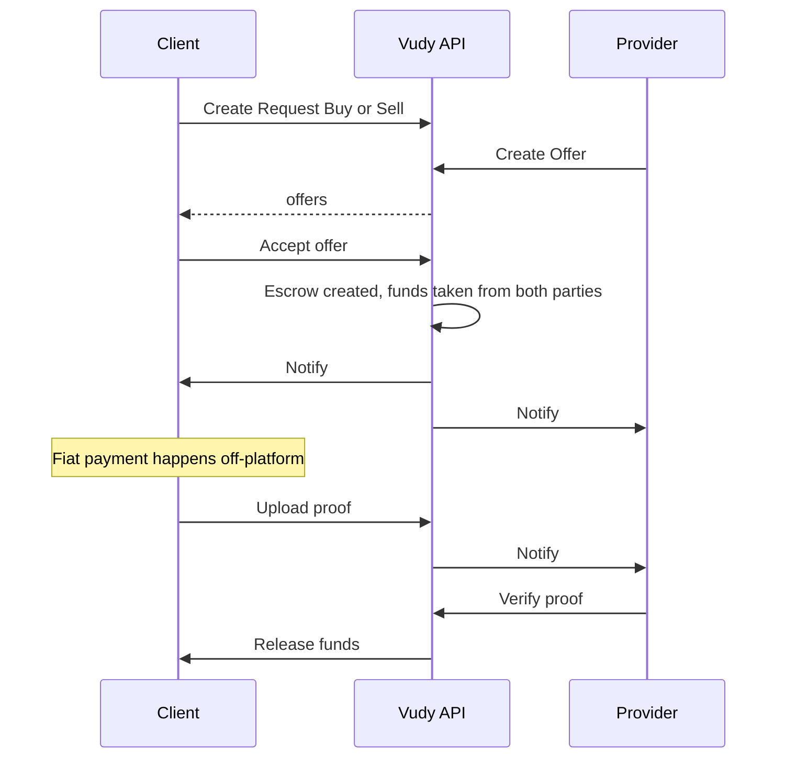

## Executive steps

1. **Create an OTC request**: `otc.create`
2. **Wait for provider offers**: provider `otc.offers.create`; user `otc.txs.list`
3. **Accept an offer**: `otc.offer.accept`
4. **Fiat proof → verify → release**:
   - Fiat-sender submits proof (`otc.proof.prepare` → `otc.proof.submit`)
   - Fiat-receiver verifies (`otc.proof.verify`) or disputes (`otc.proof.deny`)

---

# API Key Webhooks

> Source: `developer-docs/reference/api-key-webhooks.md`

<!-- ---
title: "API Key Webhooks"
description: "Configure team-level webhooks on API keys."
tags: ["reference", "webhooks", "api-keys"]
sourcePaths:
  - "./docs/API-KEY-SYSTEM.md"
  - "./app/v1/teams/README.md"
  - "./docs/Events.md"
lastReviewed: "2026-01-14"
--- -->


These webhooks are configured **per API key** (team-level). They only fire for
transactions created with that API key.

## Sequence (Mermaid)

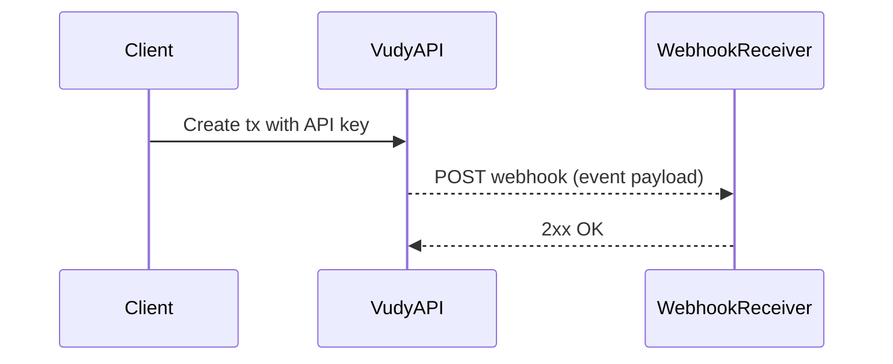

## Configure on API key create

Endpoint: `POST /v1/teams/api/create`

```json
{
  "name": "Team Production API Key",
  "permissions": ["READ", "WRITE", "WEBHOOK"],
  "webhookUrl": "https://example.com/webhook",
  "secret": "my-webhook-secret"
}
```

## Update webhook URL/secret

Endpoint: `PATCH /v1/teams/api/keys/{keyId}`

```json
{
  "webhookUrl": "https://example.com/new-webhook",
  "secret": "new-secret"
}
```

## Events

Example events sent for transactions:
- `requestPaid`
- `sendCompleted`

## Example payload

```json
{
  "event": "requestPaid",
  "data": {
    "requestId": "req-123",
    "token": "USDC",
    "amount": 100.5,
    "amountCurrencySymbol": "USD",
    "tokenAmount": "100.5",
    "hashUrl": "https://etherscan.io/tx/0x...",
    "network": "Ethereum"
  }
}
```

## Delivery notes

- Respond with HTTP 2xx to acknowledge delivery.
- Delivery outcomes are logged in team logs:
  - `webhook_notified`
  - `webhook_failed`

## Related docs

- `./docs/API-KEY-SYSTEM.md`
- `./app/v1/teams/README.md`
- `./docs/Events.md`

---

# Auth Patterns

> Source: `developer-docs/reference/auth-patterns.md`

<!-- ---
title: "Auth Patterns"
description: "Canonical authentication header patterns."
tags: ["reference", "auth"]
sourcePaths:
  - "./app/GET_STARTED.md"
  - "./docs/AUTHENTICATION-HEADER-MIGRATION.md"
lastReviewed: "2026-01-14"
--- -->


## Pattern A: API key only

```json
{
  "x-api-key": "vudy_xxx"
}
```

Use for public/config endpoints. Some endpoints using pattern B may also accept pattern A.

## Sequence (Mermaid)

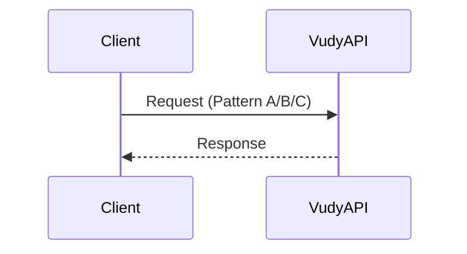

## Pattern B: API key + profile/team headers

```json
{
  "x-api-key": "vudy_xxx",
  "x-profile-id": "profile-uuid",
  "x-team-id": "team-uuid"
}
```

Use for server-to-server calls when no session exists.

## Pattern C: API key + session token

```json
{
  "x-api-key": "vudy_xxx",
  "Authorization": "Bearer <session_token>"
}
```

Use for user-authenticated flows. No `x-profile-id` or `x-team-id` needed.

## Conditional (Pattern B or C)

Some endpoints accept **either** Pattern B or Pattern C (session preferred).

## Related docs

- `./app/GET_STARTED.md`
- `./docs/AUTHENTICATION-HEADER-MIGRATION.md`

---

# Logged-in Profile View: Data Map

> Source: `developer-docs/reference/logged-in-profile-view-data-map.md`

<!-- ---
title: "Logged-in Profile View: Data Map"
description: "Which endpoints to call to build a profile/team/wallets view for logged-in users."
tags: ["reference", "profile", "teams", "wallets"]
sourcePaths:
  - "./developer-docs/flows/01-authentication.md"
  - "./app/v1/auth/README.md"
  - "./app/v1/auth/verify-otp/route.ts"
  - "./app/v1/profile/README.md"
  - "./app/v1/profile/route.ts"
  - "./app/v1/teams/README.md"
  - "./app/v1/teams/members/route.ts"
  - "./app/v1/wallet/README.md"
  - "./app/v1/wallet/list/route.ts"
  - "./app/v1/wallet/default/route.ts"
  - "./app/v1/wallet/portfolio/route.ts"
lastReviewed: "2026-01-18"
--- -->


## TL;DR (minimum calls)

- `POST /v1/auth/verify-otp` → **session token** + **teams list** (team switcher + current context)
- `GET /v1/profile` → **profile card** + **KYC** + **wallets** + **banks** + **profile imageUrl**
- `GET /v1/wallet/list?profileId=<profileId>&includeCompliance=true` → **wallet list** (+ compliance)
- `GET /v1/wallet/portfolio?wallets=<addr1,addr2,...>` → **balances** for wallet cards
- `GET /v1/teams/members` (optional) → **team roster**

## Auth (for logged-in users)

- Use **Pattern C**: `x-api-key` + `Authorization: Bearer <session_token>`
- After login, the backend derives **current** `profileId` + `teamId` from the session. You usually do **not** need `x-profile-id` / `x-team-id` headers.
- Some “team management” endpoints are **Conditional (Pattern B or C)**; session preferred.

## What data comes from where

### 1) “Who am I / what teams do I have?” (login response)

**Endpoint**: `POST /v1/auth/verify-otp` (API key only)

**Use it for**
- Session token for Pattern C calls
- Team switcher list (team name + role + profile nickname)
- Immediate “default receiver wallet address” per team (address only)

**Key fields**
- `data.session`: session JWT
- `data.teams[]`:
  - `teamId`, `teamName`
  - `profileId`, `profileNickname`, `profileRole`
  - `teamDefaultReceiverWallet` (address, nullable)

### 2) Profile card (identity + compliance status)

**Endpoint**: `GET /v1/profile` (Pattern C)

**Use it for**
- Profile header (display name / nickname / avatar)
- KYC badge
- “My wallets” quick list (addresses + types)
- Bank accounts summary (if shown in profile UI)

**Key fields**
- `data.profile`: `id`, `nickname`, `metadata` (often includes `name`, `image`), `createdAt`
- `data.user`: `firstName`, `lastName`, `username`, `country`, `language`
- `data.kyc`: `isVerified`, `status` (and optionally `verification`)
- `data.wallets[]`: `address`, `walletType`, `profileId`, `teamId`, `metadata`, timestamps
- `data.banks[]`: bank + currency objects
- `data.imageUrl`: profile avatar proxy route (only if image exists)

### 3) Wallet list (normalized, “UI-ready” list + compliance)

**Endpoint**: `GET /v1/wallet/list` (API key only)

**Use it for**
- Wallet cards list (labels, default marker, compliance records)

**How**
- Profile wallets: `GET /v1/wallet/list?profileId=<profileId>&includeCompliance=true`
- Team wallets: `GET /v1/wallet/list?teamId=<teamId>&includeCompliance=true`

**Key fields**
- `data.wallets[]`: `address`, `walletType`, `isDefault`, `metadata`, `complianceRecords[]`, timestamps
- `data.total`

**Notes**
- Current implementation filters to **valid EVM** (`walletType === "EVM"` + valid `0x` address). Don’t rely on this endpoint for non-EVM wallets.

### 4) Wallet balances (portfolio)

**Endpoint**: `GET /v1/wallet/portfolio` (API key only)

**Use it for**
- Total USD balance per wallet
- Token list grouped by symbol, per-chain breakdown

**How**
- `GET /v1/wallet/portfolio?wallets=<comma-separated-wallet-addresses>`

**Key fields**
- `data[]` (per wallet):
  - `wallet`
  - `totalUsdBalance`
  - `tokens[SYMBOL]`: `totalUsdBalance`, `totalBalance`, `tokenLogo`, `chains[chainSlug]` → `address`, `balance`, `price`, `chainLogo`

### 5) Default receiver wallet (full object)

**Endpoint**: `GET /v1/wallet/default?teamId=<teamId>` (API key only)

**Use it for**
- Showing the “default receiving wallet” with metadata (label) and timestamps

**Key fields**
- `data.defaultWallet` (wallet object) or `null`

**Tip**
- `verify-otp` already returns `teamDefaultReceiverWallet` (address only). Use this endpoint when you need the full wallet object.

### 6) Team roster (members list)

**Endpoint**: `GET /v1/teams/members` (Conditional: Pattern B or C)

**Use it for**
- Team “Members” tab (names, emails, roles)

**Key fields**
- `data[]`:
  - membership: `profileId`, `role`, `joinedAt`, `addedBy`
  - `profile`: `nickname`, `metadata`
  - `user`: `email`, `firstName`, `lastName`, `country`, `language`
  - `imageUrl` (profile avatar proxy route when present)

## Gaps / gotchas (for UI planning)

- There is **no dedicated read-only** “get team details” endpoint here. For team name, rely on `verify-otp.data.teams[]`.
- Team/profile “imageUrl” proxy routes exist (`/team/...`, `/profile/...`), but you only get the **hash** when:
  - fetching `GET /v1/profile` (profile `imageUrl`), or
  - after image upload confirmation endpoints return `imageUrl`, or
  - a team object is returned via some mutation flows that enrich with `imageUrl`.

---

# Response Format

> Source: `developer-docs/reference/response-format.md`

<!-- ---
title: "Response Format"
description: "Standard success/error response envelope."
tags: ["reference", "responses"]
sourcePaths:
  - "./app/GET_STARTED.md"
  - "./docs/AUTH-ENDPOINTS.md"
lastReviewed: "2026-01-14"
--- -->


## Success

```json
{
  "success": true,
  "data": {}
}
```

## Error

```json
{
  "success": false,
  "error": {
    "code": "ERROR_CODE",
    "message": "Human-readable error message",
    "details": {}
  }
}
```

## Troubleshooting

- Check `error.code` first; it maps to documented errors.
- Validate headers (auth pattern mismatch is the most common issue).

---

# Vudy Requests User Flow

> Source: `developer-docs/user-flows/vudy-requests.md`

## Expectations

- API creates a request and returns a request URL.
- Client redirects the user to the request URL.
- User completes payment on the request page.
- VudyAPI notifies the user's webhook when the request completes.

## Sequence

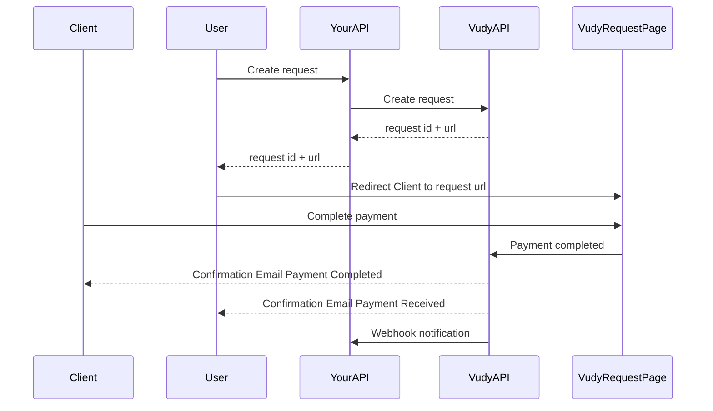

---

